# 企业数字化转型平台 · 全渠道智能客服 设计文档

> 状态：草案 v1.0（v0.3 增加待办事项与订单管理；v0.4 纳入第三轮决定；v0.5 增加加工与工人角色；v0.6 增加库存；v0.7 增加仓库：材料与成品、领料单与入库单；v0.8 重做开单界面，增加修改历史；v0.9 增加接口传输加密和按岗位的控制台；v1.0 开单时的商品联想，待评审）
> 日期：2026-09-28（v0.3–v0.9 更新于 2026-09-30，v1.0 更新于 2026-10-01）
> 范围：需求 R1–R8 的整体架构、关键决策与分期方案。本文确认后，再按阶段拆解实施计划。
> 修订记录见附录 B。

---

## 0. 摘要

平台是一个**多租户 SaaS**，以「客户对话」为核心数据资产，分三步：

1. 把企业（租户）所有触点的客户对话汇聚到一个坐席工作台。触点先是企业微信和官网/H5，后续加入飞书、钉钉、WhatsApp、Telegram。
2. 由 AI 做第一道接待，在必要时自主转人工。
3. 把沉淀下来的对话持续提炼成企业知识库，再反哺 AI 和坐席。

**第一轮反馈带来的最大变化：企业微信「一客一群」场景**

你们的主流程是：员工用企业微信添加客户，再拉「客户 + 接单员 + AI 客服账号」建群，由 AI 在群里接待并实时记录。核对官方接口后发现：

- 企业微信**没有**官方方式让 AI 在客户群里自动发言。智能机器人只能用于企业内部；客户群的「小助理」只支持管理员预设的关键词回复。
- 把一个成员账号拉进群，**不会**让平台通过 API 读到群消息。读取群消息正文的唯一官方途径是会话内容存档；而 SaaS 服务商只能在企业微信的「数据与智能专区」里处理存档数据，拿不到明文。
- 因此，「AI 客服账号在群里实时收发、无需会话存档」只能靠非官方协议托管登录这个账号来实现，存在封号和法律风险。

§4 给出三个方案。**本文默认按方案 A 设计**：AI 自动接待放到「微信客服」1:1 入口（官方接口，平台拿到全量数据）；群内由员工服务，企业微信侧边栏里的 AI 助手给出建议回复，员工一键发送。

**核心设计决策**

1. **多租户 SaaS**：共享集群；所有租户数据带 `tenant_id` 并启用 PostgreSQL RLS；支持租户开通、套餐与计量，并提供平台运营后台。
2. **后端**：FastAPI 模块化单体 + 独立 Worker 进程。客户、会话、权限、知识等业务数据以平台后端和 PostgreSQL 为准。
3. **消息**：
   - OpenIM 作为实时消息总线，一个客户渠道身份对应一个服务群（Room），转接就是 Room 的成员变更。
   - 访客直连 IM；员工与 AI 的发送走平台 API；历史消息从平台 API 读取。
   - 先直接使用 OpenIM，商用前购买授权。
4. **企业微信**：以服务商身份，通过「代开发应用」接入。
   - 「客户联系」同步客户和客户群。
   - 「微信客服」承担 AI 前台。
   - 聊天工具栏侧边栏承担群内的 AI 辅助。
   - 不使用非官方协议。
5. **AI**：RAG + 受限工具调用 + 确定性的转人工决策引擎。只接国内大模型（OpenAI 兼容协议），按租户计量和限额。
6. **知识沉淀**：
   - LLM 批量抽取问答候选，去重聚类后人工审核。
   - 发布后推送给坐席，同时产出知识缺口榜。
7. **权限**：租户隔离（RLS）+ 应用层数据范围 + IM 群成员隔离。坐席只看得到自己的客户和当前会话，租户管理员看得到本租户的全部数据。
8. **待办与订单（v0.3 新增，v0.4 确认）**：AI 从对话中解析客户的需求，生成待办（回电、开票、退换货等）和订单，由员工处理，处理完再通知客户。AI 生成的待办先进入"待确认"页，人工确认后才进入待办列表；AI 生成的订单先由员工审核。AI 只能告诉客户建议零售价，成本价从不进入 AI 的上下文。订单登记收款方式，每次修改都留痕，访客可以通过跟踪链接查看订单（§24、§25）。

> ⚠️ **需要你拍板的问题**见 §23。最关键的一条：企业微信群场景选方案 A、B 还是 C。待办与订单的第三轮问题已确认，见 §26。

---

## 1. 已确认的决策（2026-09-28）

| # | 问题 | 决定 | 对设计的影响 |
|---|---|---|---|
| 1 | 交付形态 | 多租户 SaaS | 新增 §7 多租户设计；企业微信必须以服务商身份接入（代开发应用），并受数据与智能专区的规则约束（§3.1、§7.4） |
| 2 | 大模型 | 以国内大模型为主 | LLM 网关只接国内模型（OpenAI 兼容协议），按租户计量与限额；平台需评估生成式 AI 的登记/备案义务（§3.3、§11.5） |
| 3 | OpenIM 许可 | 先直接使用，后续购买授权 | 直接用官方 Web SDK；把购买授权列为商用上线闸门（§21） |
| 4 | 企业微信场景 | 员工加客户为好友 → 拉「客户 + 接单员 + AI 客服账号」建群；希望 AI 在群里实时记录，不买会话存档 | 官方接口不支持这种做法，需要在 §4 的方案中选择；本文默认按方案 A 设计 |
| 5–8 | 规模、客户归属、知识审核、业务系统对接 | 未回复，按上一版默认执行 | 规模见假设 A3；首次人工接待即归属该坐席；知识必须人工审核；P3 预留只读的业务系统接口 |
| 9 | 新增需求（2026-09-30） | 增加待办事项和订单管理：AI 解析客户需求后生成待办或订单，由客服处理 | 新增需求 R9、R10 和 §24、§25；调整非目标（§2.2）、AI 工具与护栏（§11）、权限、数据模型、接口、前端和路线图（新增 P6） |
| 10 | 待办与订单的第三轮问题（2026-09-30） | AI 生成的待办一律人工确认；预置类型不变；订单登记收款方式（在线收款、货到付款、预付定金、暂欠）；商品库用 Excel 模板上传；AI 只能告诉客户建议零售价，并防止套取成本价；改单不需要客户再确认，但保留修改记录；对接后以企业系统为准；提供访客订单跟踪页 | 见 §26 和 §24、§25 的相应小节 |

---

## 2. 背景与目标

### 2.1 需求映射

| # | 需求 | 设计章节 | 分期 |
|---|---|---|---|
| R1 | 基于 Web 的全渠道客服（OpenIM + FastAPI + Vue3），触达企业全部客户并收集聊天数据 | §6 §9 §10.1 §10.2 §17 | P1 |
| R2 | 对接企业微信（后续飞书/钉钉/WhatsApp/Telegram）：聊天、群组、读取客户数据 | §4 §7.4 §10.3–§10.7 | P2（其余渠道 P5） |
| R3 | 企业知识库，能从聊天内容整理沉淀 | §12 | P3 手工知识 / P4 自动沉淀 |
| R4 | 接入大模型的 AI 聊天，承担前期客户接待 | §11.1 §11.5 | P3 |
| R5 | 自主判断是否需要人工介入，AI 处理不了时呼叫客服 | §11.2 §11.3 | P3 |
| R6 | 管理员/坐席角色；每个客户有独立档案；坐席只看自己的客户，管理员看全部 | §13 §15 | P1 |
| R7 | 把客户转移给其他坐席接待 | §14 | P1 |
| R8 | 持续收集聊天内容，更新知识库并分发给其他客服 | §12.3–§12.7 | P4 |
| R9 | 待办事项：AI 解析客户需求后生成待办，通知客服处理 | §24 §11.1 | P6 |
| R10 | 订单管理：AI 解析客户需求后生成订单，由客服处理 | §25 §11.1 | P6 |

### 2.2 非目标（一期不做）

- 电话呼叫中心（IVR、语音坐席）。
- 营销自动化（SOP、群发编排），以及进销存、会员等业务系统本身。对话中产生的待办和订单由平台处理（§24、§25），履约和财务仍以企业自己的系统为准；库存和仓库只做与订单、加工配套的部分（§25.12、§25.13）。
- 原生移动端 App。坐席在手机上使用企业微信内打开的 H5 工作台和侧边栏。
- 通过非官方协议（iPad 协议、PC Hook、RPA 等）接入个人微信或企业微信。
- 在线支付。套餐只做计量和账单展示；客户订单只登记收款方式和收款记录，不在平台内收款（§25.5）。

### 2.3 关键假设（可推翻）

| # | 假设 | 不成立时的影响 |
|---|---|---|
| A1 | 首批租户是中国大陆企业，主要触点是企业微信，其次是官网 | 若以海外为主，P2 改做 WhatsApp/Telegram，并引入海外模型 |
| A2 | 采用共享集群的多租户 SaaS；个别大客户可以单独部署 | 如果大量客户要求私有化，需要提前做私有化交付包（见方案 B） |
| A3 | 首年规模：≤50 个租户，单租户 ≤50 坐席；全平台 ≤1 万同时在线访客、≤300 万条消息/天 | 超出时需要提前做消息表冷热分离、按租户分片和 OpenIM 集群扩容 |
| A4 | "为每个客户建立单独的客户数据库"理解为：每个客户在所属租户的客户库中有一份独立档案，通过归属关系做行级隔离。不是物理上每人一个库 | 如果要求物理隔离，转接和管理员全局视图的实现代价会很高，不建议 |
| A5 | 知识入库需要人工审核（至少前 6 个月） | 如果要求全自动，需要更强的评测和回滚机制 |
| A6 | "员工通过微信添加客户"指员工用企业微信添加客户的个人微信（企业微信「客户联系」） | 如果员工用的是个人微信，官方没有任何接口，只能改为引导客户进入企业微信或微信客服 |

---

## 3. 调研结论：必须遵守的外部约束

以下结论主要依据官方文档（2026-09 查阅），它们直接决定了架构。标注「需要 POC 验证」或「以官方为准」的条目，请在实施前复核。

### 3.1 企业微信（按 SaaS 服务商视角）

**接入身份**

- 企业微信有三种应用形态：
  - 企业自建应用：由企业自己开发和部署。
  - 第三方应用：服务商开发和部署，面向所有企业，权限由企业按白名单授予。
  - 代开发应用：服务商代企业开发，权限接近自建应用，企业用黑名单排除敏感权限。
- **多租户 SaaS 需要以服务商身份接入**，流程是：
  1. 注册企业微信服务商。
  2. 创建代开发应用模板，通过审核后上线。
  3. 租户管理员扫码授权。
  4. 服务商为每个授权企业完成配置和上线。
- 服务商拿到的成员 ID 和外部联系人 ID 是服务商维度的 ID，需要做映射（以官方 ID 转换规则为准）。

**微信客服（kf）**

- **能做什么**：
  - 微信用户可以从公众号、小程序、视频号、网页、APP、聊天中的客服链接等入口进入客服账号，企业通过 API 收发消息。
  - 代开发应用和第三方应用获得「微信客服」权限后即可调用（以官方权限说明为准）。
- **关键限制**：
  1. 只有会话处于"新接入待处理（0）"或"由智能助手接待（1）"时，API 才能发消息。
  2. 客户最后一次发消息后的 48 小时内，企业最多发 5 条；客户再发消息后，额度重置。
  3. `sync_msg` 只能拉取最近 3 天的消息，回调里的 token 10 分钟内有效。
- **对设计的影响**：
  - 平台整体扮演"智能助手"。人工坐席也在平台内通过 API 回复，**不把会话转到"由人工接待（3）"**。
  - 工作台展示回复窗口和剩余条数。
  - AI 的回答合并成一条发送，节省额度。
- **这是官方唯一允许 AI 全自动接待微信用户、并且平台能拿到消息明文的通道。**

**客户联系与客户群**

- **能做什么**：
  - 同步员工的外部联系人、标签、客户群和群成员，并接收变更回调。
  - 新客户欢迎语。
  - 「联系我」和「加入群聊」。
  - 在职继承、离职继承。
- **关键限制**：
  1. **不能通过 API 直接给外部联系人或客户群发消息。** 只有两种方式：创建群发任务，由员工或群主在客户端确认；或者在聊天工具栏侧边栏里，由员工点击后通过 JS-SDK 发送。
  2. **服务端不能直接创建客户群。** 可以在侧边栏用 JS-SDK `openEnterpriseChat` 一键发起建群（由员工确认；含外部联系人时最多 40 人），或者配置"加入群聊"二维码（群满后自动建新群）。
  3. 在职继承：90 天内每位客户最多被转接 2 次，24 小时后自动接替，每次最多 100 个客户。

**客户群里的机器人和自动回复**

- **智能机器人**：只支持企业内部的单聊和内部群聊，在群里需要被 @ 才会响应。外部微信用户无法与它交互，它也不能加入客户群。
- **客户群「小助理」自动回复**：
  - 管理员在后台预设关键词（包含匹配或完全匹配）和回复内容（文本、图文、网页、小程序），群主需要逐个群开启。
  - 客户 @小助理 或 @员工，且命中关键词时，小助理自动回复。
  - **它不是 AI，也不能接入平台的大模型。**
- **结论：官方没有让 AI 在客户群里自动发言的方式。**

**会话内容存档（读取聊天正文的唯一官方途径）**

- **费用**：付费功能，按存档员工数计费。2026-01-22 起价格上调：办公版 400、服务版 900、企业版 1800 元/人/年（以官方为准）。
- **客户同意**：需要客户同意。群主是存档员工时，该群为"存档群"，新进群的客户默认同意（以官方规则为准）。
- **服务商（SaaS）的限制**：
  - 服务商原有的经典存档接口授权到期后不能再用，必须改用「数据与智能专区」。
  - 在专区里，消息明文只对部署在专区内的程序可见：只有把消息传入专区内的自有模型时，才会替换成原文。**专区外拿不到明文，只能取回分析结果。**
  - 文档只提到两类模型：企业微信提供的模型，以及上传到专区的自有模型；没有提供调用外部大模型 API 的途径（需要 POC 确认）。
  - 会话记录只能获取最近 5 天的数据，需要及时拉取。
- **企业自建应用**：仍然可以用经典 C SDK 拉取并解密明文（5 天内的数据，每次最多 1000 条）。

**通用前置条件**

- 服务商资质（企业认证）、代开发模板审核、回调域名备案、可信 IP 等都需要提前准备，审核有周期。
- **P0 阶段就要启动。**

### 3.2 OpenIM

- **版本**：服务端最新稳定线是 v3.8.3 及其后续 patch，Web SDK 同属 3.8.3 线。
- **许可**：

  | 组件 | 许可 | 结论 |
  |---|---|---|
  | open-im-server | Apache-2.0 | 可以放心自托管 |
  | openim-sdk-core（Go 核心） | Apache-2.0 | — |
  | openimsdk/chat（官方业务层：注册登录、管理后台） | GPL-3.0 | **不使用**，业务层由 FastAPI 承担 |
  | `@openim/client-sdk`（纯 JS Web SDK，不在浏览器存数据，可以跑在小程序里） | GPL-3.0-only | 打包进前端并分发到浏览器，可能触发 copyleft 义务 |
  | `@openim/wasm-client-sdk`（WASM + IndexedDB 本地库） | AGPL-3.0-only | 同上，而且更严格 |

  - **决定**：现在直接使用 `@openim/client-sdk`，商用上线前购买 OpenIM 商业授权（见 §21 上线闸门）。
  - SDK 调用仍然收敛在 `packages/im-client` 这一个适配层。
- **多租户**：
  - OpenIM 开源版没有内置的租户隔离，平台用一个共享集群，用户和群的 ID 统一加租户前缀。
  - 只有平台后端能签发 token。不同租户之间没有好友关系，也没有共同的群，所以天然隔离。
  - OpenIM 里只存展示名和头像，不存敏感信息。
  - 大租户可以分配独立的 OpenIM 集群。
- **Webhook**：
  - 在 `config/webhooks.yml` 中配置。支持单聊和群聊的发送前、发送后回调，以及建群前后、用户上下线等事件。
  - "发送前"回调可以拒绝或修改消息，但会把业务后端放进 IM 的关键路径。
  - 已知问题：`failedContinue` 从 v3.7.0 起配置不生效（open-im-server issue #3808）。
  - **我们的用法**：只用"发送后"回调做入库，再用定时对账兜底；用"建群前"回调禁止访客自行建群。
- **REST 发消息**：
  - 用 `imAdmin` 管理员令牌调用 `/msg/send_msg`，可以指定任意 `sendID`，支持单聊和群聊。
  - `isOnlineOnly`：只投递给在线用户、不存储，适合"正在输入""新会话分配提醒"这类信令。
  - `ex` 扩展字段：携带平台消息 ID，便于去重和关联。
- **流式消息**：开源主线曾经加入这个功能，后来又移除了，目前正在重新引入（issue #3770 / PR #3771），**不能依赖**。AI 回复采用"正在输入提示 + 整段或分段发送"。

### 3.3 合规（SaaS 运营方视角）

- **生成式 AI**：
  - 面向公众提供 AI 对话，需要使用已完成生成式人工智能服务备案的国内模型。
  - 平台作为调用已备案模型的应用运营方，通常还要在属地网信部门办理登记。上线前请法务确认。
- **AI 生成内容标识**：《人工智能生成合成内容标识办法》自 2025-09-01 起施行，AI 回复需要显式标识。例如在访客端的消息气泡上标注"AI 助手"；纯文本渠道加前缀。
- **个人信息保护（PIPL）**：
  - 平台是租户的受托处理者，需要与租户签订数据处理协议（DPA），约定处理目的、范围、保存期限和删除规则。
  - 敏感个人信息需要脱敏。
  - 支持删除和导出请求。
- **运营资质**：
  - 面向企业收费的在线 SaaS，通常需要增值电信业务经营许可（ICP、EDI 等，具体类型按业务形态由法务确认）。
  - 企业客户常会要求等保测评（二级或三级）。
- **非官方协议的法律风险**：
  - 国内已有微信外挂、群控软件的开发者被以「提供侵入、非法控制计算机信息系统程序、工具罪」判刑。
  - 也有群控软件开发商因不正当竞争被判赔偿腾讯。
  - 详见 §4.5。

---

## 4. 企业微信「一客一群」场景：能力边界与方案选择

### 4.1 你们设想的流程

1. 员工用企业微信添加客户。
2. 员工建群，成员包括客户、企业接单员和「AI 客服账号」。
3. AI 客服在群里接待客户、实时记录全部对话；需要时由接单员或客服接手。
4. 不购买会话存档。

### 4.2 官方能力核对

| 需要的能力 | 官方支持 | 说明 |
|---|---|---|
| 同步客户、客户群、群成员及其变更 | ✅ | 客户联系接口 + 变更回调（代开发应用） |
| 新客户自动欢迎语 | ✅ | 由添加客户事件触发，可以附带链接或小程序（有时间窗口，以官方为准） |
| 建群 | ⚠️ 需员工确认 | 在侧边栏用 JS-SDK 一键发起，员工在客户端确认；或使用"加入群聊"二维码 |
| AI 在客户群里自动回复 | ❌ | 智能机器人不能进客户群；「小助理」只有关键词回复 |
| "AI 客服账号"（普通成员）通过 API 在群里发言 | ❌ | 没有自动发送接口；群发任务需要群主在客户端确认 |
| 成员在群里，平台就能读到群消息 | ❌ | 成员身份不等于接口权限；读取正文只能用会话存档 |
| SaaS 平台拿到群消息明文 | ❌ | 服务商只能在专区内处理存档数据，明文不出专区 |
| 员工在群里用 AI 辅助回复 | ✅ | 员工把客户问题粘贴到聊天工具栏侧边栏，AI 生成建议回复，员工点击后由 JS-SDK 发送到当前群（侧边栏读不到群消息） |
| AI 全自动接待微信用户（1:1） | ✅ | 微信客服，消息明文回调给平台 |

**结论**：只把「AI 客服账号」拉进群，官方接口既读不到群消息，也不能替它发言。要做到"AI 在群里实时收发、无需存档"，只能用非官方协议托管登录这个账号（即方案 C）。

### 4.3 三个方案

**方案 A：官方合规（推荐，SaaS 默认）**

- **做法**：微信客服做 AI 前台；群内由员工服务，侧边栏的 AI 助手辅助回复。
- **AI 自动接待**：✅ 通过微信客服 1:1 接待。
- **AI 在群里自动发言**：❌ 由员工一键发送 AI 建议。
- **群聊原文进入平台**：❌ 可选在专区内做分析，只取回摘要、标签等结果（需要 POC）。
- **会话存档费用**：不启用专区分析时为零。
- **封号与法律风险**：无。
- **适用**：多租户 SaaS 主线。

**方案 B：私有化部署 + 会话存档**

- **做法**：平台部署在客户自己的环境里，使用企业自建应用和经典存档 SDK。
- **AI 自动接待**：✅ 同方案 A。
- **AI 在群里自动发言**：❌ 同方案 A。
- **群聊原文进入平台**：✅ 延迟需要实测。
- **会话存档费用**：可以只给担任群主的「存档账号」开通。覆盖范围和同意规则以官方为准。
- **封号与法律风险**：无。
- **适用**：愿意私有化部署、且必须留存群聊原文的大客户。

**方案 C：用非官方协议托管账号**

- **做法**：由第三方网关以 iPad 协议、PC Hook 或 RPA 方式登录「AI 客服账号」。
- **AI 自动接待**：✅ 在群内。
- **AI 在群里自动发言**：✅
- **群聊原文进入平台**：✅
- **会话存档费用**：无。
- **封号与法律风险**：高。
- **适用**：不建议。

方案 B 里，你们设想的「在每个群里放一个专用账号」仍然有用。它的角色从"发言的 AI"变成了"存档锚点"：只需为这一个账号购买存档席位，就能官方地采集它担任群主的服务群。

### 4.4 推荐方案 A 的业务流程

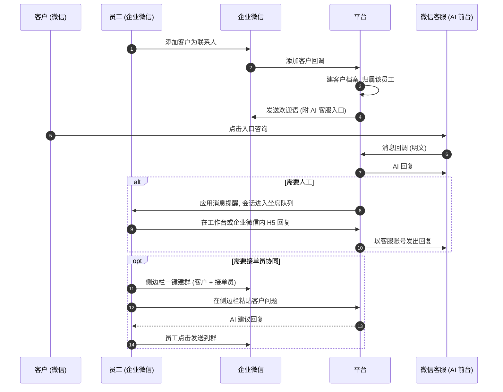

**要点**

- **客户看到的「AI 客服」**：是租户的微信客服账号（可以设置品牌名和头像），不是群成员。
  - 入口可以放在欢迎语、员工对外资料、群公告、公众号菜单、小程序和官网里。
- **群内服务**：
  - 由员工和接单员服务。
  - 侧边栏展示客户档案、历史会话摘要（来自微信客服和 Web）和知识检索；员工把客户的问题粘贴到侧边栏后，AI 给出推荐回复，员工一键发送。
  - 通过侧边栏发出的消息会记录到平台。
- **兜底**：由租户管理员在企业微信后台配置「小助理」关键词回复，例如在非工作时间把客户引导到 AI 客服入口。
- **数据**：
  - 微信客服、Web 以及侧边栏发出的消息全量进入平台，支撑客户档案和知识沉淀。
  - 客户在群里直接发的消息，默认不进入平台。
  - 如果需要分析群聊，走专区 POC（§10.6）或方案 B。
- **对业务流程的改变**：AI 自动接待从"群内"移到了"微信客服入口"。需要确认这一点在业务上能否接受（§23）。

### 4.5 关于方案 C

方案 C 是市面上一些 SCRM 产品的做法，能实现你们设想的效果。本设计不采用它，也不包含协议层的实现，原因如下：

1. **违反平台规则**：企业微信的服务协议不允许未经授权的第三方客户端和自动化操作。账号可能被限制或封禁，受影响的可能不只是 AI 账号，还会波及企业主体。
2. **SaaS 的系统性风险**：所有租户依赖同一套协议通道。一次风控升级或客户端更新，就可能让全部租户同时中断。
3. **法律风险**：
   - 国内已有微信外挂、群控软件的开发者被以「提供侵入、非法控制计算机信息系统程序、工具罪」判处有期徒刑。
   - 也有群控软件开发商因不正当竞争被判赔偿腾讯 260 万元。
   - 作为平台运营方，这些风险由你们公司承担。
4. **安全风险**：账号的登录凭证和全部客户聊天数据都要经过第三方网关。

如果公司经法务评估后仍希望走方案 C，需要单独决策。平台的渠道适配层不依赖任何一种接入方式，按方案 A 建设主链路不受影响。

---

## 5. 关键架构决策（含备选方案）

### D1 后端形态：模块化单体（选定）

- **做法**：
  - 一个 FastAPI 代码库，按领域划分模块：tenancy / iam / customer / conversation / routing / channels / ai / knowledge / billing / analytics / audit。
  - 部署成四类进程：API 进程、实时消费进程、后台任务进程、调度进程。
- **备选方案：微服务。** 否决理由：团队初期规模小，领域边界还在变化，分布式事务和运维的成本都很高。
- **保留的演进空间**：模块之间只通过服务接口和领域事件交互，日后可以把"渠道适配器""AI 推理"拆成独立服务。

### D2 OpenIM 使用模型：一个客户渠道身份对应一个服务群 Room（选定）

| 方案 | 做法 | 优点 | 缺点 |
|---|---|---|---|
| **A. 服务群 Room（选定）** | 每个客户渠道身份对应一个 OpenIM 群。成员是：客户身份、AI 机器人、当前坐席，以及可选的旁听主管 | 转接就是换成员，历史连续；天然支持主管旁听和协助；外部渠道的桥接方式统一；坐席只收到自己 Room 的消息 | 群数量约等于客户数（OpenIM 可以承载）；需要屏蔽成员变更通知；需要禁止访客自行建群 |
| B. 服务号单聊 | 客户与一个虚拟"客服号"单聊，平台在后台把消息路由给坐席 | 客户看到的身份始终一致 | 坐席端几乎用不上 IM 能力，要另建一套实时推送；转接和旁听都要自研 |
| C. 坐席直连单聊 | 客户直接与坐席单聊 | 最简单 | 转接会产生新会话，历史割裂；无法旁听。不推荐 |

### D3 读写路径：访客直连 IM；员工与 AI 走 API 写入；历史走 API 读取（选定）

- **访客消息**：
  - 链路：Widget → OpenIM → `afterSendGroupMsg` 回调 → 平台入库，并触发 AI 或路由。
  - 低延迟、断线重连、离线消息都由 IM 负责。
  - 调度进程定时对账补漏。
- **坐席、AI、系统消息**：
  - 先发到平台 API。平台校验权限、回复窗口和敏感词，写审计日志，先落库。
  - 再按渠道投递：Web 渠道由 OpenIM REST 以坐席身份发到 Room；微信客服先通过渠道 API 发出，成功后再镜像到 Room。
- **历史消息**：工作台一律从平台 API（PostgreSQL）读取，由平台统一控制数据范围。OpenIM 只负责实时增量。
- **理由**：
  - 业务校验必须同步生效，同时又不能把后端放进 IM 的关键路径。
  - 转接后，新坐席需要看到自己加入之前的完整历史，而 IM 群对新成员的历史可见性不适合作为权限依据。

### D4 企业微信接入：服务商 + 代开发应用，只用官方 API（选定）

- **分工**：
  - 客户联系：客户和客户群数据、欢迎语、归属关系。
  - 微信客服：AI 前台，双向收发。
  - 聊天工具栏侧边栏：单聊和群聊中的 AI 助手。
  - 数据与智能专区：可选的群聊分析。
- **应用形态**：
  - 选代开发应用，因为它的权限接近自建应用；第三方应用的权限白名单较窄。
  - 以后如果要上架应用市场，再补一个第三方应用。
- **否决**：非官方协议（见 §4.5）。

### D5 AI 编排：RAG + 受限工具 + 确定性决策引擎（选定）

- **做法**：
  - 模型只拿到只读或低风险的工具：检索知识、请求转人工、读取客户资料、登记当前客户的线索字段、登记待办、检索商品、提交订单草稿、查询当前客户的待办和订单。
  - 写入类工具产生的都是等待员工处理的草稿或待办；价格、订单的确认和取消都由员工决定（§24、§25）。
  - 任何越权动作都不提供对应工具。
  - 是否转人工，由规则引擎综合多个信号来裁决。
- **备选方案：完全由模型自主决策（Agent）。** 否决理由：客服场景对可控性和可解释性要求高，需要能调阈值，也需要能回溯每一次判定。

### D6 知识沉淀：LLM 批量抽取 + 人工审核后发布（选定）

- **备选方案：自动入库。** 否决理由：一条错误知识会被 AI 反复输出给客户，代价远大于审核成本。
- **例外**：低风险变更（比如给已有问题补充相似问法）可以开放自动通过。

### D7 数据存储：PostgreSQL + pgvector 一库多用（选定）

- **做法**：业务数据、消息归档、向量检索（稠密向量 + 稀疏向量）都放在 PostgreSQL 17 + pgvector ≥0.8 中。
- **理由**：减少早期要运维的组件。OpenIM 本身已经依赖 MongoDB、Redis、Kafka、MinIO、etcd。
- **演进**：
  - 大表按月分区、按租户分区；租户规模增长后，按租户分片。
  - 知识切片达到千万级，或检索 QPS 很高时，迁移到 Milvus 或 Elasticsearch。
  - 报表数据量大时，引入 ClickHouse。
  - 检索层做接口隔离，方便替换。

### D8 LLM 供应商：国内大模型 + 网关按场景路由（选定）

- **接入方式**：统一通过 OpenAI 兼容协议接入国内模型，例如 DeepSeek、通义千问、智谱、豆包、Kimi。需要私有化时，用 vLLM 部署开源模型。
- **按场景配置**：接待回答、意图/情绪分类、转人工摘要、坐席建议、知识抽取这几个场景，分别配置模型、超时和降级策略。
- **扩展性**：海外模型不在当前范围，适配器接口保留扩展能力。

### D9 多租户：共享集群 + 逻辑隔离（选定）

- **做法**：
  - 所有租户共享一套集群。
  - 所有租户数据表都带 `tenant_id`，并启用 RLS。
  - OpenIM、Redis、对象存储和向量检索都按租户命名空间隔离。
- **备选方案：每个租户独立数据库或独立部署。** 否决理由：早期租户数量多、规模小，独立部署的运维成本不可接受。
- **保留**：为大客户提供"专属部署"，作为高配套餐。

---

## 6. 总体架构

### 6.1 架构图

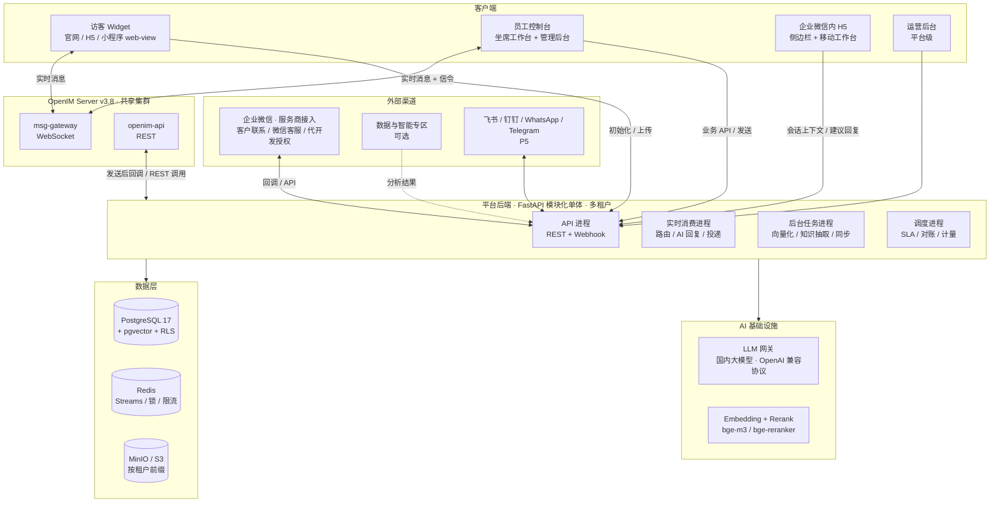

### 6.2 组件职责

| 组件 | 职责 |
|---|---|
| 访客 Widget | 嵌入式聊天窗口（用 iframe 隔离）；支持匿名和实名访客；收发文字、文件、表情；提供"转人工"按钮、排队提示、满意度评价、离线留言；展示 AI 标识和隐私告知 |
| 员工控制台 | 一个 Vue3 SPA，按角色展示"坐席工作台"和"管理后台"两套布局 |
| 企业微信内 H5 | 聊天工具栏侧边栏（客户档案、AI 建议回复、一键建群、发送），以及手机上的精简版坐席工作台（企业微信内免登） |
| 运营后台 | 平台级：租户、套餐、用量、渠道授权状态、模型供应商配置、系统健康 |
| OpenIM | 实时投递、离线消息、在线状态、"正在输入"、文件上传（对象存储）、多端同步 |
| API 进程 | 业务 REST API；接入 OpenIM 和企业微信的 Webhook（验签后写入 Redis Streams，立即返回） |
| 实时消费进程 | 按（租户，会话）有序消费消息事件：入库、身份解析、会话状态机、路由分配、AI 回复（含登记待办、提交订单草稿）、渠道投递 |
| 后台任务进程 | 文档解析与向量化、知识抽取与聚类、会话后解析待办、商品库导入与向量化、企业微信全量和增量同步、向企业系统推送订单事件、报表 |
| 调度进程 | 排队 SLA 计时、会话超时关闭、消息对账、用量汇总、待办的时限提醒与升级 |
| PostgreSQL | 业务数据的权威来源：租户、员工、客户、会话、消息归档、知识库（含向量）、计量、审计 |
| Redis | 与 OpenIM 使用不同的实例或 DB。承担事件流（Streams）、会话锁与防抖、坐席负载、回复窗口计数、按租户限流、缓存 |
| MinIO | 存放渠道媒体的转存文件和知识文档原件，按租户前缀隔离。可以与 OpenIM 共用集群，但使用不同的 bucket |

### 6.3 技术选型

| 层 | 选型 | 说明 |
|---|---|---|
| 后端 | Python 3.12、FastAPI、Pydantic v2、SQLAlchemy 2.0（async）、Alembic、httpx | 全异步 |
| 任务 | Redis Streams（实时事件）+ Taskiq（后台任务，asyncio 原生） | 如果团队更熟悉 Celery 也可以替换，任务接口已做隔离 |
| 数据库 | PostgreSQL 17 + pgvector ≥0.8 | 稠密向量用 HNSW 索引，稀疏向量用 `sparsevec`；0.8 的迭代索引扫描改善带过滤条件的检索 |
| IM | OpenIM Server v3.8.x（Docker Compose / K8s），共享集群 | 依赖 MongoDB、Redis、Kafka、MinIO、etcd；商用前购买授权 |
| 前端 | Vue 3 + TypeScript + Vite + Pinia + Vue Router + Element Plus（企业微信 H5 用移动端组件库，如 Vant） | pnpm workspace；API 客户端由 OpenAPI 生成 |
| IM 客户端 | `@openim/client-sdk`，封装在 `packages/im-client` 中 | 纯 JS，不在浏览器落盘，转接后旧坐席的电脑上不会残留聊天记录 |
| Embedding/Rerank | bge-m3（稠密 + 稀疏）、bge-reranker-v2-m3，自托管 | 中文效果好，数据不出平台；也可以换成模型供应商的向量接口 |
| LLM | 国内大模型（DeepSeek、通义千问、智谱、豆包等），OpenAI 兼容协议；需要时用 vLLM 私有化部署 | 见 §11.5 |
| 可观测性 | OpenTelemetry、Prometheus + Grafana、Loki | OpenIM 自带 Prometheus 指标；所有指标带租户维度 |
| 工程 | uv、ruff、mypy、pytest + testcontainers；eslint、vitest、Playwright | CI 跑 lint、单测和关键 E2E |

---

## 7. 多租户 SaaS 设计

### 7.1 隔离方案

| 层 | 隔离方式 |
|---|---|
| PostgreSQL | 所有租户表带 `tenant_id` 并启用 RLS；每个请求在事务内执行 `SET LOCAL app.tenant_id`；平台运营的跨租户查询使用单独的数据库角色，并全程审计 |
| 大表 | `messages` 按月分区；`kb_chunks` 按租户哈希分区；租户规模增长后可以按租户分片 |
| Redis | key 前缀 `t:{tenantId}:`；按租户限流 |
| 对象存储 | 路径前缀 `t/{tenantId}/`；只通过签名 URL 访问 |
| OpenIM | 共享集群，用户和群 ID 带租户前缀；不跨租户建立好友或群 |
| 向量检索 | 在 SQL 层强制按 `tenant_id` 过滤 |
| LLM | 每次调用带租户标识；按租户记账，设置配额和并发上限；可选由租户自带 API Key |
| 密钥 | 租户级数据密钥（信封加密），用于加密渠道凭证和敏感字段 |
| 实时消费 | 按（租户，会话）分区；设置单租户并发上限，防止某个租户挤占资源 |

### 7.2 租户开通与生命周期

1. **开通**：自助注册或由运营开通 → 创建租户（分配短码）→ 初始化默认角色、技能组、路由策略 → 邀请租户管理员。
2. **渠道接入向导**：
   - 生成 Web Widget 嵌入代码。
   - 企业微信扫码授权代开发应用。
   - 在企业微信里把微信客服账号交给该应用管理。
3. **生命周期**：试用 → 正式套餐 → 续费或升级 → 停用 → 注销。注销时先提供数据导出，再按保留期删除。

### 7.3 套餐与计量

- **计量维度**：坐席数、AI 接待会话数与 Token、知识库条目与存储、渠道数量、专区分析（如启用）、AI 生成的待办和订单数。
- **功能开关**：待办、订单与商品库按套餐开放（§24、§25）。
- **汇总**：每日汇总到 `usage_records`，租户管理员可以在后台查看。
- **额度控制**：用量接近或超过额度时提醒；超额时按套餐策略处理（提醒、限流，或把 AI 降级为人工接待）。
- **计费**：一期只做套餐、计量和账单展示，在线支付后续再接入。

### 7.4 企业微信服务商接入

1. **注册服务商**：平台注册为企业微信服务商（需要企业认证）。
2. **创建代开发应用模板**：
   - 申请通讯录（成员）、客户联系、客户群、应用消息、JS-SDK（聊天工具栏）、微信客服等权限。
   - 配置指令回调和数据回调 URL。
   - 提交审核，审核通过后上线模板。
3. **租户授权**：
   - 租户管理员扫码授权。
   - 平台收到授权通知，换取永久授权码。
   - 服务商在后台为该企业配置并提交上线。
   - 平台加密保存企业凭证，开始全量同步。
4. **回调路由**：数据回调走统一入口，按 CorpID 路由到对应租户。
5. **需要租户配合的操作**：
   - 在企业微信后台把微信客服账号交给该应用管理。
   - 把侧边栏页面配置到聊天工具栏（由租户管理员或服务商按官方流程完成）。
   - （可选）购买会话存档并授权专区。

### 7.5 运营后台（平台级）

- **功能**：
  - 租户管理：开通、停用、套餐、功能开关。
  - 用量与账单。
  - 渠道授权状态。
  - 模型供应商与路由配置。
  - 全局敏感词与内容安全策略。
  - 系统健康与平台审计。
- **访问控制**：
  - 运营人员账号与租户员工账号完全分开，登录和权限都独立。
  - 运营人员访问租户业务数据，需要租户授权或工单审批，并全程审计。

---

## 8. 核心领域模型

### 8.1 概念

- **租户 Tenant**：一个企业客户。所有业务数据都带 `tenant_id`。
- **套餐 Plan / 订阅 Subscription**：租户的功能与额度。
- **员工 Staff**：租户内的平台用户。
  - 角色有租户管理员、主管、坐席、知识管理员。
  - 坐席有技能组、最大并发数和在线状态。
  - 可以绑定企业微信成员 ID。接单员如果需要接待客户，也开坐席账号。
- **客户 Customer**：客户档案的主记录，也就是 R6 里的"独立档案"。
  - 有归属坐席（`owner_id`），以及标签、备注和自定义字段。
  - 提供客户 360 视图：基本信息、各渠道身份、历史会话、所在企业微信群、线索字段。
- **渠道身份 Identity**：客户在某个渠道上的身份，例如访客 ID、微信客服 external_userid、客户联系 external_userid。
  - 一个客户可以有多个身份。
  - 支持合并：按实名签名、unionid 自动识别；疑似同一客户时，由管理员确认后合并。
- **渠道账号 ChannelAccount**：一个接入点，例如某个官网 Widget 或某个微信客服账号。每个渠道账号挂一套路由策略。
- **服务室 Room**：`客户身份 × 渠道账号` 的长期对话容器，对应一个 OpenIM 群。
- **会话 Session**：Room 中的一次服务过程，从客户发起到结束。
  - 记录 AI/排队/人工状态、分配的坐席、转接记录、摘要和满意度。
  - 知识沉淀以 Session 为单位。
- **消息 Message**：所有渠道消息的统一归档。平台库是消息的业务权威来源。
- **企业微信客户群 WecomGroupChat**：从企业微信同步的客户群，关联客户档案和群成员。在方案 A 下，只有元数据和通过侧边栏发出的消息。
- **知识 KnowledgeItem**：包括 FAQ（标准问 + 相似问 + 答案）、文档和话术。每条知识都有状态、版本、可见范围和有效期。
- **待办 Todo**（v0.3）：需要员工在线下完成的一件事，例如回电、开票、退换货。由 AI 从对话中解析、由系统规则生成或由员工创建；有类型、处理人、截止时间和状态（§24）。原来的留言并入待办。
- **订单 Order 与商品 Product**（v0.3）：客户在对话中下的订单，由 AI 采集、员工审核和跟进；商品库用于识别客户要买什么（§25）。

### 8.2 会话状态机

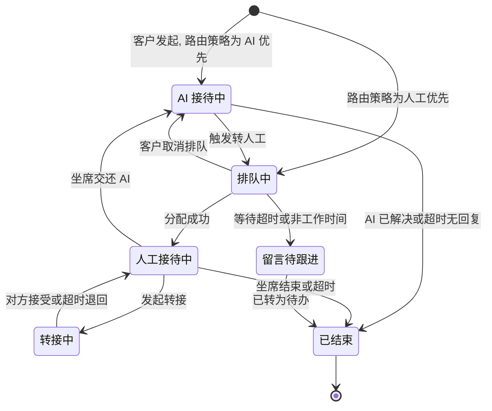

- 会话结束后，客户再发消息时，会在同一个 Room 中新建 Session。
- 如果在结束后 N 分钟内（可配置）再发消息，可以"续接"原会话。

### 8.3 OpenIM 映射约定

| 平台对象 | OpenIM 对象 | ID 约定（示例，`{t}` 为租户的 IM 前缀：租户代码中的 "-" 写作 "X"，见实施计划 §7.2） |
|---|---|---|
| 访客或外部客户的身份（外部渠道客户是不登录的"影子用户"，只用于在 Room 中代表客户发言） | 用户 | `{t}_c_{identityId}` |
| 员工 | 用户 | `{t}_s_{staffId}` |
| AI 机器人 | 用户（每个租户一个） | `{t}_bot` |
| 系统用户（群主、系统提示、信令） | 用户 | `{t}_sys` |
| Room | 群，群主为 `{t}_sys` | `{t}_r_{roomId}` |

- **REST 调用**：平台后端使用 `imAdmin` 令牌调用 REST 接口，负责注册用户、签发短时有效的用户 token、建群和换成员、发消息。
- **Room 成员**：
  - 固定成员是客户身份和 AI 机器人，再加上当前被分配的坐席。
  - 可选"归属坐席常驻"。
  - 主管旁听时，以观察者身份加入，访客端不展示观察者。
- **通知屏蔽**：
  - 关闭"成员进群/退群"等群通知在访客端的展示（通过 OpenIM 通知配置和 Widget 过滤）。
  - 转接时，由平台发一条面向客户的系统提示，例如「已为您转接至 XX」。
- **防滥用**：
  - 开启 `beforeCreateGroup` 回调，只允许平台用管理员令牌建群。
  - 单聊开启好友校验，访客之间、访客与员工之间都不能私聊。
  - 系统用户与员工预先建立好友关系，保证单聊信令可达。
- **信令**：业务事件（新分配、转接请求、AI 建议就绪、SLA 告警）由 `{t}_sys` 以 `isOnlineOnly` 自定义消息发给坐席。坐席上线或重连时，从平台 API 拉取最新状态作为兜底。
- **消息关联**：消息的 `ex` 字段携带平台消息 ID（`pmid`），用于前端去重和关联。

---

## 9. 消息链路

### 9.1 Web 访客：AI 接待 → 转人工

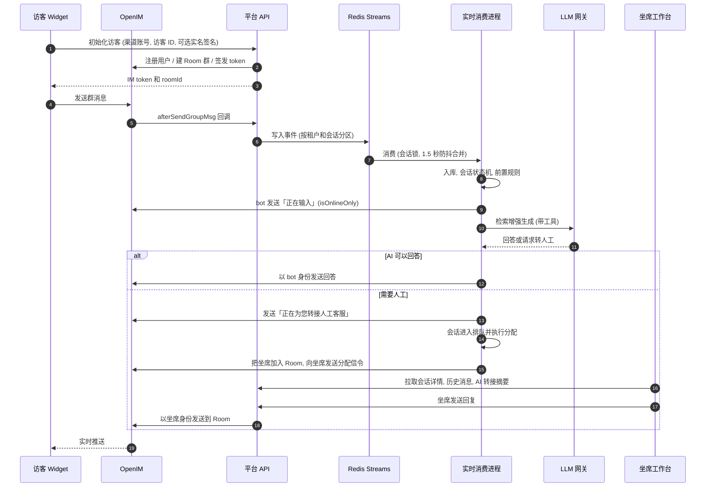

### 9.2 坐席发送（统一走 API 写入）

1. 工作台生成 `clientMsgId` 作为幂等键，调用 `POST /api/v1/sessions/{id}/messages`。
2. 平台依次校验：
   - 数据范围：这个会话是否分配给了我。
   - 会话状态。
   - 渠道回复窗口，例如微信客服的 48 小时 / 5 条。
   - 敏感词、附件类型和大小。
3. 写入 `messages` 表，状态为 `pending`。
4. 按渠道投递：
   - Web 渠道：通过 OpenIM REST 以坐席身份发到 Room。
   - 微信客服：通过渠道 API 发送，成功后再镜像到 Room，用 `ex.pmid` 关联。
5. 把状态更新为 `sent` 或 `failed`，失败原因实时回显到工作台，例如"已超过 48 小时回复窗口"。

### 9.3 可靠性

- **幂等**：
  - 入站消息用 `(channel_account_id, channel_msg_id)` 唯一约束去重。OpenIM 消息取 `serverMsgID`，企业微信消息取 `msgid`。
  - 出站消息用 `clientMsgId` 去重。
- **对账补漏**：
  - OpenIM 的发送后回调是异步通知，失败时不保证重投。调度进程每分钟对活跃 Room 按 seq 拉取增量，与平台库比对后补录。
  - 企业微信 `sync_msg` 的游标持久化保存。回调丢失时，由定时任务兜底拉取。由于消息只保留 3 天，拉取频率必须有保障。
- **有序与防抖**：
  - 同一会话的事件串行处理：按（租户，会话）哈希到 N 个分区流，每个分区同一时刻只由一个消费者处理。
  - 客户连续发多条短消息时，等待 1.5–3 秒，合并成一轮再交给 AI。这样可以避免答非所问，也不浪费微信客服的 5 条额度。
- **租户公平**：Webhook 入口和 AI 调用都按租户限流，单个租户的突发流量不影响其他租户。
- **降级**：
  - LLM 超时或故障时，发送兜底话术，并直接转人工。
  - OpenIM 不可用时，坐席发送会返回错误并提示；微信客服等渠道的入站消息照常入库，OpenIM 恢复后再镜像补发。
- **媒体转存**：
  - 企业微信的临时素材只有 3 天有效期，收到后立即下载，转存到 MinIO。
  - 语音从 amr/silk 转码为 mp3，供 Web 端播放；可选语音转文字，供 AI 理解。

---

## 10. 渠道接入层

### 10.1 统一抽象

```python
class ChannelCapabilities(BaseModel):
    reply_window: timedelta | None       # 微信客服 48h；WhatsApp 24h；Web 无限制
    max_msgs_in_window: int | None       # 微信客服 5 条
    supports_media: set[MediaType]
    supports_groups: bool
    supports_recall: bool
    text_limit: int | None
    agent_can_send_via_api: bool         # 客户联系/客户群为 False（只能群发任务 / 侧边栏）
    proactive_outreach: OutreachMode     # 主动触达方式：none / template / broadcast_task


class ChannelAdapter(Protocol):
    type: ChannelType
    capabilities: ChannelCapabilities

    async def verify_and_parse(self, request: Request) -> list[InboundEvent]: ...     # 回调验签/解密/解析
    async def pull(self, account: ChannelAccount, cursor: str | None) -> PullResult: ...  # 拉取型渠道
    async def send(self, room: Room, msg: OutboundMessage) -> SendResult: ...
    async def fetch_profile(self, identity: Identity) -> ProfilePatch: ...
```

**入站的统一流程**

`InboundEvent` → 确定租户 → 身份解析（查找或新建 Identity 和 Customer）→ 查找或新建 Room → 查找或新建 Session → 归档 → 镜像到 OpenIM Room → 触发路由或 AI

**关于"触达全部客户"（R1）**

平台可以汇聚所有渠道的客户，但每个渠道能否"主动"联系客户，受渠道规则限制：

| 渠道 | 主动触达规则 |
|---|---|
| Web 访客 | 只能在访客在线时联系 |
| 微信客服 | 只能在客户最后一次发消息后的 48 小时内联系 |
| 企业微信客户联系、客户群 | 需要员工确认群发任务，或由员工在侧边栏发送 |
| WhatsApp | 需要使用已审核的模板消息 |

这些差异由 `capabilities` 描述。后续的营销触达（P5）统一建立在这层抽象上。

### 10.2 Web 访客渠道

- **嵌入方式**：
  - 企业在网页中插入 `<script src="https://cs.example.com/widget.js" data-channel="ch_xxx" async></script>`，页面上会出现悬浮按钮，点开后加载 iframe（独立源，CSS 和令牌都与宿主页面隔离）。
  - `data-channel` 对应某个租户的渠道账号，平台据此确定租户。
  - 同时提供移动端 H5 全屏链接。小程序通过 web-view 打开。
- **访客身份**：
  - **匿名访客**：Widget 生成访客 ID，平台签发短时有效的 IM token。
  - **实名访客（推荐）**：适用于企业官网的已登录用户。企业服务端用共享密钥对 `{userId, name, phone, ts}` 签名（HMAC 或 JWT）后传给 Widget。平台验签通过后，把访客绑定到同一份客户档案，防止冒充。
- **功能**：文字、表情、图片、文件；AI 标识；"转人工"按钮；排队位置；满意度评价；离线留言；隐私告知与同意。
- **防刷**：按访客、IP 和租户限流，限制图片和文件的类型与大小，可选人机验证。

### 10.3 微信客服（AI 前台，P2 核心）

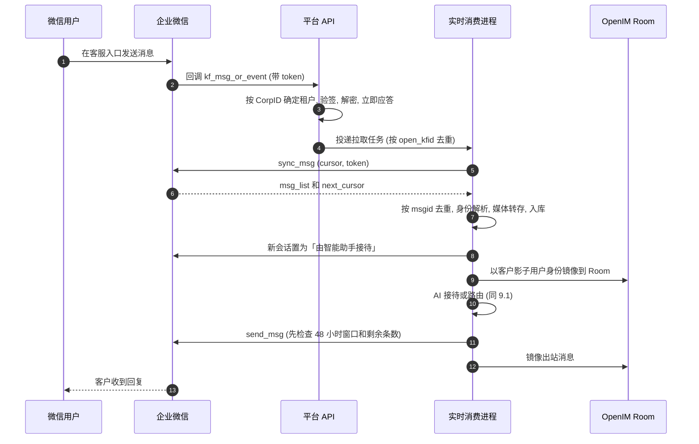

**接入方式（SaaS）**

- 通过代开发应用的「微信客服」权限接入。
- 租户需要在企业微信里把客服账号交给该应用管理（以官方流程为准）。

**入口投放**

欢迎语、员工对外资料、群公告、公众号菜单、小程序、官网等处都可以放客服入口（参见 §4.4）。

**接管模式（推荐）**

- 收到新会话时，平台把它置为"由智能助手接待（1）"。
- 之后 AI 接待和人工接待都在平台内完成，**不把会话转到"由人工接待（3）"**。否则平台就无法再通过 API 发消息。

**混合模式（可选）**

- 部分坐席继续用企业微信客户端接待（状态 3）。
- 这类会话在平台上只读：通过 `sync_msg` 中 origin=5 的消息同步归档，不在平台内回复。

**回复窗口**

- Redis 按 `(open_kfid, external_userid)` 记录客户最后一次发消息的时间，以及之后已发送的条数。
- 工作台的输入框显示「剩余 N 条 / 截止 hh:mm」。额度用完后，输入框禁用并给出提示。
- AI 的回答合并成一条发送；转人工的过渡话术尽量与最后一条回答合并。
- 可以用菜单消息引导客户点选。客户点选会产生一条客户消息，从而重置回复额度。这一点需要 POC 验证。

**欢迎语**

收到 `enter_session` 事件后，用事件响应接口发送欢迎语。`welcome_code` 只在短时间内有效，而且只能使用一次。

**客户资料**

- 通过 `kf/customer/batchget` 获取客户的昵称、头像，以及 unionid（如果已绑定）。
- unionid 可以用来和客户联系、公众号、小程序体系打通客户身份。

**消息类型**

文本、图片、语音、视频、文件、图文、小程序、菜单消息（可以做成"转人工""满意度"按钮）、位置。

### 10.4 企业微信 · 客户联系与客户群（P2）

| 功能 | 方案 |
|---|---|
| 客户同步 | 授权后按员工全量拉取外部联系人，再批量获取详情；之后通过 `change_external_contact` 回调（添加、编辑、删除）增量同步。写入客户档案和 Identity。如果添加人是平台坐席，就作为客户的默认归属坐席 |
| 新客户欢迎语 | 收到添加客户事件后，发送欢迎语，附带「AI 客服」入口（微信客服链接）。有时间窗口，并且与后台已配置的欢迎语互斥，以官方为准 |
| 标签 | 企业标签双向同步：平台上打的标签会写回企业微信 |
| 客户群 | 同步群列表和成员，通过 `change_external_chat` 回调增量更新；把群和客户档案关联起来，在客户 360 视图中展示 |
| 建群 | 服务端不能直接建客户群，有两种方式：① 在侧边栏用 JS-SDK `openEnterpriseChat` 一键发起建群（客户 + 接单员），由员工确认；② 平台配置"加入群聊"二维码（可以满员后自动建新群），用于活动入群 |
| 给客户发消息 | 不能通过 API 直发，有两种方式：① 平台创建群发任务，员工或群主在企业微信确认后发出，平台回收发送结果；② 在侧边栏由员工点击后通过 JS-SDK 发送 |
| 员工登录 | 员工在企业微信内打开 H5 时免登；在电脑上可以用企业微信扫码登录控制台。同时完成"平台员工 ↔ 企业微信成员"的绑定 |
| 内部通知 | 通过应用消息推送给员工，例如新排队、转人工请求、转接请求、知识更新摘要 |
| 归属转移 | 平台上的客户转移可以联动在职继承和离职继承（见 §14.3） |

### 10.5 聊天工具栏侧边栏（P2 基础 / P3 接入 AI）

- **运行位置**：员工企业微信客户端的单聊和客户群聊天窗口右侧（H5 页面，使用 JS-SDK，需要先调用 `agentConfig`）。
- **获取上下文**：单聊用 `getCurExternalContact` 取当前客户；客户群用 `getCurExternalChat` 取当前群。平台据此加载客户档案，并校验当前员工的数据范围。
- **功能**：
  - 客户档案与标签（可以编辑）。
  - 该客户在微信客服和 Web 的历史会话摘要。
  - AI 推荐回复（P3）、知识检索、快捷话术。
  - 一键建群（`openEnterpriseChat`）。
  - 一键发送到当前聊天（`sendChatMessage`）。
- **记录**：通过侧边栏发出的内容写入平台（渠道记为 `wecom_sidebar`），同时作为坐席采纳 AI 建议的反馈数据。
- **限制**：JS-SDK 读不到聊天内容，侧边栏不知道客户在群里说了什么。生成建议回复时，需要员工把客户的问题粘贴或输入到侧边栏；AI 再结合客户档案，以及该客户在微信客服和 Web 的历史，给出建议。

### 10.6 会话存档与数据与智能专区（可选）

- **SaaS（方案 A 的可选增强）**：
  - 租户购买会话存档，为「存档账号」开通。
  - 平台在专区内部署分析程序，做群聊摘要、情绪、质检和知识候选抽取，只取回结果。
  - 需要 POC 验证：
    - 专区可用的模型和资源。
    - 能否输出"泛化后的问答候选"。
    - 延迟和费用。
- **私有化（方案 B）**：
  - 使用企业自建应用 + 经典 C SDK，每 1–5 分钟按 seq 增量拉取。
  - 用 RSA 私钥解密后入库，私钥放在 KMS 或密钥管理系统中。
  - 可以只给担任群主的存档账号开通。

### 10.7 后续渠道（P5）

| 渠道 | 官方方式 | 需要关注的约束 |
|---|---|---|
| WhatsApp | WhatsApp Business Platform（Cloud API） | 24 小时客服窗口；窗口外只能发已审核的模板消息；按消息计费 |
| Telegram | Bot API（Webhook） | 用户需要先主动与机器人对话；在群里使用需要先把机器人拉进群 |
| 飞书 | 开放平台的机器人 / 服务台 | 主要面向飞书用户（含外部联系人），和面向 C 端的微信场景不同 |
| 钉钉 | 开放平台的机器人 / 服务群 | 同上 |

新增一个渠道，只需要实现一个 `ChannelAdapter` 并补充配置页面，不需要改动会话、AI 和知识模块。

---

## 11. AI 接待与人工介入

### 11.1 AI 回复流水线


**模型可以使用的工具**（只读或低风险；写入类工具只生成等待员工处理的草稿或待办）：

| 工具 | 作用 |
|---|---|
| `search_knowledge(query, filters)` | 当模型认为首轮检索的资料不足时，进行二次检索 |
| `get_customer_profile()` | 读取当前客户的档案摘要，不含敏感字段 |
| `save_lead_info(fields)` | 前期接待时登记线索。只能写当前客户的白名单字段，标记来源为 AI，由坐席确认 |
| `request_human_handoff(reason, category, urgency, summary)` | 请求转人工，交给决策引擎裁决 |
| `create_todo(type, title, detail, fields, expected_time, urgency)` | 登记需要员工线下处理的事，如回电、开票、退换货（§24.4）。只能使用租户启用并开启了 AI 登记的类型；登记后进入待确认页，由人工确认；服务端校验字段和频率，并合并重复。原来的 `create_ticket`（留言建单）并入它的"留言"类型 |
| `lookup_todos()` | 查询当前客户的待办进度，只读 |
| `search_products(query)` | 在商品库中检索商品（§25.2）。只返回对客可见的字段，不含成本价和备注；只读 |
| `create_order_draft(items, receiver, delivery, remarks, confirm_message_id)` | 客户确认后提交订单，进入待审核（§25.3）；单价由服务端取建议零售价 |
| `lookup_order(order_no?)` | 查询当前客户本人的订单状态和物流；对接企业系统后可以实时查询，只读 |

**系统提示词要点**

- 设定身份和语气（每个租户可以配置自己的 AI 客服名称和话术风格）。
- 只依据提供的资料作答。资料里没有时，明确说不知道，并调用转人工。
- 不承诺价格、赔付或法律结论。
- 登记待办和提交订单时，只使用配置的承诺话术，不自行承诺处理时间、价格、库存和结果。
- 不透露内部信息。
- 遵守渠道格式约束，例如纯文本渠道不使用 Markdown。

### 11.2 转人工决策引擎

| 类型 | 信号 | 默认处理 |
|---|---|---|
| 硬触发 | 客户明确要求人工（关键词 + 意图识别，如"转人工""找客服"） | 立即转 |
| 硬触发 | 模型调用了 `request_human_handoff` | 立即转 |
| 硬触发 | 敏感类别：投诉、退款/赔偿、法律、安全、隐私删除请求 | 立即转 |
| 硬触发 | 客户是 VIP，或有专属坐席且策略要求人工接待 | 立即转 |
| 硬触发 | 后置护栏连续两次不通过 | 立即转 |
| 软信号 | 检索的最高相关度低于阈值（知识缺失） | +0.4 |
| 软信号 | 模型自评置信度低 | +0.3 |
| 软信号 | 负面情绪或情绪升级（情绪分类） | +0.3 |
| 软信号 | 重复提问：与上一轮问题的语义相似度高于阈值，达到 2 次 | +0.3 |
| 软信号 | 客户否定了回答（"没用""不是这个意思"） | +0.2 |
| 软信号 | AI 接待超过 N 轮仍未解决 | +0.2 |

- **判定规则**：
  - 软信号加权得分 ≥ 阈值（默认 0.6）时转人工。
  - 初始权重是经验值，上线后根据标注数据调整；可以按租户和渠道分别配置。
- **判定留痕**：
  - 每次判定都写入 `ai_decisions`，包括各信号、得分和结果。
  - 管理后台可以查看"误转"和"漏转"的样本，用来调参。
  - 这也是知识缺口的主要来源（见 §12.4）。
- **转接时对客户**：发送过渡话术，例如「这个问题我帮您转给人工客服，请稍候」，并告知排队位置和预计等待时间。

### 11.3 排队与分配策略

分配按以下顺序进行（可配置）：

1. **专属坐席优先**：客户有归属坐席，且该坐席在线、并发未满时，直接分配给该坐席。企业微信场景里，归属坐席通常就是添加该客户的员工。
2. **技能组匹配**：按渠道账号的默认技能组分配；或者按 AI 识别出的意图（售前、售后、技术、投诉）映射到技能组。
3. **组内负载均衡**：优先分配给"当前会话数 / 最大并发数"最低的坐席；相同时，选空闲最久的坐席。
4. **排队**：没有坐席可接时，进入技能组队列。
   - 优先级：VIP > 情绪激动或投诉 > 普通。同一优先级按等待时间排序。
   - 向客户推送排队位置。
5. **溢出与兜底**：
   - 等待超过 X 分钟，溢出到备用技能组。
   - 非工作时间或等待超时，转为"留言"类待办（§24），指派给归属坐席或技能组次日跟进。
   - 等待期间，AI 可以继续回答客户的其他问题（可配置）。

**坐席提醒**

- 分配或转人工时，除了工作台信令，还通过企业微信应用消息提醒坐席。
- 坐席点击提醒，在企业微信内打开 H5 工作台直接回复。

**坐席状态**

- 状态分为在线、忙碌（不接新会话）、小休、离线。
- 登录工作台后自动上线。
- 断线超过 N 分钟后自动离线，已分配但尚未接起的会话退回队列。

### 11.4 坐席 AI 助手（Copilot）

人工接待期间，AI 只对坐席可见。它同时出现在坐席工作台和企业微信侧边栏里，提供以下能力：

- **转接摘要**：客户的诉求、已经提供的信息、AI 已回答的内容、客户情绪。
- **推荐回复**：基于知识库和上下文，生成 1–3 条候选。坐席一键插入后可以编辑，不会自动发给客户。
- **知识检索**：在侧边栏搜索知识库，结果可以一键插入。
- **实时提醒**：情绪升级、出现敏感信息、坐席使用了承诺类话术时给出提示。
- **待办与订单**：识别到需要跟进的事或购买意向时，提示坐席"生成待办""生成订单"，并根据选中的消息预填（§24.3、§25.3）。
- **会话小结**：会话结束时自动生成小结和标签，坐席确认后写入客户档案。
- **采纳反馈**：记录每条建议是"采纳""修改后采纳"还是"忽略"，用于优化知识和提示词。

### 11.5 LLM 网关与模型选择（国内大模型）

**统一接口**：`chat()`（支持工具调用、结构化输出、流式）、`embed()`、`rerank()`。

**横切能力**：

- 超时重试与供应商降级（主力供应商故障时切到备用供应商）。
- 按租户记账、配额和并发上限；可选由租户自带 API Key。
- Token 和成本记账（写入 `llm_calls`，汇总进用量计量）。
- 提示词版本管理。
- 调用前 PII 脱敏，日志脱敏。
- 内容安全：输入和输出都要经过内容安全检查（供应商内容安全接口 + 平台敏感词库）。

**供应商**

- DeepSeek、通义千问（阿里云百炼）、智谱 GLM、豆包（火山方舟）、Kimi 等，都通过 OpenAI 兼容协议接入，用同一个适配器。
- 需要私有化时，用 vLLM 部署开源模型（如 Qwen、DeepSeek）。
- 只使用已完成生成式人工智能服务备案的模型（见 §3.3）。

**各场景的模型建议**

| 场景 | 要求 | 建议 |
|---|---|---|
| 接待回答 | 低延迟、支持工具调用、中文质量好 | 评测后选定的主力模型 |
| 分类、情绪、改写 | 高并发、低成本 | 同一供应商的轻量模型 |
| 转接摘要、会话小结 | 质量稳定 | 主力模型 |
| 知识抽取（离线批量） | 长上下文、结构化输出、低成本 | 主力模型，走供应商的批量接口（如有）或在夜间限速运行 |

**其他**

- **能力标签**：每个模型都登记能力标签（工具调用、JSON Schema、上下文长度、批量接口），网关按场景需求选择可用的模型。
- **模型选型用评测说话**：
  - P3 开始前，用种子租户真实的 200–500 条历史问答建立评测集。
  - 评测指标包括：准确率、拒答正确率、转人工正确率、延迟、成本。
  - 候选模型跑同一套评测后再做决定。

### 11.6 AI 安全与护栏

- **输入不可信**：客户输入一律视为不可信数据，需要防范提示词注入。
  - 手段：系统提示隔离、工具权限最小化、输出过滤。
  - AI 的写入只有三类：当前客户的线索字段草稿、待办、订单草稿，都要员工确认或审核后才对客户生效。AI 不能改价，不能确认或取消订单，也不能修改或关闭待办。写入类工具在服务端重新校验参数，并有频率上限（§24.4、§25.3）。
  - 成本价从不进入模型的上下文；套价识别和回复检查见 §25.2。
- **内部资料在检索层过滤**：`visibility=internal` 的知识永远不进入对客 AI 的上下文，而不是靠提示词让模型"不要说"。
- **租户隔离**：检索、客户资料、上下文组装全部按租户过滤，AI 永远拿不到其他租户的数据。
- **内容过滤**：输入和输出都做敏感词过滤；检测价格、赔付、时效等承诺类话术。登记待办或提交订单的那一轮，回复中的承诺必须与配置的话术一致。
- **AI 标识**：AI 回复要显式标识。Widget 气泡上标注"AI 助手"，纯文本渠道加可配置的前缀。
- **脱敏**：调用模型前，把手机号、身份证、银行卡、地址等替换为占位符；必要时在回复中还原。

---

## 12. 企业知识库与知识沉淀闭环

### 12.1 知识模型

- **知识空间**：按产品线或部门划分。空间内有分类树和标签。每个租户的知识库完全独立。
- **知识类型**：
  - **FAQ**：标准问题 + 多个相似问法 + 答案（可以包含图片、链接、小程序卡片）。这是客服场景的主力。
  - **文档**：产品手册、政策制度等（PDF、Word、Markdown、网页），解析后切片。
  - **话术**：坐席的快捷回复模板，可以带变量。
- **属性**：
  - 状态：草稿 → 待审核 → 已发布 → 已归档。
  - 版本。
  - 可见范围：对客 AI 可用 / 仅坐席可见 / 仅管理员可见。
  - 生效和失效时间，用于活动、价格类知识。
  - 来源：手工录入 / 导入 / 对话沉淀。
  - 负责人和引用证据。
- **冷启动**：支持从 Excel 批量导入 FAQ、上传文档，以及抓取官网帮助中心。

### 12.2 检索设计

- **切片**：
  - 文档按标题层级加语义切分，每片 300–800 字，重叠 10–15%。每个切片保留标题路径作为上下文前缀。
  - FAQ 把标准问和每个相似问分别向量化，因为"问题对问题"的匹配最准。答案单独存储。
- **向量**：
  - bge-m3 同时产出稠密向量（1024 维，使用 pgvector HNSW 索引）和稀疏词权重（`sparsevec`），不需要额外的中文分词插件就能做混合检索。
  - 注意：HNSW 索引对稀疏向量的非零元素数有上限（1000），所以切片长度需要控制。
- **查询流程**：
  1. 问题改写。
  2. 稠密检索和稀疏检索各取 Top-50。
  3. 用 RRF 融合结果。
  4. 用 bge-reranker 重排，取 Top-5。
  5. 用相关度阈值判断"有没有相关知识"。
- **过滤**：租户、空间、可见范围、有效期、渠道，全部在 SQL 层过滤。pgvector 0.8 的迭代索引扫描能保证过滤之后仍有足够的召回数量。

### 12.3 数据来源（按方案 A）

| 来源 | 能否进入沉淀流水线 |
|---|---|
| Web 访客会话 | ✅ 全量 |
| 微信客服会话 | ✅ 全量 |
| 企业微信侧边栏发出的消息 | ✅ 员工回复，以及被采纳的 AI 建议 |
| 客户群里客户直接发的消息 | ❌ 默认不采集；启用专区后，只有专区内抽取出的结果（需 POC）；方案 B 可以全量采集 |
| 手工录入、文档导入 | ✅ |

### 12.4 沉淀流水线（R3 / R8 的核心）

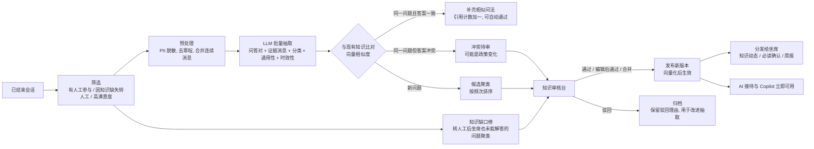

**抽取输出示例（结构化）**

```json
{
  "qa_pairs": [
    {
      "question": "订单发货后多久能到？",
      "answer": "一般 2–3 天送达，偏远地区 5–7 天，可在「我的订单」查看物流。",
      "evidence_message_ids": ["m_01J8...", "m_01J8..."],
      "category": "物流",
      "generalizable": true,
      "time_sensitive": false,
      "confidence": 0.86
    }
  ],
  "unresolved_questions": ["能否开具电子专票？"]
}
```

**要点**

- **只抽取可泛化的知识**：客户个人信息和个案细节必须剔除。有三道关口：先脱敏再抽取；提示词约束；审核时二次检查。
- **不跨租户**：抽取、比对、聚类都只在同一个租户内进行，任何知识都不会流入其他租户。
- **运行方式**：抽取按天批量运行，成本低，也便于安排审核。每条候选都记录抽取时使用的提示词和模型版本，方便追溯。
- **优秀话术挖掘**：从高满意度的会话中，提取坐席的高质量回复，作为话术候选。

### 12.5 审核与发布

- **审核台**：
  - 候选按"影响度 = 出现频次 × 近期趋势"排序。
  - 展示内容：候选本身、相似的现有知识、差异高亮、证据对话（已脱敏）。
- **审核操作**：通过 / 编辑后通过 / 合并到已有知识 / 标记为仅坐席可见 / 驳回（需填写理由）。
- **版本管理**：
  - 每次发布都产生新版本，可以回滚到任意历史版本。
  - 有效期到期后自动下线，并提醒负责人。
- **自动通过规则**（可选，默认关闭）：只适用于"给已有 FAQ 增加相似问法"，且要求证据 ≥3 条、相似度 ≥ 阈值。

### 12.6 分发给坐席（R8）

- **知识动态**：工作台的"知识动态"流按技能组推送新增和变更的知识。
- **必读确认**：政策、价格等重要变更可以设为"必读"，坐席需要确认已读，管理员可以查看确认率。
- **始终最新**：推荐回复和知识检索（工作台和侧边栏）始终基于最新发布的版本。
- **知识周报**：每周通过站内信和企业微信应用消息发送，内容包括新增知识、热门问题、知识缺口 Top 10。
- **快捷话术**：快捷话术库随知识更新同步。

### 12.7 知识运营指标

- **AI 效果**：AI 独立解决率、知识命中率、转人工原因分布。
- **知识缺口**：缺口数量、缺口关闭时长。
- **沉淀质量**：候选通过率、坐席对 AI 建议的采纳率。
- **单条知识**：点赞/点踩、关联的满意度、长期未被命中的"僵尸"知识。

---

## 13. 权限与客户数据隔离（R6）

### 13.1 角色与数据范围

| 层级 | 角色 | 功能权限 | 数据范围 |
|---|---|---|---|
| 平台 | 平台运营 | 租户、套餐、用量、供应商配置 | 不直接访问租户业务数据（需要授权并审计） |
| 租户 | 租户管理员 | 员工、技能组、渠道、路由、知识库、报表、客户分配 | 本租户全部客户和会话 |
| 租户 | 主管（可选，P1 预留） | 所辖团队的监控、转接和质检 | 本团队坐席的客户和会话 |
| 租户 | 坐席 | 接待客户、查看和编辑自己的客户档案、发起转接、搜索知识 | 自己的客户 + 当前分配给自己的会话 |
| 租户 | 知识管理员（作为权限点授予） | 知识审核、发布 | 知识库 + 证据对话（已脱敏） |

权限用"权限点"组合成角色，例如 `customer:read`、`customer:export`、`kb:publish`、`session:transfer:any`，便于日后自定义角色。待办与订单的权限点见 §24.8 和 §25.7，数据范围与客户一致。

### 13.2 坐席的可见性规则

- **能看到哪些客户**：`owner_id = 我` 的客户，加上当前有会话分配给我的客户。后者只在服务期间临时可见，但能看到完整历史。
- **会话结束后**：如果客户不归属于我，就不再可见。可以配置保留 N 小时，方便补写小结。
- **敏感字段**：手机号等字段默认掩码展示（如 `138****1234`），拥有 `customer:view_sensitive` 权限才能看到完整内容。
- **导出**：坐席不能导出客户。租户管理员导出需要二次确认，并记录审计日志。

### 13.3 实现：四层防护

1. **租户层**：
   - 所有租户表都启用 PostgreSQL RLS：每个请求在事务内执行 `SET LOCAL app.tenant_id`。
   - 从根本上防止跨租户泄露。
2. **应用层**：
   - 所有客户、会话、消息的查询，都必须经过统一的 `DataScope` 依赖注入过滤条件。这一点在仓储层强制执行，禁止裸查询。
   - 配套"越权"自动化测试，覆盖列表、详情、消息、搜索、附件下载、导出。测试两件事：坐席 A 通过任何 API 都拿不到坐席 B 的客户；租户甲通过任何 API 都拿不到租户乙的数据。
3. **IM 层**：
   - 坐席只是自己负责的 Room 的群成员，实时消息天然隔离。
   - 转接后，旧坐席被移出 Room。前端使用不落盘的 SDK，旧坐席的电脑上不会残留聊天记录。
4. **企业微信侧边栏**：用企业微信返回的当前员工身份和当前会话，再叠加平台的数据范围做双重校验，只返回该员工有权看到的客户数据。

**附件下载**：先校验数据范围，再签发短时有效的签名 URL，不直接暴露对象存储地址。

---

## 14. 转接与客户归属（R7）

### 14.1 三种操作

| 操作 | 含义 | 发起人 | 效果 |
|---|---|---|---|
| 会话转接 | 把"当前这次对话"交给另一位坐席或技能组 | 坐席、主管、管理员 | 新坐席接手本次会话；客户归属不变（可以勾选"同时转移归属"） |
| 客户转移 | 永久变更客户的归属坐席 | 管理员（坐席可以申请，由管理员审批） | 原坐席失去该客户的可见性；支持批量操作；记录归属历史 |
| 邀请协助（P3） | 邀请其他坐席或主管进入会话协助，不转移会话 | 坐席 | 形成三方会话，协助者可以只读，也可以发言 |

**离职交接**就是批量客户转移：按规则分配给指定坐席，或平均分配给技能组。

### 14.2 会话转接流程

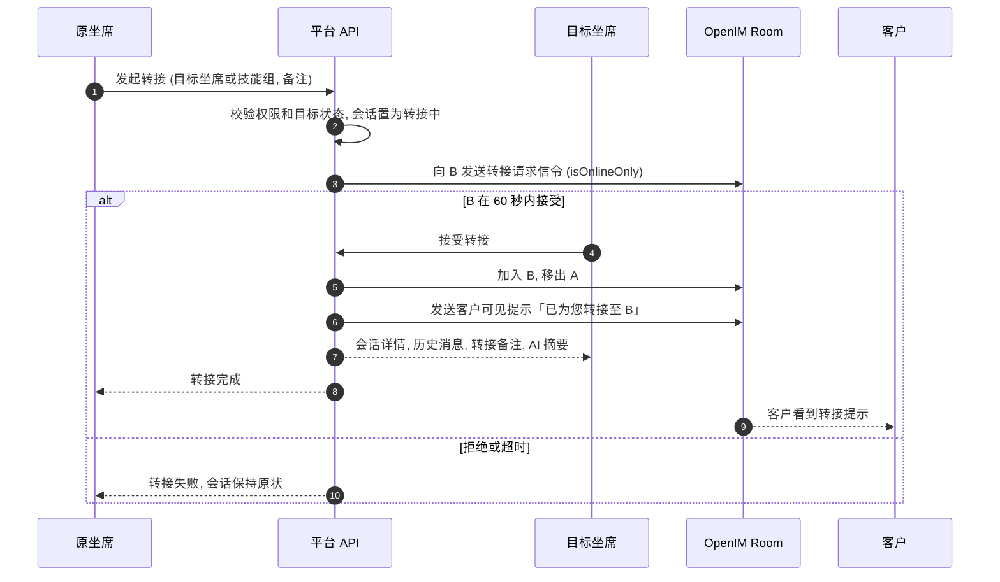

- **转给技能组**：走 §11.3 的分配逻辑，不需要对方接受确认。
- **强制转接**：管理员可以强制转接，不需要对方接受。
- **记录与统计**：所有转接都写入 `session_events`，报表可以统计转接率和转接原因。

### 14.3 与企业微信联动

- **微信客服会话**：转接只在平台内部发生，企业微信侧无感知。
- **客户联系的外部联系人**：
  - 如果客户转移需要同步变更企业微信里的"添加人"，调用在职继承或离职继承接口。
  - 平台需要向操作人提示限制：90 天内每位客户最多被转接 2 次；24 小时后自动接替。
  - 转接结果异步回收。失败时，保留平台内的转移，并标记"企业微信未同步"。
- **客户群**：如果员工离职或调岗，可以把其作为群主的客户群一并转给接替的员工（以官方接口为准）。

---

## 15. 数据模型（PostgreSQL 关键表）

**通用约定**

- 除平台级表外，所有表都含 `id`（UUIDv7）、`tenant_id`、`created_at`、`updated_at`，并启用 RLS。
- 手机号、密钥等敏感字段用租户级数据密钥加密。
- `messages` 表按月分区；`kb_chunks` 按租户哈希分区。
- 待办和订单引用对话消息时只保存消息 ID（`evidence_message_ids`），不建外键（消息表是分区表）。

| 模块 | 表 | 关键字段 |
|---|---|---|
| 平台与租户 | `tenants`（平台级） | code, name, status, plan_id, settings, created_by |
| | `plans`（平台级） | name, limits(jsonb), price |
| | `subscriptions` | plan_id, period_start, period_end, status |
| | `usage_records` | metric(seats/ai_sessions/tokens/storage/...), date, quantity |
| | `tenant_keys` | key_ref, wrapped_key（信封加密） |
| | `platform_users`（平台级） | 运营人员账号，与租户员工分开 |
| 组织与权限 | `staff` | name, email, phone_enc, password_hash, wecom_userid, im_user_id, status |
| | `roles` / `role_permissions` / `staff_roles` | 用权限点组合出角色；`roles.console`（v0.9，§25.15）：自定义角色选择的岗位 |
| | `teams` / `skill_groups` / `skill_group_members` | 主管团队、技能组 |
| | `agent_settings` | staff_id, max_concurrency, status(online/busy/away/offline), status_changed_at |
| 客户 | `customers` | display_name, avatar, phone_enc, email, company, level, owner_id, owner_since, custom_fields(jsonb), lead_fields(jsonb), first_contact_at, last_contact_at |
| | `customer_identities` | customer_id, channel, channel_account_id, external_id, unionid, im_user_id, profile(jsonb), verified；唯一键 (tenant_id, channel_account_id, external_id) |
| | `customer_owner_history` | customer_id, from_owner, to_owner, reason, operator_id, wecom_sync_status |
| | `tags` / `customer_tags` / `customer_notes` | 标签字典（与企业微信企业标签同步）、客户标签、备注 |
| 渠道 | `channel_accounts` | type(web/wecom_kf/wecom_contact/...), name, config_enc(jsonb), routing_policy_id, status |
| | `channel_cursors` | channel_account_id, cursor, updated_at（sync_msg 游标等） |
| 会话 | `rooms` | customer_id, identity_id, channel_account_id, im_group_id, last_message_at |
| | `sessions` | room_id, customer_id, status, assignee_id, skill_group_id, started_at, first_response_at, handoff_at, human_joined_at, closed_at, close_reason, handoff_reason, ai_summary, csat, resolved |
| | `session_events` | session_id, type(created/ai_reply/handoff/queued/assigned/transfer_*/closed…), actor_id, payload(jsonb) |
| | `messages`（按月分区） | room_id, session_id, direction, sender_type(customer/agent/bot/system), sender_id, content_type, content(jsonb), text_plain, channel_msg_id, im_msg_id, client_msg_id, delivery_status；唯一键 (channel_account_id, channel_msg_id) |
| | `routing_policies` | mode(ai_first/human_first), business_hours, default_skill_group_id, overflow_rules, max_wait_seconds |
| | `tickets` | 留言（v0.3 起并入 `todos` 的"留言"类型，数据迁移后下线） |
| AI | `ai_decisions` | session_id, message_id, signals(jsonb), score, decision |
| | `llm_calls` | scene, provider, model, input_tokens, output_tokens, latency_ms, cost, status, session_id |
| | `prompt_templates` | scene, version, content, is_active（平台默认 + 租户覆盖） |
| | `ai_suggestions` | session_id, source(workbench/sidebar), content, sources, adoption(adopted/edited/ignored) |
| 知识 | `kb_spaces` / `kb_categories` | 知识空间、分类树 |
| | `kb_items` | space_id, type(faq/doc/snippet), title, answer/content, visibility, status, version, valid_from, valid_to, source, owner_id, stats(jsonb) |
| | `kb_item_versions` | 历史版本快照 |
| | `kb_questions` | item_id, question, is_primary（标准问与相似问） |
| | `kb_documents` | 原始文件、解析状态 |
| | `kb_chunks`（按租户哈希分区） | item_id 或 document_id, content, embedding vector(1024), sparse sparsevec, metadata(jsonb) |
| | `kb_candidates` | cluster_id, question, answer, evidence_message_ids, frequency, matched_item_id, suggestion(new/merge/conflict), status, reviewer_id, review_note, extractor_version |
| | `kb_gaps` | 问题聚类、频次、状态 |
| | `kb_feedback` / `kb_acks` | 点赞点踩、必读确认 |
| 企业微信 | `wecom_authorizations` | corp_id, auth_type(代开发/第三方), permanent_code_enc, agent_id, scopes, status, authorized_at |
| | `wecom_kf_accounts` | open_kfid, name, channel_account_id |
| | `wecom_contacts` / `wecom_follow_users` | 外部联系人及其添加人（客户联系同步） |
| | `wecom_group_chats` / `wecom_group_members` | 客户群及成员，关联客户档案 |
| | `wecom_zone_results`（可选） | chat_id, type(summary/sentiment/qa_candidates), payload(jsonb) |
| 待办（v0.3） | `todo_types` | code, name, ai_hint（给 AI 的说明）, examples, fields(jsonb 字段定义), assign_rule(jsonb), priority, sla_response_minutes, sla_resolve_minutes / sla_resolve_days, remind_before_minutes, escalate_after_minutes, ai_enabled, handoff, notify_supervisor, promise_text, done_template, preset, enabled |
| | `todos` | no, type_id, title, detail, fields(jsonb，敏感字段加密), customer_id, session_id, order_id, source(ai_chat/ai_summary/zone/copilot/sidebar/staff/visitor/rule/api), confidence, evidence_message_ids, priority, status(pending/open/in_progress/waiting/done/cancelled/rejected), assignee_id, skill_group_id, due_at, respond_due_at, first_response_at, confirmed_at, closed_at, result, reject_reason, nudge_count, dedupe_key, external_ref（企业系统的单号，租户内唯一，同一个单号重复创建返回原待办）, created_by_type, created_by |
| | `todo_events` | todo_id, type(created/confirmed/rejected/assigned/claimed/started/waiting/resumed/commented/reminded/escalated/customer_notified/merged/done/cancelled/reopened…), actor_type(ai/staff/system/api/visitor), actor_id, payload(jsonb) |
| | `todo_extractions` | session_id, status, created, skipped（会话结束后的解析，每个会话一次） |
| 订单（v0.3） | `products` | code（租户内唯一）, name, model, spec, category, image_url, cost_price（仅有权限可见，不进入 AI）, retail_price, remark, aliases, status, terms（检索词）, embedding；库存（v0.6，§25.12）：stock（现有库存，为空表示不管理库存）, stock_alert（预警值）；仓库（v0.7，§25.13）：kind(goods/material，创建后不能修改), unit, ready_made（现货），stock 与 stock_alert 改为最多三位小数；联想（v1.0，§25.16）：search_key（检索键：各字段统一写法后的内容，名称和俗称的全拼与拼音首字母） |
| | `product_materials`（v0.7） | product_id（成品）, material_id（材料）, quantity（每一件成品的用量）, sort |
| | `stock_documents`（v0.7） | kind(requisition/receipt), no（LL/RK + 日期 + 序号）, status(pending/confirmed/rejected/voided), order_id（可以为空）, note, created_by, submitted_at, confirmed_by/at, rejected_by/at, reject_reason, voided_by/at, void_reason |
| | `stock_document_lines`（v0.7） | document_id, product_id, code/name/spec/unit（开单时的快照）, planned（按配方或订单算出的建议数量）, quantity, stock_before/stock_after（确认时） |
| | `product_imports` | 上传的文件、状态、逐行校验结果（rows）、新增/更新/跳过的数量，确认人 |
| | `product_gaps` | term, sample, count, first_seen_at, last_seen_at, resolved_at（客户问到、商品库里没有的商品） |
| | `orders` | no, status(draft/pending_review/confirmed/fulfilling/shipped/completed/cancelled), source(ai_chat/copilot/sidebar/staff/api), customer_id, session_id, assignee_id, skill_group_id, receiver(jsonb：收货人、电话、地址逐项加密并带掩码), payment_method(online/cod/deposit/credit), deposit_amount, credit_due_date, credit_approved_by, payment_status, items_amount, discount, total, paid_amount, refunded_amount, expected_at, shipping_company, tracking_no, submitted_at, confirmed_at, confirmed_by, shipped_at, completed_at, cancelled_at, cancel_reason, tracking_token, tracking_expires_at, external_no（企业系统的单号，租户内唯一）, version, modified, ai_error, confirm_message_id, evidence_message_ids, customer_note, internal_note, created_by_type(ai/staff/api), review_todo_id, collection_todo_id；加工（v0.5，§25.11）：worker_id, claimed_at, processed_at, processed_by, shortage_at（有缺货的商品时不为空）, ship_todo_id, shortage_todo_id；库存（v0.6）：stock_out_at（商品出库的时间，只扣一次） |
| | `stock_movements`（v0.6） | product_id, kind(import_set/import_add/adjust_set/adjust_add/adjust_remove/untrack/order_out/order_return/api_set，v0.7 增加 requisition/receipt), delta, stock_before, stock_after（为空表示不管理库存）, order_id, import_id, document_id（v0.7）, note, actor_type(staff/api/system), actor_id（只追加） |
| | `order_items` | order_id, product_id（未匹配时为空）, 代码、名称、型号、规格和图片的快照, raw_text（客户原话）, quantity, list_price（建议零售价快照）, unit_price, cost_price 快照（仅有权限可见）, amount；加工（v0.5）：work_status(pending/done/out_of_stock), done_at, done_by, shortage_qty（为空表示整行都缺）, shortage_note, restock_date, shortage_at, shortage_by |
| | `order_payments` | order_id, kind(payment/refund), amount, channel(wechat/alipay/bank/cash/other), paid_at, reference_no（企业系统回传时按它去重）, proof_url, note, recorded_by_type, recorded_by, voided_at, void_reason |
| | `order_revisions` | order_id, version, kind(created/edit/status/payment), actor_type(ai/staff/system/api), actor_id, reason(customer_request/ai_error/price_adjust/substitution/other), note, changes(jsonb), snapshot(jsonb)（只追加，不修改） |
| | `order_events` | order_id, type(submitted/api_created/updated/confirmed/started/shipped/completed/cancelled/paid/refunded/payment_voided/customer_notified/link_regenerated/collection_due/claimed/released/worker_assigned/item_done/item_reopened/shortage/restocked/processed/reprocess…), actor_type, actor_id, payload(jsonb), public（客户在跟踪页能看到的动态） |
| | `tenant_settings.orders`（jsonb） | 编号前缀、必填信息、启用的收款方式和定金尾款规则、发货环节、AI 告知建议零售价、AI 下单与每日上限、草稿跟进、数量与优惠上限、跟踪链接保留天数 |
| | `tenant_settings.console`（jsonb，v0.9，§25.15） | 除管理员以外每个岗位显示的菜单（没有调整时用默认值） |
| | `ai_security_events` | kind(price_probe/reply_blocked), session_id, customer_id, detail(jsonb) |
| 开放接口（v0.3） | `api_keys` | name, prefix（`edp_<prefix>_…` 里用于查找和显示的部分，唯一）, key_hash（SHA-256，完整密钥只在创建时显示一次）, scopes(products:write/orders:read/orders:write/todos:write), last_used_at, revoked_at |
| | `webhook_endpoints` | name, url, secret_enc（签名密钥，租户数据密钥加密）, events（订阅的事件）, enabled |
| | `webhook_events` | event, resource_type, resource_id, data(jsonb), actor_type, dispatched_at（与业务变更同一事务写入的推送发件箱，分发后保留 7 天） |
| | `webhook_deliveries` | endpoint_id, event_id, event, body（按分发时的内容固定，重发不变）, status(pending/succeeded/dead), attempts, next_attempt_at, last_status, last_error, delivered_at |
| 审计 | `audit_logs` | actor_type(platform/staff), actor_id, action, resource_type, resource_id, detail(jsonb), ip |
| | `record_versions`（v0.8，§25.14） | record_type(order/requisition/receipt/todo/goods/material), record_id, seq（每条记录内从 1 开始）, action, actions（同一次操作里的全部动作）, actor_type(ai/staff/system/api/visitor), actor_id, label（单号或名称）, reason, note, snapshot(jsonb：操作后的完整内容，删除时是删除前的；收货信息和敏感字段只有掩码)（只追加，和业务数据同一事务写入） |

---

## 16. 接口概览

```text
# 员工端（JWT，令牌内含 tenant_id）
POST   /api/v1/auth/login  |  /auth/refresh  |  /auth/wecom/oauth
GET    /api/v1/me
PUT    /api/v1/agent/status
GET    /api/v1/sessions?status=&scope=mine|team|all
GET    /api/v1/sessions/{id}  |  /sessions/{id}/messages?before=
POST   /api/v1/sessions/{id}/messages                # 坐席发送（clientMsgId 幂等）
POST   /api/v1/sessions/{id}/accept | close | transfer | return-to-ai
GET    /api/v1/sessions/{id}/copilot/suggestions
GET    /api/v1/customers  |  /customers/{id}      PATCH /customers/{id}
POST   /api/v1/customers/transfer                   # 批量客户转移（管理员）
GET    /api/v1/kb/search?q=
CRUD   /api/v1/kb/items  |  /kb/documents  |  /kb/candidates/{id}/review
CRUD   /api/v1/admin/staff  |  /admin/skill-groups  |  /admin/channels  |  /admin/routing-policies
GET    /api/v1/admin/usage                          # 本租户用量与额度
GET    /api/v1/admin/integrations/wecom             # 企业微信授权状态与向导
GET    /api/v1/reports/*

# 员工端 · 待办与订单（v0.3）
GET    /api/v1/todos?view=pending|mine|pool|assigned|all&status=&type_id=&due=     GET /todos/counts    # 列表与菜单角标
POST   /api/v1/todos                                # 新建（员工新建的直接进入列表）
GET    /api/v1/todos/{id}      PATCH /todos/{id}
POST   /api/v1/todos/{id}/confirm | discard | claim | start | wait | resume | done | cancel | reopen | assign | reschedule | merge | comments | notify | reveal
POST   /api/v1/todos/batch                          # 批量确认、驳回、分派
POST   /api/v1/todos/extract                        # 从选中的消息或粘贴的文字预填（不落库）
POST   /api/v1/todos/export                         # 导出（再次输入密码）
GET    /api/v1/todo-types      CRUD /api/v1/admin/todo-types      GET|PUT /api/v1/admin/todo-settings
GET    /api/v1/orders?view=all|pending_review|processing|awaiting_shipment|out_of_stock|receivable|modified&status=&source=&assignee_id=&customer_id=     GET /orders/counts
POST   /api/v1/orders          GET /orders/{id}     PATCH /orders/{id}    # PATCH 带版本号和修改原因
POST   /api/v1/orders/{id}/submit | confirm | start | ship | complete | cancel | assign | notify | reveal
POST   /api/v1/orders/{id}/payments       POST /orders/{id}/payments/{pid}/void    # 收款、退款记录
GET    /api/v1/orders/{id}/revisions  |  /orders/{id}/revisions/{version}          # 修改记录与版本对比
POST   /api/v1/orders/{id}/tracking-link            # 重新生成跟踪链接
POST   /api/v1/orders/{id}/items/{item_id}/restock  # 客服登记缺货商品到货（v0.5）
GET    /api/v1/products?stock=low|tracked|untracked # 商品列表带现有、占用、可用库存（v0.6）
POST   /api/v1/products/{id}/stock                  # 调整库存：入库、出库、盘点、不再管理（inventory:manage）
GET    /api/v1/products/{id}/stock-movements        # 库存记录
GET|PUT /api/v1/products/{id}/materials             # 成品的配方（v0.7，修改需要 product:manage）
GET    /api/v1/warehouse/items?kind=material|goods  # 材料库存、成品库存（没有价格）
GET    /api/v1/products/suggest?q=&limit=           # 下单时联想上架的成品（v1.0，§25.16；不带 q 时是自己最近用过的）
GET    /api/v1/warehouse/suggest?kind=&q=&limit=    # 开领料单、入库单时联想材料或成品（带库存，不带价格）
GET    /api/v1/warehouse/drafts?kind=&order_id=     # 给订单开单的预填（领料按配方，入库按订单）
GET|POST /api/v1/warehouse/documents                # 领料单、入库单（工人只看自己的和自己加工的订单的）
PUT    /api/v1/warehouse/documents/{id}             # 修改后重新提交（待确认、已退回）
POST   /api/v1/warehouse/documents/{id}/confirm|reject|void # 仓管确认（可按实际数量修改）、退回、作废
GET    /api/v1/warehouse/movements                  # 全部库存记录
GET|PUT /api/v1/warehouse/settings                  # 仓管、单据是否需要确认（修改需要 order:config）
GET    /api/v1/warehouse/orders?q=                  # 在仓库开领料单时可以关联的订单：已确认或处理中、还没加工完成（v0.8；工人只看自己领取的）
GET    /api/v1/warehouse/categories?kind=           # 成品或材料的分类（开单时"批量选择"按分类筛选，v0.8）
GET    /api/v1/history/{record_type}/{record_id}    # 一条记录的修改历史：每个版本的内容和与上一版本的差异（v0.8；能看到这条记录的员工，已删除的需要 audit:read）
GET    /api/v1/history?type=&action=&actor_id=&start=&end=&q=&cursor=   # 全部修改历史，新的在前（audit:read；action=create/delete/change）
GET    /api/v1/transport/key                        # 传输加密的服务器公钥（v0.9，§25.15；生产环境的前端在构建时写入）
POST   /api/v1/transport/handshake                  # 传输加密握手：浏览器的一次性公钥 → 会话号、服务器的一次性公钥、过期时间、签名（按 IP 限流）
GET    /api/v1/tenant/console                       # 每个岗位显示的菜单（v0.9，settings:manage）
PUT    /api/v1/tenant/console
POST   /api/v1/products/imports                     # 导入商品表格，stock_mode=set（盘点）|add（入库）
POST   /api/v1/orders/extract                       # 从选中的消息或粘贴的文字预填（不落库）
POST   /api/v1/orders/export                        # 导出（再次输入密码）
CRUD   /api/v1/products        GET /products/search?q=  |  /products/categories  |  /products/export
GET    /api/v1/products/template                    # Excel 模板
POST   /api/v1/products/imports                     # 上传并预览（逐行校验）
POST   /api/v1/products/imports/{id}/confirm | cancel      GET /products/imports/{id}/result
GET    /api/v1/products/gaps   POST /products/gaps/{id}/resolve    # 商品缺口
GET    /api/v1/orders/settings                      # 员工端需要的订单设置（收款方式等）

# 员工端 · 加工（v0.5，§25.11；production:work，指派需要 production:assign）
GET    /api/v1/production/orders?view=pool|mine|done|all&q=      GET /production/counts
GET    /api/v1/production/orders/{id}                            GET /production/workers   # 可指派的加工人
POST   /api/v1/production/orders/{id}/claim | release | complete | assign
POST   /api/v1/production/orders/{id}/items/{item_id}/done | undo | restock
PUT    /api/v1/production/orders/{id}/items/{item_id}/shortage   # 登记或修改缺货
GET    /api/v1/admin/order-settings   PUT /admin/order-settings
GET    /api/v1/reports/todos  |  /reports/orders    # 待办、订单报表
# 企业系统对接（管理员，integration:manage）
GET    /api/v1/admin/api-keys  POST /admin/api-keys  POST /admin/api-keys/{id}/revoke    # 完整密钥只在创建时返回
CRUD   /api/v1/admin/webhooks  POST /admin/webhooks/{id}/rotate-secret | test           # 签名密钥只在创建、更换时返回
GET    /api/v1/admin/webhook-deliveries?status=pending|retrying|succeeded|dead  |  /admin/webhook-deliveries/{id}
POST   /api/v1/admin/webhook-deliveries/{id}/resend

# 企业微信侧边栏（企业微信免登 → 平台会话）
GET    /api/v1/sidebar/context?externalUserId=|chatId=   # 当前客户或群的档案
POST   /api/v1/sidebar/suggestions                  # AI 建议回复
POST   /api/v1/sidebar/sent                         # 记录员工通过侧边栏发出的内容
GET    /api/v1/sidebar/jssdk-config                 # JS-SDK 签名

# 访客端（渠道 key + 访客签名）
POST   /api/v1/visitor/init                         # 返回 IM token、roomId、Widget 配置
POST   /api/v1/visitor/handoff                      # 点击「转人工」
POST   /api/v1/visitor/rating  |  /visitor/leave-message
POST   /api/v1/visitor/uploads                      # 预签名上传
GET    /api/v1/visitor/orders                       # Widget"我的订单"
GET    /api/v1/visitor/progress                     # 服务进度：自己的待办（可选，默认关闭）
GET    /api/v1/public/orders/{token}                # 订单跟踪页（无需登录，只读，限流）

# 运营后台（平台账号，独立鉴权）
CRUD   /platform/v1/tenants  |  /platform/v1/plans
GET    /platform/v1/usage  |  /platform/v1/health
GET    /platform/v1/ops/webhook-deliveries?status=dead|retrying    POST /platform/v1/ops/webhook-deliveries/resend

# 开放接口（Authorization: Bearer edp_<prefix>_<密钥>，按权限范围授权；每个密钥每分钟 600 次，另计入租户的接口限额）
PUT    /open/v1/products/{code}                     # 同步商品、价格和上下架（products:write）
PUT    /open/v1/products/{code}                     # 同步商品和价格；v0.6 可以带 stock（盘点数，null 表示不再管理）和 stock_alert
GET    /open/v1/orders?updated_since=&cursor=       # 按更新时间增量拉取（orders:read，含明文收货信息）
GET    /open/v1/orders/{ref}                        # ref 是平台订单号或企业系统单号
POST   /open/v1/orders                              # 企业系统创建订单（orders:write；带 external_no 时幂等）
POST   /open/v1/orders/{ref}/status                 # 回传状态、物流和收款（只能前进；收款按 reference_no 去重）
POST   /open/v1/todos          GET /open/v1/todos/{ref}    # 企业系统创建待办（todos:write；带 external_ref 时幂等）
# 平台推送给企业系统（出站）：order.created / order.updated / order.confirmed / order.status_changed / order.cancelled /
# order.payment / todo.done，测试推送为 ping。请求头 X-EDP-Event、X-EDP-Delivery（重发不变，用于去重）、
# X-EDP-Signature: t=<时间戳>,v1=<HMAC-SHA256(签名密钥, "时间戳.正文")>；失败按 1m/5m/15m/1h/3h/6h 重试，共 7 次

# Webhook（仅内网可达或验签）
POST   /hooks/openim/{command}                      # afterSendGroupMsg、beforeCreateGroup、用户上下线
GET    /hooks/wecom/{callbackType}                  # 回调 URL 验证（cmd 为指令回调，data 为数据回调）
POST   /hooks/wecom/{callbackType}                  # 指令回调：授权变更；数据回调：客户联系、客户群、微信客服事件（按 CorpID 路由租户）
```

---

## 17. 前端设计

### 17.1 应用划分

- `apps/console`：员工控制台，包含坐席工作台和租户管理后台，按角色路由。
- `apps/widget`：访客端。以体积为先，独立构建，通过 iframe 嵌入；订单跟踪页（v0.4）也在这里。
- `apps/wecom-h5`：企业微信内的 H5，包含聊天工具栏侧边栏和手机端精简工作台，移动端优先。
- `apps/platform-admin`：平台运营后台，独立域名和登录。
- `packages/im-client`：OpenIM SDK 的封装，负责连接、重连、消息标准化、去重。**这是唯一允许直接引用 OpenIM SDK 的包。**
- `packages/api-client`：由 FastAPI 的 OpenAPI 描述自动生成的类型和请求函数。
- `packages/ui`：共享组件，如消息气泡、富文本、文件预览。

### 17.2 坐席工作台（三栏布局）

| 区域 | 内容 |
|---|---|
| 左栏：会话列表 | 分为"进行中""排队""AI 接待中"（主管可见）"已结束"四个标签；顶部是坐席状态切换（在线/忙碌/小休） |
| 中栏：聊天区 | 顶部显示客户名、渠道、回复窗口（如「剩余 4 条 / 截止 18:30」）；消息流的历史部分走 API，增量部分走 IM；底部是输入框，以及快捷话术、转接、结束按钮 |
| 右栏：辅助面板 | 客户档案与历史会话（含所在企业微信群）、AI 助手（摘要、推荐回复）、知识检索、会话信息（标签、小结）、待办与订单（当前客户的待办和订单，新建或由 AI 预填，§24.9、§25.9） |

### 17.3 租户管理后台

| 模块 | 内容 |
|---|---|
| 数据看板 | 实时排队、在线坐席、AI 解决率、满意度 |
| 员工与角色 | 员工、角色、权限点 |
| 技能组与路由策略 | 技能组、分配规则、工作时间、溢出策略 |
| 渠道接入 | 生成 Widget 嵌入代码、企业微信授权向导、微信客服账号绑定 |
| 客户管理 | 全部客户、批量转移、合并客户、企业微信客户群 |
| 会话监控 | 实时旁听、强制转接 |
| 知识库 | 知识空间、知识条目、文档、审核台、缺口榜 |
| AI 配置 | AI 客服名称与话术风格、提示词、转人工阈值、评测 |
| 待办 | 待办中心（待确认、我的、待认领、全部）、待办类型 |
| 订单与商品 | 订单中心（待审核、应收、修改记录）、商品库（表格模板、上传与预览）、商品缺口、订单设置、企业系统对接（接口密钥、推送地址） |
| 用量与套餐 | 用量、额度、账单 |
| 报表与审计 | 运营报表、审计日志 |

### 17.4 企业微信侧边栏

- **单聊客户**：客户档案、标签、历史会话摘要、AI 建议回复、快捷话术、一键建群。
- **客户群**：群成员与关联客户、群内客户的档案、AI 建议回复、快捷话术。
- **待办与订单**：当前客户的待办和订单；粘贴客户的话，由 AI 预填待办或订单；一键发送订单摘要或完成通知（§24.7）。
- **交互原则**：所有发送都由员工点击触发，平台不在后台替员工发消息。

---

## 18. 安全、合规与审计

- **认证**：
  - 员工使用账号密码登录，或者用企业微信扫码登录、企业微信内免登。
  - Access Token 有效期 15 分钟；Refresh Token 有效期 7 天、轮换使用，存放在 httpOnly Cookie 中。
  - 登录失败达到次数后锁定。
  - 平台运营账号使用独立的登录入口，并强制二次验证。
  - 后续支持 OIDC 和 LDAP。
- **密钥**：
  - 包括 OpenIM 管理员密钥、企业微信服务商凭证与各企业的永久授权码、模型 API Key。
  - 统一放在密钥管理系统中（K8s Secret + 外部 KMS/Vault）。数据库里只存引用或加密值，租户凭证用租户级密钥加密。
- **传输加密**（v0.9，§25.15）：控制台、Widget、运营后台的接口请求和响应在 HTTPS 之外再用 ECDH 握手 + AES-256-GCM 加密，防重放、防篡改；生产环境强制。
- **网络**：
  - OpenIM 的 Webhook 只在内网可达，并附带共享密钥。
  - 企业微信回调需要验签和解密。
  - 对外只暴露网关。
  - OpenIM API 在网关层做路径白名单和限流，管理员接口只允许内网访问。
- **审计**：记录登录、权限变更、客户转移、会话转接、数据导出、知识发布、查看敏感字段，以及平台运营人员对租户数据的任何访问；v0.3 起还记录待办改派、订单改价与取消、收款登记与作废、查看完整收货信息和成本价、接口密钥的创建与撤销。
- **数据生命周期**：
  - 消息保留期可以按租户配置（如 3 年），到期后删除或匿名化。
  - 知识库只保存脱敏后的内容。
  - 支持客户提出的数据查询和删除请求。待办随客户删除；订单中的个人信息清空，商品、金额和收款记录保留用于统计（§25.7）。
  - 租户注销时先导出、再删除，并出具删除记录。
- **隐私告知**：访客首次打开 Widget 时展示隐私提示；与租户签订数据处理协议。
- **合规**：见 §3.2 与 §3.3（开源许可、模型备案与登记、AI 生成内容标识、PIPL、运营资质）。

---

## 19. 非功能需求与部署

### 19.1 目标

| 指标 | 首年目标 |
|---|---|
| 消息端到端投递 | P95 < 500 ms（Web 渠道） |
| AI 首次回复 | P95 < 8 s（含防抖时间，期间显示"正在输入"） |
| 可用性 | 消息链路 99.9%；AI 故障时自动降级为人工接待 |
| 规模 | ≤50 个租户、全平台 ≤1 万同时在线访客、≤300 万条消息/天 |
| 数据可靠性 | PostgreSQL PITR（RPO ≤ 5 分钟）；MongoDB 和 MinIO 定期备份 |

### 19.2 部署

- **开发 / POC**：用 Docker Compose 一键拉起全部组件：OpenIM 官方 compose、PostgreSQL/pgvector、Redis、MinIO，以及平台的各个进程。
- **生产**：
  - 使用国内云上的 Kubernetes。OpenIM 官方提供 K8s 部署方案。
  - 平台 API 和实时消费进程可以水平扩展。
  - PostgreSQL 使用云数据库（主从 + PITR）。
  - 如有需要，Embedding/Rerank 服务部署在 GPU 节点上。
- **域名与网络**：
  - 使用已备案域名的公网 HTTPS，承载 Widget、控制台、企业微信 H5、OpenIM 的 wss 网关和企业微信回调。
  - 把平台的出口 IP 配置为企业微信可信 IP。
- **专属部署**：大客户可以使用独立的命名空间或独立集群，代码与 SaaS 版一致。

### 19.3 可观测性

- **链路追踪**：贯穿"渠道回调 → Redis Streams → 实时消费 → LLM → 投递"全程，所有追踪和指标都带租户维度。
- **核心指标看板**：
  - 排队：排队长度、等待时长。
  - 坐席：在线人数、负载。
  - AI：解决率、转人工率。
  - LLM：延迟、错误率、成本（按租户）。
  - 消息链路：Webhook 延迟、对账补录数。
  - 企业微信：API 错误码分布、授权失效数。
  - 待办与订单：待确认积压、逾期待办、最久未认领的时长、待审核订单积压、逾期应收、套价拦截次数、向企业系统推送失败。
- **告警**：排队超时、LLM 错误率升高、回调积压、对账差异过大、企业微信凭证失效、租户用量异常、待确认积压、待办逾期积压、订单审核积压、订单推送失败。

---

## 20. 代码仓库结构（建议）

```text
EnterpriseDigitalPlatform/
├── backend/
│   ├── pyproject.toml
│   ├── alembic/
│   ├── app/
│   │   ├── main.py
│   │   ├── core/              # 配置、数据库、鉴权、租户上下文、RLS、DataScope、事件总线、日志
│   │   ├── modules/
│   │   │   ├── tenancy/ billing/ iam/ org/ customer/ conversation/ routing/
│   │   │   ├── channels/      # base, web, wecom_kf, wecom_contact, wecom_sidebar, wecom_zone
│   │   │   ├── ai/            # gateway, rag, handoff, copilot, prompts, safety
│   │   │   ├── knowledge/     # ingest, search, extract, review
│   │   │   ├── todos/ orders/  # 待办；订单、商品库与开放接口（v0.3）
│   │   │   └── analytics/ audit/
│   │   ├── integrations/      # openim_client, wecom_client (服务商/代开发), storage, kms
│   │   ├── platform_api/      # 运营后台接口
│   │   └── workers/           # 实时消费、Taskiq 任务、调度
│   └── tests/
├── frontend/
│   ├── apps/console/
│   ├── apps/widget/
│   ├── apps/wecom-h5/
│   ├── apps/platform-admin/
│   └── packages/im-client/ api-client/ ui/
├── deploy/
│   ├── compose/               # 开发环境
│   └── k8s/                   # 生产环境
└── docs/
    └── plans/
```

---

## 21. 分期路线图

参考团队配置：后端 3 人、前端 2 人、测试 1 人；AI 方向可以由后端兼任，或增加 1 人。

**P0 基础（3 周）**

- **交付内容**：
  - 代码仓库与 CI；Compose 开发环境（OpenIM + PostgreSQL + Redis + MinIO）。
  - FastAPI 骨架：配置、数据库、JWT、RBAC、租户上下文与 RLS、DataScope。
  - 租户开通流程与运营后台雏形。
  - 控制台骨架：登录、布局、按角色显示菜单。
  - 技术验证（见下方清单）。
  - **并行启动**：企业微信服务商注册与代开发模板审核；大模型登记/备案评估；OpenIM 商业授权询价。
- **验收标准**：
  - 可以一键启动。
  - 可以开通两个租户，且互相看不到对方的数据。
  - 不同角色登录后看到不同的菜单。
  - 技术验证有结论。

**P1 Web 客服核心（5–6 周，覆盖 R1、R6、R7）**

- **交付内容**：
  - 访客 Widget。
  - Room、Session、消息归档与对账。
  - 路由与排队。
  - 坐席工作台。
  - 客户档案与归属、数据范围权限。
  - 会话转接和客户转移。
  - 租户管理后台：员工、技能组、渠道、客户、会话。
  - 基础报表与用量计量。
- **验收标准**：
  - 访客与坐席可以实时对话。
  - 转接后，新坐席能看到完整历史，旧坐席看不到。
  - 越权测试全部通过（跨坐席、跨租户）。
  - 租户管理员可以看到本租户的全部客户和会话。

**P2 企业微信接入（服务商模式，5–6 周，覆盖 R2）**

- **交付内容**：
  - 代开发授权接入与多企业凭证管理。
  - 客户联系同步：客户、标签、客户群、归属映射。
  - 新客户欢迎语（附 AI 客服入口）。
  - 微信客服接入：收发、回复窗口、媒体。
  - 企业微信免登与 H5 工作台、应用消息提醒。
  - 侧边栏 v1：客户档案、一键建群、快捷话术、发送记录。
  - 在职继承与离职继承联动。
- **验收标准**：
  - 新租户扫码授权后，客户和客户群自动出现在平台。
  - 微信用户通过客服入口咨询，在平台内完成接待。
  - 员工在企业微信里用侧边栏查看客户档案并一键建群。

**P3 AI 接待（5–6 周，覆盖 R3、R4、R5）**

- **交付内容**：
  - LLM 网关（国内模型，按租户计量）。
  - 知识库：FAQ、文档导入、切片、向量化、混合检索。
  - AI 接待，覆盖 Web 和微信客服。
  - 转人工决策引擎和转接摘要。
  - 坐席 Copilot（工作台 + 侧边栏建议回复）。
  - 评测集和 AI 配置后台。
- **验收标准**：
  - 在评测集上，准确率和转人工正确率达到约定阈值。
  - AI 故障时自动降级为人工接待。
  - 超出额度时，按套餐策略处理。

**P4 知识沉淀闭环（4 周，覆盖 R3、R8）**

- **交付内容**：
  - 抽取流水线、去重聚类、审核台、版本管理与发布。
  - 知识缺口榜。
  - 知识动态、必读确认、周报。
  - 反馈指标。
  - 专区 POC（如租户有需求）。
- **验收标准**：
  - 每天自动产出知识候选。
  - 审核发布后，AI 和坐席立即可以使用新知识。
  - 缺口榜可以形成闭环。

**P5 扩展（持续）**

飞书、钉钉、WhatsApp、Telegram 渠道；在线支付；质检；ClickHouse 报表；私有化交付包（方案 B）。

**P6 待办与订单（v0.3 新增，约 6–7 周，覆盖 R9、R10；P4 之后即可开始，与 P5 并行）**

- **交付内容**：
  - 待办：待办类型、待确认页、待办中心、分派与认领、时限提醒与升级、通知客户；留言并入待办。
  - AI：`create_todo`、`lookup_todos`；会话后解析；Copilot 与侧边栏的 AI 预填。
  - 商品库：Excel 模板、上传预览与导入、检索（关键词 + 向量）、商品缺口、成本价保护。
  - 订单：AI 下单流程（`search_products`、`create_order_draft`、`lookup_order`）、审核与跟进、收款方式与收款记录、应收与催收、修改记录与版本对比、订单卡片与通知客户、订单跟踪页与 Widget"我的订单"。
  - 对接：接口密钥、开放接口、事件推送（签名、重试、死信）。
  - 报表、指标与告警；评测集（待办识别、订单字段）。
- **验收标准**：
  - 访客在对话中申请开票，AI 追问必填信息后登记待办，进入待确认页；确认人确认后，处理人立即收到提醒；逾期后升级给主管。员工新建的待办直接进入待办列表。
  - 客户在对话中下单，AI 找到正确的商品和规格，按建议零售价复述确认；提交后处理人审核、确定收款方式并确认，客户收到确认信息和跟踪链接，打开跟踪页能看到最新状态。
  - 改价、改商品后，订单的修改记录里能看到修改人、时间、前后差异和原因。
  - 套价评测中成本价零泄露。
  - 在评测集上，待办识别和订单字段（商品、规格、数量）的准确率达到约定阈值。
  - AI 不能改价、确认或取消订单；越权测试覆盖新接口（跨坐席、跨租户）。
  - 收货信息加密保存、默认掩码，查看和导出都记审计。

**商用上线闸门**（全部满足后才能对外收费）

1. 已购买 OpenIM 商业授权。
2. 企业微信服务商资质与代开发模板上线。
3. 大模型相关的登记/备案手续与 AI 生成内容标识到位。
4. 增值电信业务经营许可、等保测评（按法务和客户要求）。
5. 数据处理协议（DPA）与隐私政策模板。

**P0 技术验证清单**（先做小规模 POC，再定细节）

1. **OpenIM 多租户下的 Room 模型**：在目标规模（10 万个群、频繁的成员变更）下的表现；bot 和系统用户的发送路径（作为群成员发送，还是配置为管理员身份免校验发送）。
2. **OpenIM 回调**：吞吐量、延迟，以及按 seq 对账的可行性。
3. **Widget 集成**：`@openim/client-sdk` 在 iframe Widget 中的体积、断线重连、多标签页行为。
4. **企业微信测试企业**（需要服务商资质）：
   - 代开发授权全流程。
   - 微信客服的接管模式、48 小时 / 5 条额度、菜单消息能否重置额度。
   - 欢迎语里附带客服链接。
   - 侧边栏 JS-SDK（`openEnterpriseChat`、`sendChatMessage`）在客户群中的表现。
5. **中文 RAG 基线**：用种子租户的真实数据，测试 bge-m3 + 候选国内模型的效果。

**排期说明**

- P1 用 Web 渠道打通核心链路，不依赖服务商审核；审核期间并行开发 P2。
- P2 和 P3 相互独立，两个小组可以并行。

---

## 22. 风险与应对

| 风险 | 影响 | 应对 |
|---|---|---|
| 企业微信群内无官方 AI 发言能力 | 与设想的业务流程不一致 | 采用方案 A（微信客服 AI 前台 + 侧边栏辅助）；先与 2–3 个种子租户验证流程是否可接受 |
| 服务商资质与代开发模板审核周期 | P2 延期 | P0 启动申请；P1 先做 Web 渠道 |
| 专区能力不确定 | 群聊分析无法实现或成本过高 | 只作为可选增强，先 POC，不作为主链路依赖；强需求客户走方案 B |
| 选择方案 C 的风险 | 封号、全部租户同时中断、法律责任 | 本设计不采用；如需评估，由公司法务单独决策 |
| OpenIM Web SDK 是 GPL/AGPL | 未授权即商用有合规风险 | 已决定商用前购买授权（上线闸门）；IM 调用收敛到 `packages/im-client` |
| 多租户"吵闹邻居" | 单个租户拖慢全平台 | 按租户限流、配额、分区消费；大租户可专属部署 |
| 跨租户数据泄露 | 严重安全事故 | RLS + 应用层 DataScope + 跨租户越权自动化测试 + 审计 |
| AI 幻觉或错误承诺 | 客诉和合规风险 | 只依据知识作答 + 检索阈值 + 护栏 + 决策引擎 + 人工审核知识库 + 评测回归 |
| 合规（备案/登记、AI 标识、PIPL、运营资质） | 无法上线或受到处罚 | P0 启动法务评估；只用已备案的国内模型；全链路脱敏与审计 |
| 知识被污染或过期 | AI 持续输出错误信息 | 审核后发布、版本回滚、有效期、冲突检测、清理僵尸知识 |
| OpenIM 运维复杂（MongoDB、Kafka、etcd 等） | 故障排查困难 | 使用官方部署方案，配置监控告警；团队需要有人熟悉 Go 和这些组件；关键路径有对账兜底 |
| OpenIM 发送后回调是异步通知，不保证送达 | 消息漏入库 | 幂等入库 + 按 seq 定时对账 |
| OpenIM 开源版暂无稳定的流式消息 | 影响 AI 回复的体验 | 用"正在输入"提示 + 分段发送；Web Widget 可选用 SSE 流式展示 |
| 单库压力随消息量增长 | 查询变慢 | 按月分区、按租户分区、冷数据归档、报表迁移到 ClickHouse |
| AI 解析订单出错（商品、规格、数量、收货信息） | 发错货、客诉 | 商品必须来自商品库；复述后由客户确认；AI 订单一律经员工审核；价格由服务端计算；按评测集和"被员工修改的比例"持续改进 |
| AI 被诱导批量登记待办或提交订单（提示词注入、刷单） | 员工被无效工作淹没 | 写入类工具有频率上限和去重；服务端重新校验参数；待办按类型可以设为"需要确认" |
| 待办和订单包含个人信息（收货地址、电话、证件号） | 泄露风险 | 模型只看到占位符；字段加密、默认掩码；查看和导出记审计；随客户删除请求清除 |
| 渠道规则限制通知客户（微信客服 48 小时 / 5 条、客户联系不能直发） | 客户收不到处理结果 | 回复窗口内直接发送；客户联系走侧边栏或群发任务，由员工发送；无法通知时记录并提示处理人改用电话 |
| 与企业系统的订单状态不一致 | 客户得到错误的进度 | 明确"以谁为准"（§25.8）；推送可靠投递；按外部订单号对账 |
| 客户诱导 AI 说出成本价 | 泄露经营信息 | 成本价不进入模型的上下文；套价识别与回复检查；员工侧按权限显示；套价评测集回归（§25.2） |
| 订单跟踪链接被转发或泄露 | 他人看到订单进度 | 令牌随机不可猜测；页面只显示掩码后的收货信息，不显示内部信息；可以重新生成链接，到期自动失效；接口限流（§25.6） |

---

## 23. 待确认问题（第二轮）

请逐条回复。括号内是默认方案，如果不回复就按默认执行。

1. **企业微信群场景**：选方案 A（推荐）、B 还是 C？（默认：A）
2. **如果选方案 A**：把 AI 自动接待放到「微信客服」入口，群内由员工一键发送 AI 建议回复，业务上能否接受？（默认：可以接受）
3. **群聊原文**：是否必须进入平台（例如用于知识沉淀或质检）？
   - 如果必须：是接受在专区内分析（只取回结果），还是对这类客户采用私有化部署（方案 B）？
   - （默认：不必须，知识沉淀以微信客服和 Web 会话为主）
4. **接单员**：是否需要登录平台作为坐席，还是只在企业微信里协作？（默认：需要接待客户的员工都开坐席账号，在企业微信内通过 H5 和侧边栏使用）
5. **计费模式**：按坐席、按 AI 用量，还是按套餐？（默认：套餐 = 坐席数 + AI 用量额度；一期只做计量和账单展示）
6. **首批租户**：预计多少家？每家多少坐席？（默认：见假设 A3）

第三轮（待办与订单）的问题见 §26。

---

## 24. 待办事项（v0.3 新增，v0.4 按第三轮决定修订，R9）

### 24.1 目标与范围

- 客户在对话中提出、需要员工在线下完成的事情（回电、开票、退换货、预约上门、报价、寄送资料、投诉处理等），由 AI 解析成结构化的待办，经人工确认后分派给合适的员工并提醒处理；处理完成后再告知客户。
- 待办是员工的统一工作项。原来的留言（§8.2 的"留言待跟进"、§11.3 的超时转留言）、坐席在会话里答应客户的事、订单审核和催收（§25）都以待办的形式出现在同一个列表里。
- 不做：通用项目管理（子任务、看板、工时）和跨企业协作。

### 24.2 待办类型

租户自定义待办类型。每个类型定义：

- **字段**：处理这件事需要的信息，例如开票需要抬头、税号和接收邮箱。字段类型有文本、数字、日期、选项、手机号、地址和附件，可以标记为必填或敏感。
- **给 AI 的说明**：这类事是什么、客户通常怎么说（2–3 个示例），AI 据此识别。
- **处理规则**：由谁处理（§24.6）、默认优先级、时限、提醒与升级。
- **AI 登记**：开启或关闭。开启时，AI 生成的这类待办先进入"待确认"页，由人工确认后才进入待办列表（§24.5）。
- **话术**：AI 登记后答复客户的话术，以及完成后通知客户的模板。
- **是否同时转人工**：例如投诉处理。

预置类型（2026-09-30 确认：暂时就用这些；租户可以修改或停用）：

| 类型 | 客户的典型说法 | 默认处理人 | 默认完成时限 | AI 登记 |
|---|---|---|---|---|
| 回电 / 回访 | "晚点给我回个电话" | 会话坐席 → 归属坐席 | 4 个工作小时 | 开启 |
| 留言 | 非工作时间、排队超时的留言 | 归属坐席 → 渠道默认技能组 | 1 个工作日 | 开启（访客自己提交的留言由系统生成） |
| 资料寄送 | "把产品手册发我邮箱" | 会话坐席 → 归属坐席 | 4 个工作小时 | 开启 |
| 开票 | "帮我开一张专票" | 财务技能组 | 1 个工作日 | 开启 |
| 报价 | "100 台的话什么价" | 归属坐席 → 售前技能组 | 4 个工作小时 | 开启 |
| 预约上门 | "周六上午来装" | 归属坐席 | 客户期望的时间 | 开启 |
| 退换货 / 售后维修 | "收到的有破损，要换一个" | 售后技能组 | 1 个工作日 | 开启 |
| 投诉处理 | 投诉、要求赔偿 | 投诉技能组 → 主管 | 1 个工作小时内响应，2 个工作日内完成 | 开启，同时转人工 |
| 订单审核 | 订单提交后自动生成（§25） | 按订单的分派规则 | 2 个工作小时 | —（系统生成） |
| 催收 | 暂欠订单到期未收清时自动生成（§25.5） | 订单处理人 | 1 个工作日 | —（系统生成） |
| 待发货（v0.5） | 工人加工完成订单后自动生成（§25.11） | 订单处理人 | 1 个工作日 | —（系统生成） |
| 缺货处理（v0.5） | 工人登记商品缺货时自动生成（§25.11），优先级为高 | 订单处理人 | 1 个工作日 | —（系统生成） |
| 其他 | — | 归属坐席 | 1 个工作日 | 开启 |

"催收"是按第三轮决定的"暂欠"收款方式（§25.5）增加的系统类型；"待发货""缺货处理"是 v0.5 为加工（§25.11）增加的系统类型。它们都不是 AI 登记的类型。

### 24.3 待办从哪里来

规则（2026-09-30 确认）：**AI 生成的待办一律先进入"待确认"页，由人工确认后才进入待办列表；员工新建的（包括由 AI 预填、员工核对后保存的）、系统规则生成的和企业系统创建的，直接进入待办列表。**

| 来源 | 触发方式 | 进入 |
|---|---|---|
| AI 接待中 | 模型识别到客户提出了需要线下处理的事，补全必填信息后调用 `create_todo`（§11.1） | 待确认页 |
| 会话结束后 | 与会话小结同一个任务：从已结束的会话里解析客户未解决的诉求，以及坐席答应客户的事（如"我明天给您回电话"） | 待确认页 |
| 数据与智能专区（可选） | 专区程序在专区内分析群聊，只取回"待办候选"（与 §10.6 的问答候选相同） | 待确认页 |
| 人工接待中 | Copilot 识别到需要跟进的事，在工作台提示"生成待办"；坐席也可以选中几条消息，让 AI 预填表单 | 坐席核对表单后保存，直接进入待办列表 |
| 企业微信侧边栏 | 员工粘贴客户的话，由 AI 预填；或者手工新建 | 员工核对后保存，直接进入待办列表 |
| 系统规则 | 访客自己提交的留言、排队超时和非工作时间转留言、订单审核和催收（§25） | 待办列表 |
| 员工与企业系统 | 员工手工新建；企业系统通过开放接口创建（§25.8） | 待办列表 |

- 客户发来的语音先转写（§9.3），与文字一起参与解析。图片（截图、手写清单）本期不解析，由员工补充。
- **企业微信客户群**：方案 A 下平台读不到群消息（§4），不会自动从群聊生成待办。群里的需求由员工在侧边栏粘贴后生成；购买了专区时，也可以使用专区的结果。

### 24.4 AI 解析

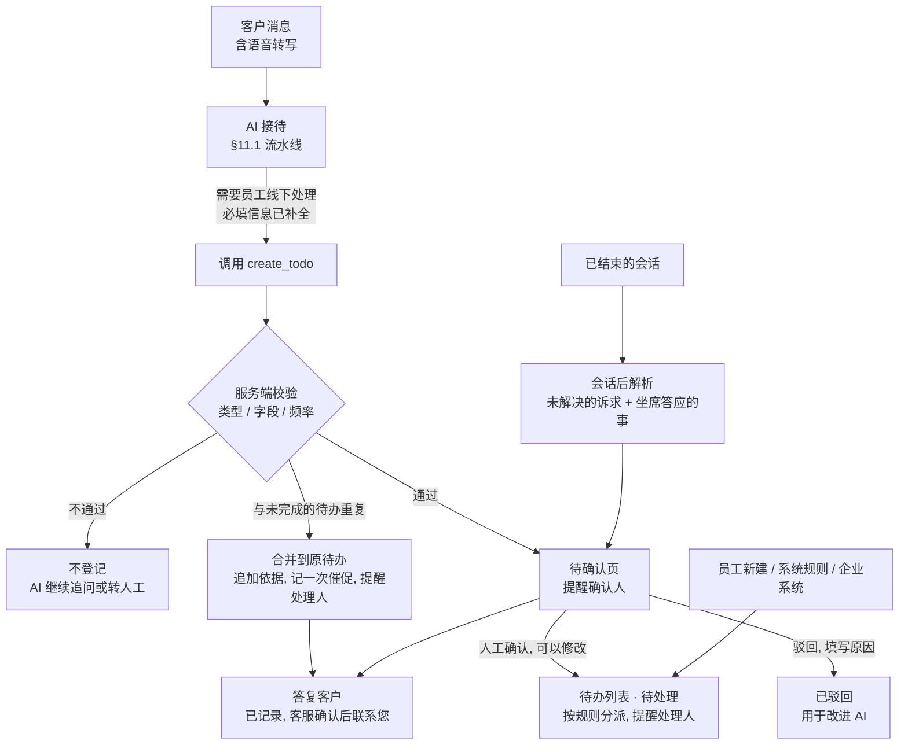

- **识别与追问**：回答时，模型对照租户启用的待办类型（名称、说明和示例），判断客户是否提出了需要线下处理的事。必填信息不全时先追问，例如开票先问抬头和税号，信息补全后再登记。
- **工具参数**：类型、标题、需求描述（保持客户原意，不加推测）、各字段的值、客户期望的时间、紧急程度、依据的消息。模型看到的手机号、地址等是占位符，服务端还原后加密保存（§11.6）。
- **服务端校验**（不信任模型的输出）：
  - 类型必须已启用，并且开启了 AI 登记。
  - 字段按类型的定义校验（必填、格式、长度）。
  - 客户期望的时间按租户时区解析成具体时间，只接受未来 30 天内的时间。
  - 每个会话每小时最多登记 3 条（可配置），防止被提示词注入批量刷单。
  - 同一次调用重试时不重复创建（按会话、触发消息和参数摘要去重）。
- **合并重复**：同一客户、同一类型、还未完成（包括待确认的），并且需求描述相似（向量相似度 ≥ 0.9，或者关键字段相同，如同一个订单号）时，不新建待办，而是在原待办上追加依据的消息，记一次"客户催促"，同时提醒处理人（或确认人）。催促达到 2 次，优先级自动提高一级。
- **答复客户**：AI 生成的待办都要人工确认，所以 AI 只说已经记录、客服确认后会联系，例如「已为您记录开票申请，客服确认后会尽快为您处理」，不承诺具体的完成时间和结果；后置护栏检查回复中的时效承诺（§11.6）。
- **与转人工的关系**：登记待办不等于转人工。只有类型设置了"同时转人工"，或者触发了 §11.2 的转人工条件时，才转人工。追问必填信息的轮次不计入 §11.2 的"AI 接待超过 N 轮仍未解决"。
- **进度查询**：客户问"我的发票开好了吗"时，模型调用 `lookup_todos()`。它只返回当前客户未完成的待办和最近 30 天完成的待办：类型、状态、预计完成时间，以及员工标记为"客户可见"的进度说明；还在待确认的，对客户显示为"已登记，等待客服确认"。匿名访客的限制同 §25.6。查询同时记一次催促。
- **会话后解析**：会话结束后与会话小结一起运行。结构化输出示例：

  ```json
  {
    "todos": [
      {
        "type": "callback",
        "title": "回电确认上门安装时间",
        "detail": "客户希望本周六上午上门安装，需要回电确认具体时间",
        "promised_by_agent": true,
        "due_hint": "明天下班前",
        "due_at": "2026-10-01T18:00:00+08:00",
        "evidence_message_ids": ["m_01J9...", "m_01J9..."],
        "confidence": 0.82
      }
    ]
  }
  ```

  置信度低于阈值（默认 0.6）的不进入待确认页。确认、修改后确认和驳回的结果按类型统计，用来改进提示词和类型说明。
- **评测**：上线前用种子租户的历史会话建立评测集，衡量识别的准确率、召回率和字段的正确率，作为 P6 的验收指标之一（§21）。

### 24.5 状态、待确认与处理

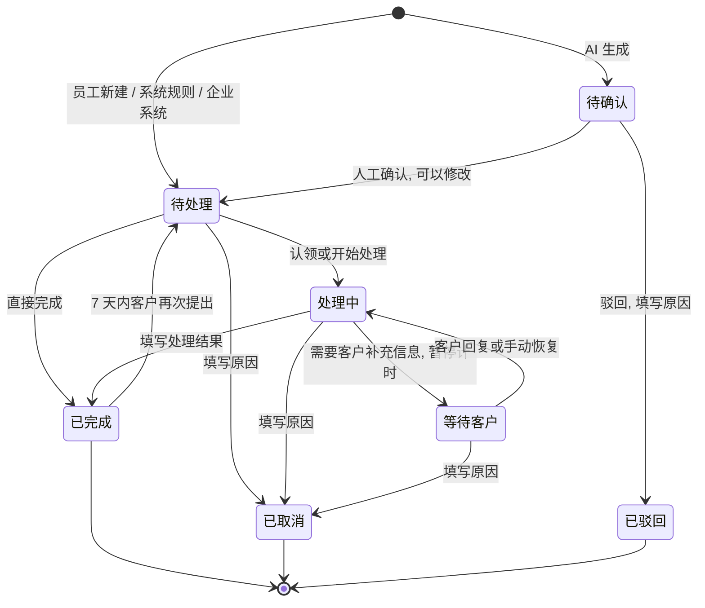

**待确认页**（2026-09-30 确认）：

- 待办中心的第一个页签，菜单上显示待确认的数量。列出 AI 生成、还没有人工确认的待办：类型、标题、需求描述、字段、依据的对话片段、置信度、建议的处理人和截止时间。
- **确认人**按 §24.6 的分派规则确定（通常是会话坐席或客户的归属坐席）；主管和管理员能看到自己数据范围内的全部待确认。
- **操作**：
  - 确认：可以先修改类型、标题、字段、处理人和截止时间；确认后进入待办列表（待处理），按规则分派并提醒处理人。
  - 驳回：选择原因（不是真实需求、重复、信息有误、其他）并补充说明。
  - 合并：并入这位客户已有的待办。
  - 支持批量确认和批量驳回。
- **提醒**：新的待确认提醒确认人；默认 2 个工作小时内还没处理，再提醒一次；投诉处理类立即提醒，并同时提醒主管。
- 截止时间从确认时开始计算；从生成到确认的时长单独统计（§24.10）。

**处理**：

- "逾期"不是一个状态：截止时间已过、仍未完成的待办标记为逾期。
- **处理人的操作**：认领、开始处理、转交他人（附说明）、改期（附原因，保留原截止时间）、评论（可以 @ 同事）、完成（填写处理结果，并选择是否通知客户）、取消（填写原因）。
- **重新打开**：完成后 7 天内客户再次提出同一件事时，坐席重新打开原待办，而不是新建；AI 发现客户再次提出时，在原待办上记一次催促并提醒处理人。
- 所有操作都写入待办动态，完整可追溯。

### 24.6 分派、时限与提醒

- **分派规则**（按类型配置，依次取第一个可用的；待确认的待办按同样的规则确定确认人）：
  1. 来自人工会话的，分派给会话坐席（坐席答应客户的事由他本人处理）。
  2. 客户的归属坐席。
  3. 类型指定的技能组：组内按"未完成待办数"最少分派，也可以放进组内的待认领池（可配置）。
  4. 类型指定的员工。
  5. 以上都没有时，进入租户的公共待认领池，由主管或管理员分派。
- 处理人离职或被停用时，未完成的待办按同样的规则重新分派，与离职交接一起处理（§14.1）。
- **时限**：类型设置响应时限（多久内开始处理）和完成时限，按工作时间计算（默认沿用路由策略的工作时间）。客户明确提出的时间（如"下周一上午回电"）优先作为截止时间。
- **优先级**：分紧急、高、普通、低。默认取类型的优先级；VIP 客户提高一级；客户催促 2 次再提高一级。
- **提醒与升级**：
  - 待确认的待办提醒确认人（§24.5）。
  - 待办进入待办列表并分派后，处理人收到站内信、工作台实时提示（菜单角标）和企业微信应用消息；点击应用消息，在企业微信内打开待办详情。
  - 截止前提醒一次（默认提前 2 小时，可以按类型配置）；逾期时再提醒一次；逾期超过设定时长（默认 4 个工作小时）升级给主管。
  - 每个工作日上班时发送"今日待办"汇总：待确认、今日到期、已逾期、待认领。
  - 同一条待办的提醒次数有上限，避免打扰。

### 24.7 通知客户

待办完成、订单确认或订单状态变化（§25）时，都可以通知客户。能否直接发送，取决于渠道的规则（§10.1）：

| 客户所在渠道 | 通知方式 |
|---|---|
| 官网 Widget | 平台以系统消息发到服务群。客户在线时实时看到，离线时下次打开窗口看到 |
| 微信客服 | 在回复窗口内（客户最后一次发消息后 48 小时内、最多 5 条）直接发送。窗口已关闭时不能主动发送，由处理人改用电话等方式联系，平台记录"未能通知" |
| 企业微信客户联系、客户群 | 不能通过接口直接发送（§3.1）。平台在侧边栏和手机工作台生成一条"待发送"的通知，由员工一键发送；或者创建只包含这位客户的群发任务，由员工在企业微信里确认 |

- 通知内容使用类型或订单的模板，例如「您的发票已开具，已发送到 x***@example.com」，发送前处理人可以修改。
- 每次通知都记入动态：已发送、发送失败或未能通知。

### 24.8 权限与数据

- **权限点**：`todo:read`（查看）、`todo:handle`（认领、处理、转交自己的待办，确认或驳回交给自己确认的待办）、`todo:assign`（分派和改派任何人的待办，确认或驳回数据范围内的全部待确认）、`todo:config`（待办类型）、`todo:export`（导出）。
- **数据范围**（与客户一致，§13）：坐席能看到分派给自己的待办、交给自己确认的待办、自己客户的待办，以及所在技能组待认领的待办；主管能看到本团队的待办；管理员能看到全部。
- **敏感字段**：标记为敏感的字段（如身份证号、银行卡号）用租户数据密钥加密，默认掩码显示。查看完整内容需要 `customer:view_sensitive` 权限，并记审计日志。
- **生命周期**：待办随客户数据一起导出和删除。客户的删除请求（§18）会删除这位客户的待办；租户导出包含待办。
- **计量**：AI 登记的待办数计入用量（§7.3）。

### 24.9 界面

- **待办中心**（控制台菜单"待办"）：
  - 视图：**待确认**（AI 生成，需要人工确认）、我的待办（今日到期、已逾期、即将到期）、待认领、我分派的、全部（按权限）。
  - 筛选：类型、状态、优先级、来源、截止时间、客户、处理人。
  - 详情：客户资料、依据的对话片段（可以跳转到会话）、字段表单、动态与评论。
- **工作台**：
  - 右栏新增"待办"页签，列出当前客户未完成的待办，可以快速新建（员工新建的直接进入待办列表）。
  - AI 登记待办时，聊天区显示一条内部提示（客户看不到）。
  - 会话小结卡片里显示这次会话 AI 生成的待办，可以直接确认或驳回（与待确认页相同）。
- **手机工作台与侧边栏**：待确认、我的待办、详情和处理；侧边栏显示当前客户的待办，粘贴客户的话可以让 AI 预填。
- **设置 → 待办类型**：字段、给 AI 的说明、分派规则、时限、提醒与升级、AI 登记（开启 / 关闭）、话术与通知模板、是否同时转人工。
- **访客端（可选，默认关闭）**：Widget 的"服务进度"里列出客户自己的待办（类型、状态、预计完成时间），不显示内部评论。

### 24.10 指标

- **数量**：新建（按来源、类型）、待确认、完成、取消、逾期、待认领。
- **时效**：从生成到确认的时长、首次响应时长、完成时长、按时完成率。
- **AI 质量**：AI 生成的待办被直接确认、修改后确认和驳回的比例（按驳回原因）；确认后又被取消的比例。
- **看板与告警**：待确认积压、逾期待办数、最久未认领的时长（§19.3）。

---

## 25. 订单管理（v0.3 新增，v0.4 按第三轮决定修订，R10）

### 25.1 目标与范围

- 客户在对话中表达购买意向时，AI 帮客户把要买的商品、规格、数量和收货信息整理成订单，交给员工核对价格，确认后一直跟进到完成。员工也可以在会话中直接下单。
- 定位是"客服订单"：平台负责订单的采集、确认、收款登记、状态跟踪和通知客户；发货和财务仍以企业自己的系统为准，平台通过开放接口和事件推送对接（§25.8）。
- 本期不做：平台直接收款和原路退款（只登记收款方式和收款记录，§25.5）、促销规则、开具发票（开票作为待办类型处理，§24.2）。库存（v0.6）和仓库（v0.7）只做与订单、加工配套的部分，见 §25.12、§25.13。

### 25.2 商品库

AI 要把"黑色那款大号的来两件"准确对应到商品，需要一份商品库。每一行是一个可以下单的商品（2026-09-30 确认的字段）：

| 字段 | 必填 | 说明 |
|---|---|---|
| 名称 | 是 | 商品名称 |
| 代码 | 否（建议填写） | 企业的商品编码，租户内唯一。再次上传时按代码更新；对接企业系统时也用它 |
| 型号 | 否 | 例如 KFR-35GW |
| 规格 | 否 | 例如"黑色 / L 码""1.5 匹" |
| 分类 | 否 | 多级用"/"分隔，例如"家电/空调" |
| 图片 URL | 否 | http 或 https 链接。平台只保存链接，由浏览器直接加载 |
| 成本价 | 否 | 内部价格。只有拥有"查看成本价"权限的员工能看到，永远不进入 AI 的上下文 |
| 建议零售价 | 否 | AI 可以告诉客户的唯一价格；为空时 AI 答复"价格以客服确认为准" |
| 备注 | 否 | 内部备注，不给 AI，也不给客户 |
| 别名 | 否 | 客户常用的俗称、简称，多个用"、"分隔，帮助 AI 识别 |
| 状态 | 否 | 上架或下架，默认上架。下架的商品 AI 不推荐，也不能下单 |

- **Excel 上传**：
  - 商品库页面提供表格模板下载（.xlsx）：第一行是表头，每列带填写说明（是否必填、格式），附一行示例；价格列只能填数字。
  - 上传后先预览：逐行校验（名称必填、价格是不小于 0 的数字、代码在表内不重复、图片链接格式），标出有问题的行和原因，确认后才导入。
  - 匹配规则：有代码的按代码更新；没有代码的按"名称 + 型号 + 规格"匹配已有商品，匹配不到的新增。
  - 导入结果（新增、更新、跳过及原因）可以下载。
- **其他维护方式**：页面上逐条新建和编辑；企业系统通过开放接口按代码同步（§25.8）。
- **检索**：代码、型号精确匹配 + 名称、别名、规格的关键词匹配 + 向量检索，按租户过滤，返回带得分的候选。
- **库存**：v0.3 不管理库存，缺货等情况由员工审核订单时处理；v0.6 起商品有库存（§25.12），v0.7 起分成品和材料（§25.13）。
- **商品咨询**：客户问商品本身（有哪些规格、多少钱）时，AI 用 `search_products` 的结果回答，只使用对客可见的字段。
- **商品缺口**：客户问到、但商品库里匹配不到的商品，汇总成"商品缺口"榜（与 §12.4 的知识缺口思路相同），提醒补充商品库。

**价格与成本价保护**（2026-09-30 确认：AI 只能告诉客户建议零售价）：

1. **成本价不进入 AI**：AI 用到的商品数据由服务端按白名单组装，只有名称、代码、型号、规格、分类、图片、建议零售价和别名；成本价和备注在查询这一层就不取出。模型从来没有见过成本价，客户无论怎么诱导，它都说不出来。坐席助手（Copilot）生成建议回复时同样不带成本价。
2. **识别套价**：客户询问成本、进价、底价、利润，或者要求 AI"忽略之前的指令""扮演内部员工"时，AI 用固定话术答复（"商品价格以建议零售价为准，如需优惠请联系客服"），不交给模型自由发挥，并记一次安全事件；同一会话多次出现时提醒坐席。
3. **回复检查**：后置护栏检查 AI 的每一条回复。回复中出现"成本""进价""底价""利润率"等内部口径，或者出现与本次对话涉及商品的成本价相同、又不是建议零售价的金额时，拦截这条回复，改用固定话术，并记安全事件。
4. **不议价**：AI 只报建议零售价，不打折、不承诺优惠；客户要求优惠时交给员工（可以同时登记"报价"待办）。
5. **员工侧权限**：成本价只有拥有 `product:view_cost` 权限的员工能在商品库和订单里看到、导出；坐席默认没有这个权限。订单里的成本价快照同样受这个权限控制。
6. **知识库**：对客可见的知识里不应包含成本信息；知识检索的结果同样经过第 3 条的检查。
7. **验收**：评测集包含一组套价话术（直接问、换说法、角色扮演、提示词注入、分步推算），要求成本价零泄露（§21 P6）。

### 25.3 AI 下单流程

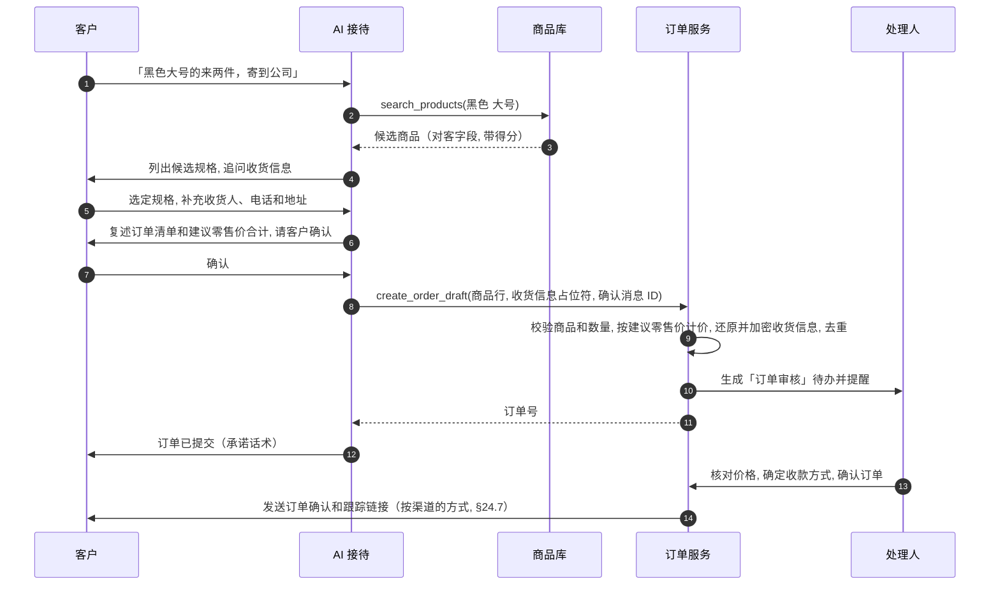

1. **识别意向**：客户表达购买、订购或补货的意向（沿用 §11.3 的意图识别）。
2. **找商品**：模型调用 `search_products`。有歧义时列出最多 3 个选项请客户选择，不替客户做决定。
3. **补全信息**：按租户订单设置里的必填项追问，例如数量、规格、收货人、电话、地址和期望时间。客户档案或历史订单里已有的收货信息，可以请客户确认后复用（地址以掩码展示）。客户提到付款方式（如"货到付款"）时一并记下，供员工审核时参考（§25.5）。
4. **复述确认**：把订单整理成清单复述给客户，可以带上建议零售价和合计，并说明"最终价格以客服确认为准"。客户明确回复确认（"确认""可以""就这样"）后才提交。
5. **提交**：模型调用 `create_order_draft`。服务端校验后生成"待审核"订单，同时生成"订单审核"待办（§24），分派给处理人并提醒。
6. **答复客户**：使用订单的承诺话术，例如「订单已提交，编号 SO20260930-0007，客服核对后会尽快联系您确认」。
7. **客户中途离开**：已收集的信息保存为"草稿"订单，不会自动提交；可以配置为同时生成一条"跟进未完成的订单"待办。

**服务端校验**（不信任模型的输出）：

- 商品必须在商品库里并且已上架。匹配不到的商品作为"未匹配商品"行，保留客户的原话，由员工处理。
- 数量必须是正整数，并且不超过单行上限；每单最多 20 行；每位客户每天最多 3 个 AI 订单（可配置）。
- 单价一律由服务端取商品的建议零售价（没有建议零售价的，单价留空，由员工填写），忽略模型给出的任何金额。
- 客户的确认必须对应会话里客户本人发出的一条消息，并记录这条消息的 ID。
- 同一次调用重试时不重复创建；30 分钟内同一客户相同商品的草稿合并。
- 收货人、电话和地址在模型面前是占位符，服务端还原后加密保存，在列表和对话中掩码显示。

**与转人工的关系**：采集订单信息的追问不计入 §11.2 的"AI 接待超过 N 轮仍未解决"。客户要求人工，或者 AI 连续两次匹配不到客户要的商品时，转人工，并把已采集的信息作为草稿交给坐席。

**人工接待中**：坐席可以选中几条消息让 AI 预填订单，或者直接新建；在企业微信侧边栏里，员工可以粘贴客户的话，让 AI 预填。

### 25.4 订单状态

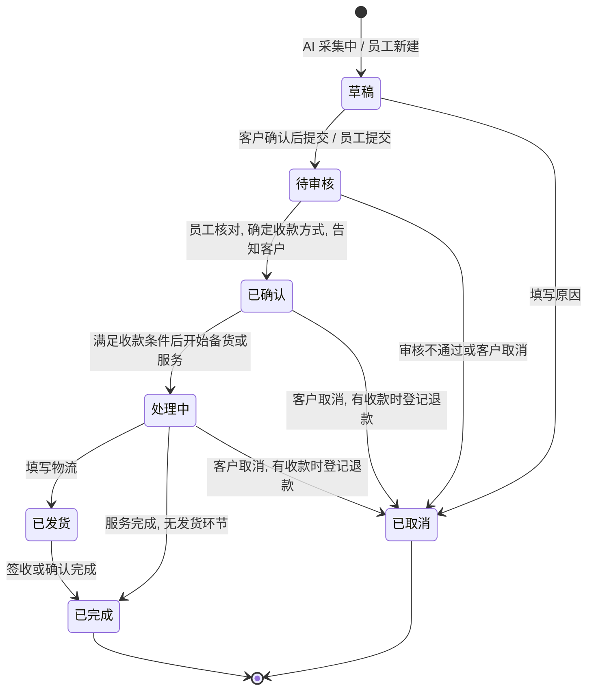

- **收款是另一条线**：订单状态只描述履约进度；收款方式和收款状态单独记录（§25.5）。开始处理前要满足收款方式的条件，例如在线收款要先收清、预付定金要先收到定金。
- **完成时还有未收金额**：货到付款要求先登记收款；暂欠允许完成，未收金额进入"应收"。
- 发货环节可以按租户关闭，例如服务类订单没有发货。
- **加工**（v0.5）：处理中的订单由工人领取加工（§25.11）。订单状态仍是"处理中"，加工进度单独记录：加工完成的进入订单中心的"待发货"，有缺货商品的进入"缺货"。
- 订单完成后的退换货：生成关联这个订单的"退换货"待办（§24），订单上显示售后状态。
- 对接企业系统后，"已确认"之后的状态以企业系统回传的为准（§25.8）。
- **订单号**：租户前缀 + 日期 + 流水号，例如 `SO20260930-0007`，租户内唯一。
- **并发修改**：订单带版本号。两个人同时修改时，后提交的一方需要刷新后重试。

### 25.5 员工处理

- **审核**：核对商品和规格（把"未匹配商品"对应到商品库）、调整数量、改价或给优惠、补全收货信息、确定收款方式，必要时联系客户。改价需要 `order:price` 权限；超过租户设置的折扣上限时，需要主管审批。
- **确认**：点"确认订单"后，按 §24.7 的方式把确认信息（商品、数量、金额、收款方式、预计时间）和订单跟踪链接（§25.6）发给客户。
- **收款方式**（2026-09-30 确认）：

  | 收款方式 | 开始处理的条件 | 说明 |
  |---|---|---|
  | 在线收款 | 收清全款 | 客户通过企业的在线渠道付款（如微信、支付宝、银行转账），员工登记收款。平台本期不直接收款 |
  | 货到付款 | 无 | 完成订单前登记收款 |
  | 预付定金 | 收到定金 | 确认订单时填写定金金额；尾款在发货前或货到时收取（订单设置） |
  | 暂欠 | 需要有 `order:credit` 权限的员工同意 | 填写约定付款日期；到期未收清时自动生成"催收"待办，提醒订单处理人 |

- **收款记录**：每一笔收款记录金额、渠道（微信、支付宝、银行转账、现金、其他）、时间、流水号、凭证图片和登记人；取消订单时可以登记退款。收款状态由记录自动计算：未收款、已收定金、部分收款、已收清、已退款。登记和作废收款记录需要 `order:payment` 权限，作废要填写原因，并写入修改记录。
- **应收**：订单中心的"应收"视图列出未收清的订单（暂欠、尾款未收、货到付款未登记），按约定日期排序，逾期标红。
- **跟进**：开始处理、登记发货（物流公司、单号）和完成，每一步都可以选择是否通知客户。
- **修改与修改记录**（2026-09-30 确认：改价、改商品不需要客户再次确认，但要保留修改记录）：
  - 订单的每一次修改都保留记录：修改人、时间、修改前后的差异（商品行的增删、数量、单价、优惠、收货信息、收款方式、收款记录、状态），以及修改原因。
  - 改价、改商品、改数量时必须选择原因（客户要求、AI 识别错误、价格调整、缺货替换、其他），可以补充说明。原因为"AI 识别错误"的，计入 AI 下单的质量统计（§25.10）。
  - 每次修改生成一个订单版本，可以查看任意版本的完整内容，并与 AI 最初生成的版本对比。
  - 修改记录只能追加，不能编辑或删除；订单列表可以筛选"修改过的订单"。
  - 修改后按 §24.7 把最新内容告知客户，不要求客户回复确认；已发货的订单不能再修改商品和金额。
- **留痕**：所有操作都写入订单动态；改价、取消、收款、查看完整收货信息和导出还要记审计日志。

### 25.6 客户侧

- **官网 Widget**：订单以卡片消息展示（商品、数量、金额、状态），状态变化时推送新的卡片。
- **微信客服**：以文本发送订单摘要和跟踪链接。能否用菜单消息让客户一键确认，以 P0 的实测结论为准（§10.3）。
- **企业微信客户联系**：员工在侧边栏一键发送订单摘要和跟踪链接（§24.7）。
- **订单跟踪页**（2026-09-30 确认）：
  - 每个订单有一个跟踪链接，里面是随机生成、无法猜测的令牌。订单确认时随确认信息发给客户，也显示在 Widget 的"我的订单"里。
  - 页面内容：订单号、进度（已提交 → 已确认 → 处理中 → 已发货 → 已完成）、商品和数量、金额、收款方式与收款状态、物流公司和单号、客户可见的动态、掩码后的收货信息，以及"联系客服"入口。
  - 不显示：内部备注、修改记录的细节、员工信息、成本价。
  - 不需要登录，在微信里打开同样可用；接口只读，按令牌和 IP 限流。
  - 员工可以重新生成链接（旧链接立即失效）；订单完成或取消 90 天后链接失效（可配置）。
- **Widget"我的订单"**：列出当前访客身份（实名访客则是同一客户档案）下的订单，点击进入跟踪页。
- **询问 AI**：客户问"我的订单到哪了"时，模型调用 `lookup_order`，只能查到当前客户本人的订单（状态、物流、预计时间，收货信息掩码），并附上跟踪链接。匿名访客只能查到在当前访客身份下提交的订单，防止别人用同一台设备冒查。对接企业系统后，可以实时查询企业系统。
- **修改或取消**：AI 不能直接修改或取消订单。客户在对话中提出修改（如"改成 3 件"）或取消时，待审核的订单由 AI 把要求记到订单上，并提醒处理人；已确认的订单则登记一条关联这个订单的待办（§24，进入待确认页），由员工处理后告知客户。

### 25.7 权限与数据

- **权限点**：`order:read`、`order:create`、`order:review`（确认、取消）、`order:price`（改价和优惠）、`order:payment`（登记和作废收款、退款）、`order:credit`（同意暂欠）、`order:export`、`order:config`（订单设置）、`product:manage`（商品库）、`product:view_cost`（查看和导出成本价）；v0.5 增加 `production:work`（领取订单加工，标记商品完成或缺货，完成订单）和 `production:assign`（指派和改派加工人），以及只有 `production:work` 的系统角色"工人"（§25.11）；v0.6 增加 `inventory:manage`（调整库存：入库、出库、盘点和导入库存，默认给管理员和主管，§25.12）；v0.7 增加 `warehouse:confirm`（确认或退回领料单和入库单），仓管另外获得 `inventory:manage` 和 `warehouse:confirm`（§25.13）。
- **数据范围**与客户一致：坐席能看到自己客户的订单和分派给自己的订单；主管能看到本团队的订单；管理员能看到全部。
- **收货信息**：收货人、电话和地址加密保存，默认掩码。导出时需要再次输入密码，并记审计日志；没有 `customer:view_sensitive` 权限时，导出的是掩码。
- **成本价**：见 §25.2 的"价格与成本价保护"。
- **客户的删除请求**：清空订单里的个人信息（匿名化），商品、金额和收款记录保留用于统计；租户也可以设置为整单删除。
- **功能开关与计量**：待办、订单和商品库按套餐开放；AI 生成的订单数计入用量（§7.3）。

### 25.8 与企业系统对接

- **事件推送**：订单创建、确认、取消、收款和状态变化时，推送到租户配置的地址。推送带 HMAC 签名，先写入推送记录再投递；失败按退避重试，多次失败后进入死信，租户管理员和平台运营都能看到并重发。
- **开放接口**：租户在管理后台创建接口密钥，按权限范围授权。企业系统可以同步商品和价格、查询订单、回传状态、物流和收款，也可以创建订单和待办。
- **订单号映射**：保存企业系统的订单号，查询和回传时都可以使用。
- **以谁为准**（2026-09-30 确认）：未对接时，平台就是订单的记录系统；对接后，确认之后的状态以企业系统回传的为准，平台负责展示和通知客户。

### 25.9 界面

- **订单中心**（控制台菜单"订单"）：
  - 视图：全部、待审核、处理中、待发货（没有发货环节时叫"待交付"）、缺货、应收（未收清）、修改过的；按状态、来源、处理人、客户、时间和金额筛选。
  - 详情：商品行、金额、收款方式与收款记录、收货信息、依据的对话、动态、修改记录（任意两个版本对比）、关联的待办、跟踪链接。
  - 新建与编辑（改价、改商品、改数量时选择原因）。
- **工作台**：右栏新增"订单"页签（当前客户的订单、新建订单、AI 预填）；AI 提交订单时，聊天区显示订单卡片和一条内部提示。
- **商品库**（控制台菜单"商品"）：表格模板下载、上传与预览、商品列表（成本价列按权限显示）、商品缺口；v0.6 增加库存列、库存筛选、调整库存和库存记录（§25.12）。
- **设置 → 订单**：编号前缀、必填项、启用的收款方式和定金规则、是否有发货环节、AI 告知建议零售价（默认开启）、AI 下单（关闭 / 采集并提交审核）、折扣上限、分派规则、通知模板、跟踪链接的有效期、企业系统对接（推送地址、接口密钥）。
- **加工**（控制台菜单"加工"，v0.5）：工人的待领取、我的加工、已完成，主管另有全部加工中的；手机上按卡片排列（§25.11）。
- **仓库**（控制台菜单"仓库"，v0.7）：材料库存、成品库存（配方）、领料单、入库单、库存记录和仓管设置（§25.13）。
- **访客端**：订单跟踪页，以及 Widget 的"我的订单"。
- **手机工作台与侧边栏**：订单列表、审核与跟进、登记收款；侧边栏可以查看当前客户的订单，并发送订单摘要和跟踪链接。

### 25.10 指标

- **AI 下单**：有购买意向的会话数、AI 提交的订单数、审核通过率、最终完成的比例，以及被员工修改的比例（按修改原因，"AI 识别错误"单独统计）。
- **业务**：订单数与金额（按来源、渠道、坐席、商品）、审核时长、取消原因分布、商品缺口 Top 10。
- **收款**：各收款方式的占比、应收金额、逾期应收。
- **安全**：套价识别和回复拦截的次数（§25.2）。
- **看板与告警**：待审核订单积压、最久未审核的时长、逾期应收、推送失败（§19.3）；v0.5 增加待发货和缺货的订单数（`edp_orders_awaiting_shipment`、`edp_orders_out_of_stock`）。

### 25.11 加工与缺货（v0.5 新增，工人角色）

目标：订单确认后，由工人在控制台的"加工"页领取订单加工。加工完成的订单交给客服发货；缺货的订单单独挂出来，由客服跟进。

**确认的决定（2026-09-30）**

1. 工人点"完成订单"后，订单进入订单中心新增的"待发货"视图，由客服处理（发货或交付）；客服在待办里收到"待发货"提醒。
2. 工人只看加工需要的信息：商品、规格、数量、客户备注、内部备注、期望时间和客户称呼。工人看不到金额、电话和地址，也进不了订单中心。

**角色与权限**

- 系统角色"工人"只有 `production:work`。登录后只有"加工"菜单，看不到订单中心、客户和对话。
- `production:assign` 用于指派和改派加工人，也可以替工人操作（例如工人请假）。主管默认有这个权限，管理员有全部权限。
- 加工属于订单功能，套餐不含订单时不可用。

**流程**

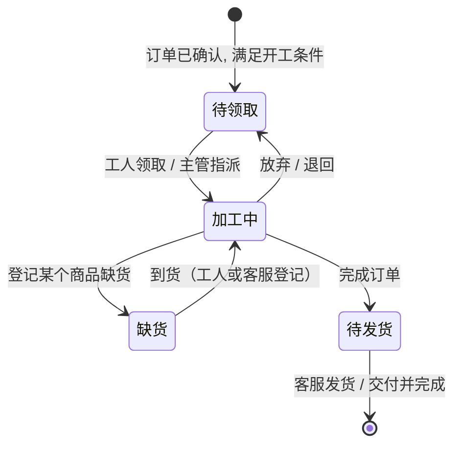

- **待领取**：已确认、满足开工条件（与"开始处理"相同，例如在线收款要先收清）的订单，以及还没有加工人、处理中的订单。领取时，已确认的订单同时开始处理。一个订单只能由一个工人领取，别人再领时提示已由谁领取。
- **逐个商品标记**：工人可以把某个商品标记为已完成（也可以撤销），也可以登记缺货：缺多少（不填表示整行都缺）、预计到货日期和说明，登记后还可以修改。
- **缺货**：订单有缺货商品时进入订单中心的"缺货"视图，订单处理人收到"缺货处理"待办（优先级高），由客服联系客户，决定等到货、换货或取消。修改缺货说明时，待办的说明随之更新，不重复生成待办。到货可以由工人在加工页登记，也可以由客服在订单详情里登记，商品回到待加工。所有缺货都处理好后，订单离开"缺货"，待办随之完成。
- **完成订单**：有缺货商品时不能完成。还有没标记的商品时，确认框提示会一并标记为已完成。完成后订单进入"待发货"（没有发货环节时叫"待交付"），订单处理人收到"待发货"待办。客户的跟踪页显示"已加工完成，等待发货"，不显示加工人。
- **发货、完成或取消**：订单离开加工页，"待发货""缺货处理"待办随之结束。加工还没完成就登记发货时，发货对话框会提示加工人还没有完成。
- **修改订单**：客服修改商品时保留加工进度。数量没有增加的商品保持已完成，数量不变的保持缺货。已加工完成的订单如果因为修改多了要加工的商品，会回到加工中，"待发货"待办取消，并记录"订单修改后需要重新加工"。
- **指派**：主管在订单详情里指派或改派加工人（为空时退回待领取）。被指派的工人收到站内信，点开直接看到这张订单。

**界面**

- **加工页**（手机优先，一张卡片一个订单）：
  - 视图：待领取、我的加工、已完成，有指派权限时还有"全部加工中"；支持按订单号或商品名称搜索。
  - 卡片内容：订单号、进度（已完成 n/m、缺货数）、客户称呼、期望时间（已过期标红）、备注和商品。
  - 操作：商品上有完成、撤销、缺货、修改缺货和到货；订单上有领取、放弃和完成订单。
  - 菜单角标显示待领取的订单数，只显示给进不了订单中心的工人。窄屏（手机）时侧边栏收起成图标，角标显示在图标右上角。
- **订单中心**：新增"待发货""缺货"视图和角标，列表行上显示"缺货""加工完成""加工中 · 某某"。
  - 详情的商品表格增加"加工"一列（进度、完成人，缺货说明和"登记到货"）。
  - 详情增加"加工人"（指派 / 改派）和"加工完成"时间。
- **动态**：领取、放弃、指派、商品完成与撤销、缺货与到货、加工完成都写入订单动态。其中加工完成客户可见。加工完成、缺货和到货作为 `order.updated` 推送给企业系统（§25.8）。

**库存**（v0.6，§25.12）：加工页只提示"库存不足"，缺货仍由工人按实际情况登记，不按库存数量自动登记。

**领料与入库**（v0.7，§25.13）：领取订单后先开领料单（商品有配方时），完成订单时开入库单；仓管确认入库后订单才进入"待发货"。现货商品直接从成品库存发货，不需要加工；全是现货的订单不进加工页。

### 25.12 库存（v0.6 新增）

目标：商品库记录每个商品的库存数量，可以用 Excel 上传（盘点或入库），发货时自动扣减；库存不够时提示，不拦截。

**确认的决定（2026-09-30）**

1. 发货时扣减库存（没有发货环节的在完成时扣减）。已确认、还没发货的订单算"占用"，页面显示现有、占用、可用；取消的订单不影响库存。
2. 可用库存不够时只提示、不拦截：确认订单、订单详情和加工页标出"库存不足"；缺货仍由工人登记（§25.11）。
3. Excel 上传时选择"盘点"（表格里的数就是现有库存）或"入库"（加到现有库存上）。商品表格加"库存"列，也可以只填"代码"和"数量"两列。
4. AI 接待时只告诉客户"有现货"或"暂时缺货"，不说具体数量。

**数据**

- 商品的现有库存和库存预警值。现有库存为空表示不管理库存，例如服务类商品。
- 占用 = 已确认、处理中的订单里这个商品的数量；可用 = 现有 − 占用。可用库存不高于预警值（没有预警值时为 0）算库存不足。
- 库存记录（只追加）：
  - 每一次变化：导入盘点、导入入库、盘点、入库、出库、不再管理、订单出库、订单取消退回、企业系统同步；
  - 变化前后的数量、原因和操作人；
  - 订单出库的记录关联订单号。

**库存怎么变**

- **手动调整**（需要 `inventory:manage`，默认给管理员和主管）：
  - 入库（增加）、出库（减少，不能超过现有库存）、盘点（改为实际数量）、不再管理；
  - 每次调整都记审计。
- **Excel**：
  - 商品表格的"库存"列按上传时选择的盘点或入库计算；留空的商品不修改库存。"库存预警"列设预警值。
  - 只有"代码"和"库存"（或"数量"）两列的表格，按代码更新已有商品。
  - 预览里标出每个商品的库存从多少变为多少；确认时按最新的库存计算。
  - 没有调整库存权限的人上传时，库存列不导入。只能调整库存、不能维护商品库的人，只能导入已有商品的库存。
- **订单**：
  - 发货时出库，没有发货环节的在完成时出库，每张订单只扣一次。
  - 已出库的订单被企业系统取消时，按出库记录退回。
  - 发货多于记录的库存时，现有库存可以是负数，提示需要盘点。
- **企业系统**：
  - 同步商品时可以带库存和预警值。库存是盘点数，null 表示不再管理。
  - 数量没变时不写库存记录。

**库存不足提示（不拦截）**

- 已确认的订单按确认的先后依次占用现有库存；排在后面、占不到的订单行标为库存不足。还没确认的订单按可用库存判断。
- 订单详情的商品行显示可用库存和"库存不足"。确认订单的对话框列出库存不足的商品，仍然可以确认。
- 加工页：待加工的商品标出"库存不足"，不显示数量；缺货仍由工人登记。
- 新建订单选择商品时，显示可用库存。

**AI**：查商品的结果和【商品信息】里，管理库存的商品注明"有现货"或"暂时缺货"（按可用库存），不给具体数量。AI 如实告诉客户、不说数量；不管理库存的商品，说"库存以客服确认为准"。

**界面**

- 商品库：
  - 库存列：可用、现有、占用和"不足"；
  - 库存筛选（库存不足、管理库存的、不管理库存的），以及"库存不足 N"快捷筛选；
  - 调整库存、库存记录，商品的"库存预警"。
- 导入对话框：选择盘点或入库，预览里有库存列。

**不做的**：多仓库、批次和保质期、采购单，以及按库存自动登记缺货或拦截下单（按决定只提示）。

> v0.7 修订（§25.13）：库存分材料库存和成品库存。成品的"占用"只算要从库存发出的订单行（现货商品，或者订单已加工入库）；需要加工的商品入库之前在生产，不看库存，也不提示"库存不足"。AI 只对现货商品说有没有现货。

### 25.13 仓库：材料与成品、领料单与入库单（v0.7 新增）

目标：工人领取订单加工时先开领料单，扣减材料库存；生产好的成品开入库单，加到成品库存里；发货时从成品库存出库。库存分材料库存和成品库存。

**确认的决定（2026-09-30）**

1. 领料单按配方自动算：每个成品有配方（用哪些材料、每件用多少），开领料单时按订单数量 × 配方用量预填，工人可以增减材料、修改数量。
2. 领料单和入库单默认要仓管确认。管理员可以指定一名仓管；没有指定时，由最早创建的工人担任仓管（小企业里仓管和工人可能是同一个人）。
3. 领料时材料库存不够只提示，照常可以领：确认后库存变成负数，提示及时补货或盘点。
4. 有的商品直接发现货：标为"现货"的成品不经过加工，发货时直接扣成品库存（不够时提示）；其他成品走"领料 → 加工 → 入库 → 发货"。

**商品库里的类别**

- 同一个商品库里分成品和材料（"类别"，创建后不能修改）。材料只用于生产：不给 AI、不能下单，也不出现在订单的商品选择里；材料总是管理库存（从 0 开始）。
- 每个商品有单位（件、米、公斤……）。库存数量最多三位小数：材料可以是 2.5 米，成品只用整数。
- 成品可以标为"现货"。
- Excel 模板增加"类别""单位""现货"列（类别、状态、现货从下拉列表里选，模板里有一个成品和一个材料的示例行）；"类别"留空的新商品按上传时的选择（从"仓库 → 材料库存"导入时是材料）。维护材料的可以是有 `product:manage` 或 `inventory:manage` 的员工，维护成品和配方要 `product:manage`。
- 企业系统同步商品时可以带类别、单位和现货。

**仓管**

- 仓管 = 设置里指定的员工；没有指定、或者指定的员工已停用时，是最早创建、启用状态的工人。仓管在每次请求时另外获得 `inventory:manage`（查看和调整库存、维护材料）和 `warehouse:confirm`（确认或退回单据）。管理员有全部权限，也可以确认。
- 仓管自己开的单据直接生效；设置里也可以关闭"要仓管确认"，所有单据开单即生效。
- 单据提交后，仓管收到站内信；确认或退回后，开单人收到站内信。

**流程**

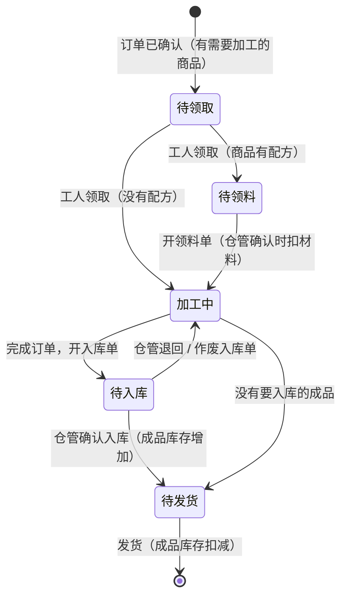

- **领料单**：工人领取订单后自动打开，按配方预填（订单里需要加工的商品数量 × 配方用量，按材料汇总；已经领过的不再预填），列出没有配方的商品。商品有配方时，没开领料单不能标记完成。可以再开领料单补料。
- **入库单**：工人点"完成订单"时开，按订单里需要加工的成品预填（减去这张订单已经入库的）；还没标记的商品一并标记完成。提交后等仓管确认，确认后订单进入"待发货"，客服收到提醒；入库单没生效时不能修改加工进度（可以先作废）。
- **仓管确认**：按实际交接的数量修改后确认（为 0 的行不领、不入库）；领料单扣材料库存，入库单加成品库存（原来不管理库存的成品从 0 开始）；每一行写库存记录，关联单据和订单。仓管可以退回（写明原因），开单人修改后重新提交，也可以作废还没生效的单据。已确认的单据不能修改，数量有出入时盘点调整。
- **仓库直接开单**：仓库的员工可以开不关联订单的领料单和入库单，例如备货生产现货商品。
- **订单变化**：订单取消时，它还没生效的单据随之作废；修改订单后有要重新加工的商品时，还没生效的入库单作废。
- **现货**：全是现货的订单不进加工页，开始处理后就在"待发货"里；和需要加工的商品一起下单时，加工页上现货商品标"现货，不用加工"。

**库存**

- 成品：占用 = 已确认、还没发货的订单里要从库存发出的数量（现货商品，或者订单已加工入库）；可用 = 现有 − 占用；需要加工的商品只在设了预警值时算库存不足（可用为负数时总是提示）。
- 材料：待领 = 还没确认的领料单里的数量；可用 = 现有 − 待领；可用不高于预警值（没有预警值时为 0）算库存不足。
- 加工页：还没领料的订单按配方算材料够不够，不够时提示"材料不够：……"（只提示）；现货商品库存不足时提示"库存不足"。
- 库存记录增加"领料""生产入库"两种变化。

**界面**

- **仓库**（菜单"仓库"，需要 `inventory:manage`，仓管自动有）：
  - 材料库存：现有、待领、可用、预警；新建和修改材料、Excel 导入（类别留空按材料）、调整库存、库存记录、开领料单；
  - 成品库存：现有、占用、可用、预警、现货、配方；开入库单；
  - 领料单、入库单：待确认的在前，按状态、单号、订单号或名称筛选，只看我开的；详情里确认、退回、作废、修改后重新提交；
  - 库存记录：全部商品的每一次变化，按材料或成品筛选，关联单据和订单；
  - 顶部显示仓管（由最早创建的工人担任时注明），有订单设置权限的员工可以修改仓管和"要仓管确认"。
  - 菜单角标显示待确认的单据数（给仓管）；站内信链接直接打开单据。
- **加工页**：卡片上有单据（点开看详情）、"材料不够"提示、"先开领料单"提示、入库单等确认或被退回的提示；"开领料单 / 补领材料""完成订单（开入库单）"。
- **商品**：只列成品，名称旁标"现货"，操作里有"配方"。
- **订单详情**：商品旁标"现货"，"领料入库"一栏列出订单的单据；全是现货的订单发货时不提示"还没有完成加工"。

**不做的**：多仓库、库位、批次、采购单与退料单、按配方的成本核算，以及配方的 Excel 导入（先在界面里维护）。

### 25.14 开单界面与修改历史（v0.8 新增）

目标：

1. 下单、领料、入库的开单界面按专业进销存软件的习惯重做：单据头、带表头的明细表、合计、固定在底部的操作栏；可以用键盘连续录入，也可以批量选择商品；手机上同样好用。
2. 订单、领料单、入库单、待办、商品和材料的每一次新建、修改、删除都留下版本，像在线表格的"版本历史"：谁在什么时候做了什么、每个版本的完整内容、和上一个版本比改了哪里。管理员能看到全部记录的修改，包括已经删除的。

**参考**（2026-09 查阅，链接见附录 A）

- 进销存软件（金蝶精斗云、用友好生意、管家婆等）：单据分为单据头（单号、日期、往来单位、经手人）、表体（按列录入的明细，最后一行接着录入）和表尾（合计、备注、制单人和审核人）；"选择商品"一次勾选多个；扫码或输入代码回车直接加入；保存、审核等按钮固定在顶部或底部；每张单据可以查看操作记录。
- Odoo：单据顶部是状态条（报价 → 销售订单 → …），明细是可以直接编辑的列表，末尾一行"添加商品"，合计在右下角；字段变化记在单据下方的记录里（谁把什么从 A 改成 B）。
- ERPNext（Frappe）：每次修改把完整内容保存为一个版本（Version），时间线里显示"把 X 从 A 改成 B"。
- 在线表格（Google 表格）的版本历史：右侧是按日期分组的版本列表，每个编辑者一种颜色；打开"显示更改"后用颜色标出改动；可以命名版本、恢复版本。

**现在的问题**

- 下单是一个 820px 宽的长表单对话框：明细没有表头，列不对齐；一次只能搜一个商品；收货信息、收款方式、备注各占一整行，要一直往下滚才能看到保存按钮；手机上对话框超出屏幕，没法用。
- 领料单、入库单：没有单据头（单号、日期、开单人、关联订单），名称和规格挤在一起，没有合计；在仓库页面开单时不能关联订单。单据详情只是一列文字，没有表头、合计和处理过程。
- 修改记录：只有订单有；待办只记下改了哪些字段，没有原来的值；领料单、入库单修改后重新提交，原来的内容就没有了；商品和材料的修改、删除没有记录。

**开单界面：统一的单据页**

下单、开领料单、开入库单和单据详情用同一个版式（电脑上从右侧打开，宽 1200px；手机上全屏）：

- **顶部**：单据名称和单号（新单据显示"保存后生成"）、状态，以及处理进度（订单：草稿 → 待审核 → 已确认 → 处理中 → 已发货 → 已完成；领料单、入库单：开单 → 仓管确认，退回、作废时标出）；右侧是操作按钮。
- **单据头**：按栅格排列的字段（电脑 3 列、手机 1 列）。
  - 订单：客户、下单日期、收款方式；收货人、联系电话、收货地址、期望时间。
  - 领料单、入库单：开单日期、开单人、确认人（仓管）、关联订单、备注。在仓库页面开领料单时可以选择一张加工中的订单（可以不选），选中后按配方带入材料；加工页开的领料单和入库单自动关联订单，可以"按配方重新带入"或"按订单重新带入"。
- **明细表**：带序号和表头，列对齐。
  - 订单：商品（名称、代码、规格）、单位、可用库存（管理库存的商品）、数量、建议零售价、单价、金额；没有匹配商品库的行显示客户的原话和"对应到商品库"。
  - 领料单：材料、单位、现有库存、建议数量、本次领用、领用后库存（负数标红）。
  - 入库单：成品、单位、现有库存、建议数量、本次入库、入库后库存。
  - **录入行**（表格最后一行）：输入名称、代码、型号或俗称，下拉列出候选（代码、规格、单位、库存、价格）；回车加入并跳到这一行的数量，数量里回车回到录入行，一直用键盘录下去；扫码枪扫出代码后回车直接加入。已经在单据里的商品不再加一行，而是在原来那一行加上数量（同一个商品扫两次就是 2 件），并跳到那一行的数量。
  - **批量选择**：选择框左边是分类，上面是搜索（可以只看有库存的），勾选多个、填好数量后一次加入。
  - **合计行**：共几项；单位都相同时的总数量；订单的金额合计。
  - 行内提示：库存不够（确认后变成负数）、待定价、没有匹配商品库。
- **金额**（订单，右下角）：商品金额、优惠、应收合计、优惠率（超过上限时提示需要主管修改）。
- **备注**：客户要求（客户可见）和内部备注并排；修改订单时在这里选修改原因、填说明、勾选告知客户。
- **底部操作栏**（固定）：左边是项数和合计，右边是按钮（订单：取消、保存草稿、提交审核；修改：保存；领料单、入库单：提交，仓管开的单是"提交（直接生效）"）。Ctrl+S 保存。
- **手机**：明细变成卡片（第一行名称和规格，下面是带标签的单位、库存、数量步进器、单价、金额）；录入框和"批量选择"在卡片下面；底部固定合计和主按钮。
- **单据详情**（领料单、入库单）：同样的版式，只读；仓管确认时直接在表格的"实际数量"列里改；按钮有历史、打印、作废、修改后重新提交、退回、确认。打印只打印单据本身（单号、日期、明细、合计、开单人和确认人、签字栏）。

**修改历史**

| 记录 | 记下的操作 |
|---|---|
| 订单 | 新建（AI、员工、企业系统）、修改内容（商品、价格、收货信息、收款方式、备注）、提交、审核、取消、状态变化、收款和退款、领取和退回加工、加工进度和缺货、入库完成 |
| 领料单、入库单 | 开单、修改后重新提交、确认（含仓管改过的数量）、退回、作废（含订单取消或修改时系统作废） |
| 待办 | 新建、确认或驳回、合并、领取、分派或转交、开始、等待客户、继续、修改内容、改期、完成、取消、重新打开 |
| 商品、材料 | 新建、修改、删除、Excel 导入、企业系统同步、修改配方、库存设置（是否管理库存、预警值；库存数量的变化在"库存记录"里，不在这里） |

- 每次操作记一个版本：时间、操作人（员工姓名；AI、系统、企业系统分别标出）、操作（新建、修改、确认……）、原因或说明，以及操作之后的完整内容（删除时是删除前的内容）。一次操作改了多处只记一个版本；内容没有变化的操作（例如只是通知了客户）不记版本。
- 两个版本之间的差异在查看时计算：哪些字段改了（原来的值 → 新的值），明细加了、删了哪些行，哪些行的数量、单价变了。
- 版本只追加，不能修改或删除；和业务数据在同一个事务里写入，一起提交或回滚。客户数据按隐私请求删除时，这个客户的订单和待办的历史一起删除。
- 敏感内容：收货人、电话、地址和待办的敏感字段只保存掩码；商品的成本价只给有"查看成本价"权限的员工看。
- 订单原来的修改记录在升级时并入修改历史，"修改原因""AI 识别错误"的统计不变。启用前已经存在的待办、单据和商品，从启用后的第一次操作开始记录（版本列表最后注明"更早的修改没有记录"）。

**查看历史（参考在线表格的版本历史）**

- 订单、领料单、入库单、待办的详情里，以及商品和材料列表的每一行，都有"历史"：
  - 右边是版本列表，按日期分组（今天、昨天、9 月 28 日……）：时间、操作人（每人一种颜色）、操作、一句话的改动摘要；最新的标"当前版本"。
  - 左边是选中版本的完整内容。打开"显示更改"时和对比的版本比较：改过的字段标黄，原来的值划掉；新增的明细行标绿，删掉的行标红并划掉；改过的单元格标出原来的值。
  - "对比"默认是上一个版本，也可以选最初的版本（例如 AI 生成的订单，替代原来的"修改记录"对话框）或其他任意版本。
  - 手机上版本列表在上面（最多占 220px，可以滚动），内容在下面。
- 菜单"操作日志"（`audit:read`，管理员有）分两页："修改历史"和"系统日志"（原来的操作日志）。修改历史列出所有记录的每一个版本：时间、操作人、类型、单号或名称、操作、改动摘要；可以按类型、操作（新建、修改和处理、删除）、操作人、时间、单号或名称筛选；点单号打开这条记录的历史，已经删除的商品也能看到删除前的内容。
- 谁能看：能看到这条记录的员工就能看它的历史（和原来订单的修改记录一样）；全部记录的修改历史、已删除记录的历史只给有 `audit:read` 的员工。

**不做的**：恢复到某个历史版本（订单和单据会影响库存和收款，改回去要走正常的修改和审核，这样每次改动也都有自己的版本；删除的商品可以照着删除前的内容重新新建）、给版本命名、客户和员工资料的修改历史（这些操作记在"系统日志"里）。

### 25.15 接口传输加密与按岗位的控制台（v0.9 新增）

目标：

1. 控制台、访客 Widget、运营后台和后端之间的接口数据，在 HTTPS 之外再加一层应用层加密：中间环节（企业网关或代理做 HTTPS 检查、CDN 或负载均衡记录请求内容、电脑上装了抓包工具的根证书）即使解开了 HTTPS，看到的也只是密文；浏览器开发者工具"网络"里的请求和响应也是密文；截获的请求不能重放，改动任何一个字节都会被拒绝。
2. 同一个企业里客服、仓管、工人、管理员看到的控制台不一样：只显示和岗位有关的菜单和首页，和岗位无关的功能直接不显示。

#### 25.15.1 接口传输加密

**能防什么、不能防什么**

- 能防：HTTPS 在中间被解开时，请求和响应（包括访问令牌、密码、客户资料、搜索的手机号）仍是密文，不会出现在网关、代理、CDN 的日志里；截获的请求不能重放，也不能挪到别的接口用；密文被改动会被拒绝。
- 不能防：能在浏览器里运行代码的人（用户本人打开调试器、恶意浏览器插件、页面被 XSS）看得到解密后的数据，任何前端加密都做不到；能改写下发给浏览器的前端代码的人可以换掉整套逻辑，所以仍然必须用 HTTPS，生产环境的服务器公钥在构建前端时写进代码。
- 不在范围内：
  - 聊天消息走 OpenIM 的 WebSocket（wss），文件上传下载直连对象存储（预签名链接），由 TLS 保护。
  - 刷新令牌在 httpOnly Cookie 里（浏览器自动带上，脚本读不到），由 HTTPS、SameSite 和刷新令牌轮换保护。
  - 服务器之间的调用：企业系统接口（`/open/v1`，接口密钥和签名）、企业微信和 OpenIM 的回调（企业微信的回调本身是 AES 加密的）。
  - 浏览器直接打开的链接：带签名的文件链接、企业微信授权的跳转。

**方案**

- **服务器签名密钥**：一对长期的 ECDSA P-256 密钥（`EDP_TRANSPORT_SIGNING_KEY`，PEM，生产环境必须配置；开发和测试环境没有配置时由 `EDP_DATA_ENCRYPTION_KEY` 派生）。公钥在构建前端时写入（`VITE_TRANSPORT_PUBLIC_KEY`，用 `app.cli transport-public-key` 导出）；没有写入时（开发环境）从 `GET /api/v1/transport/key` 获取。
- **握手**（每次打开页面一次）：
  - 浏览器生成一次性的 ECDH P-256 密钥对，把公钥发给 `POST /api/v1/transport/handshake`。
  - 服务器也生成一次性的密钥对，算出共享密钥，用 HKDF-SHA256 派生两把 AES-256-GCM 密钥（请求用、响应用），返回会话号、服务器的一次性公钥、过期时间和签名。签名覆盖双方公钥、会话号和过期时间，浏览器用写死的公钥验证，中间人换不掉。
  - 会话密钥存在 Redis 里，12 小时后过期（浏览器自动重新握手）；浏览器里是不可导出的 CryptoKey，只在内存里，刷新页面重新握手。握手按来源 IP 限流。
- **请求**：
  - `X-EDP-Transport`：会话号。`X-EDP-Sealed`：时间戳、随机数和加密的"信封"，信封里是原来的查询参数和 `Authorization`、`Content-Type` 等请求头。
  - 请求体（JSON、上传的 Excel 等任何类型）整体加密，`Content-Type: application/x-edp-sealed`。
  - 附加认证数据绑定方法、路径、会话号、时间戳和随机数：密文不能挪到别的接口用。
  - 防重放：时间戳在前后 5 分钟内，随机数 10 分钟内只能用一次（Redis）。
- **响应**：状态码不变（前端要按 401 刷新令牌等）；响应体连同原来的 `Content-Type`、`Content-Disposition` 一起加密（`application/x-edp-sealed`），附加认证数据绑定这次请求的随机数，不能被换成别的请求的响应；导出的 CSV、Excel 也加密，前端解密后照常保存；`Cache-Control: no-store`。
- **出错**：会话不存在或已过期返回 428（前端重新握手后重试一次）；密文不对、重放、时间不对返回 400；要求加密而请求没加密时返回 426。
- **是否强制**（`EDP_TRANSPORT_ENCRYPTION`）：
  - `required`（生产环境的默认值）：只接受加密的请求（排除的路径除外）。
  - `optional`（开发和测试的默认值；CI 的浏览器验收脚本直接调接口准备数据）：加密和不加密的都接受，加密的请求返回加密的响应。
  - `off`：关闭。
- **实现**：后端是一个 ASGI 中间件（在 CORS 里面、业务路由外面），业务代码不用改；前端在 `@edp/api-client` 里包一层 `fetch`，控制台、Widget、运营后台三个客户端和刷新令牌都经过它，页面代码不用改。

#### 25.15.2 按岗位的控制台

**现在的问题**

- 菜单只按权限显示：客服能看到"商品"，主管、管理员的菜单很长；首页对所有人都一样（实时接待数字和"常用功能"），仓管、知识管理员打开首页没有有用的内容。
- 仓管不是一个角色，而是"仓库设置"里指定的一名工人（没指定时是最早创建的工人），不能单独给仓管开账号。

**岗位**

| 岗位 | 由哪些角色决定 | 菜单（还要有相应的权限） | 首页 |
|---|---|---|---|
| 管理员 | 租户管理员 | 全部 | 实时接待（团队）、待处理（待审核订单、待确认待办、待确认单据）、常用功能 |
| 主管 | 主管 | 全部（按权限） | 同管理员 |
| 客服 | 坐席 | 首页、工作台、会话记录、待办、订单、客户、知识库 | 我的接待（排队、正在接待、今天的会话）、我的待办（逾期、今天到期）、待审核的订单、快捷入口（工作台、新建订单、新建待办） |
| 仓管 | 仓管（新增的系统角色），或仓库设置里指定的仓管 | 首页、仓库、待办（兼工人的另有"加工"） | 待确认的领料单和入库单（点开直接确认）、库存不足的材料和成品、快捷入口（开领料单、开入库单、库存记录） |
| 工人 | 工人 | 加工 | 没有首页，登录后直接打开"加工" |
| 知识管理员 | 知识管理员 | 首页、知识库 | 待审核的知识、快到期的知识 |

- 一个员工有多个角色时（例如小企业里客服兼仓管），菜单是几个岗位的菜单合在一起，首页依次显示各个岗位的内容；登录后打开第一个菜单。
- 自定义角色在"员工 → 角色"里选择岗位；不选时按权限判断（能管理设置的是管理员，能看团队或报表的是主管，能用工作台的是客服，能确认单据或管理库存的是仓管，能加工的是工人，能维护知识库的是知识管理员）。
- 管理员可以在"设置 → 控制台"里调整除管理员以外每个岗位显示的菜单（例如让客服也能打开"商品"）；菜单不会超出权限，隐藏菜单也不改变权限（接口照常按权限判断）。

**仓管角色**

- 新增系统角色"仓管"（权限：首页、库存管理、确认单据），升级时给已有的企业加上。
- 谁是仓管：仓库设置里指定的员工；没有指定时，有"仓管"角色的员工都是仓管（都收到待确认的提醒，谁都可以确认）；也没有"仓管"角色的员工时，和原来一样由最早创建的工人担任。

**实现**

- 后端：`/api/v1/me` 增加 `console`（岗位和菜单；菜单名是 OpenAPI 里的枚举，前端写错会在编译时报错）；岗位和菜单的默认值在 `iam/console.py`；角色增加 `console`（自定义角色选择的岗位）；企业的调整存在 `tenant_settings.console`，`GET/PUT /api/v1/tenant/console`（`settings:manage`）。
- 前端：菜单和登录后打开的页面按 `console.menus`（没有首页的岗位打开首页地址时也去第一个菜单）；隐藏的页面有权限时仍然可以从站内信、单据里的链接打开；首页按岗位组合（管理员和主管、客服、仓管、知识管理员各一块），首页上的数字和按钮打开筛选好的页面或开单页；"设置 → 控制台"勾选每个岗位的菜单；"员工 → 角色"选择岗位。知识管理员首页的"快到期的知识"用 `GET /api/v1/kb/items?expiring=true`（7 天内到期的已发布知识）。

**不做的**：按员工单独配置菜单（按岗位配置就够了，员工多了难以维护）；隐藏菜单以外的页面内容定制。

### 25.16 开单时的商品联想（v1.0 新增）

需求：所有开单的地方增加辅助输入——输入品名时，自动从商品库（库存商品）里找出品目、代码、规格相近的商品，作为下拉的推荐选项。

**现在的问题**

- 录入行（§25.14）已经能下拉候选，但下单用的是"相邻两字"的词项匹配：输入第一个字时找不到，代码要整段输入（"WIN0"找不到 WIN-01）；仓库开单只做"包含"匹配，不看分类，结果也不排序。
- 都不认拼音首字母（进销存软件常用的"助记码"），规格写法不同（"1.2*1.5"和"1.2m×1.5m"）、少一个字（"铝窗"和"铝合金窗"）时找不到。
- 订单里 AI 没有匹配上商品库的明细（客户的说法），要自己再搜一遍对应的商品。

**范围**

- 下单和改单（包括工作台里下单）、开领料单和入库单（仓库、加工）的录入行；
- 订单里没有匹配的明细的"对应到商品库"；
- "批量选择"的搜索框，以及商品库、仓库列表的搜索（同样的匹配规则）。

**怎么找**

- 从输入第一个字开始联想，在名称（品名）、俗称、分类（品目）、代码、型号、规格里找，并且认：
  - 拼音首字母和全拼：由名称和俗称自动生成（"铝合金窗"→ lhjc、lvhejinchuang；ü 也可以输入 u）；需要自定义的叫法写在俗称里。
  - 不同写法：不分大小写、全角半角，忽略空格、横线和斜线（"win01"→ WIN-01）；数字之间的"*""x""×"视为相同（"1.2*1.5"→ 1.2m×1.5m）。
  - 几个词组合，先后不限（"1.5 铝合金窗"：规格加名称）。
  - 写法相近的（少字、多字、错一个字）：字的重合度够高时列为"相近"。
- 排序：完全一致 > 开头一致 > 包含 > 拼音 > 相近。字段的权重：代码、名称最高，俗称、型号、规格、拼音其次，分类最低；输入了几个词时，每个词都找到的排在前面。分数接近时，最近 90 天开单用得多的、有库存的排在前面。
- 不带关键词（录入行获得焦点或按 ↓）时，列出自己最近开单用过的商品，最近用的在前。

**显示**

- 每个候选：名称（标出命中的部分）、代码、分类、型号和规格、单位；下单时另有建议零售价和可用库存，开单时有现有和可用库存（不够时标红）。按什么找到的用小标签标出（代码、规格、俗称、拼音、分类、相近）；只有相近的结果时，标题写"没有完全匹配，相近的商品"。
- 订单里没有匹配的明细：打开"对应到商品库"时，按客户的说法直接列出相近的商品，也可以再输入。
- 键盘与原来相同：↑↓ 选择、回车加入、Esc 收起；扫码枪扫出代码后回车，代码完全一致的直接加入。

**实现**

- 商品增加 `search_key`（检索键：各字段统一写法后的内容，名称和俗称的全拼和首字母），新建、修改、导入、企业系统同步时和检索词项一起更新；迁移 `0026` 给已有商品补上。拼音用 pypinyin。
- `GET /api/v1/products/suggest`（下单：上架的成品）和 `GET /api/v1/warehouse/suggest`（开单：材料或成品）：先用检索键和检索词项在数据库里筛出候选（最多几百个），再逐个打分排序，返回前几个、分数和匹配方式；不带关键词时返回最近用过的。权限与原来的商品检索、仓库库存相同。
- 商品库和仓库列表的搜索也按检索键匹配（因此"批量选择"同样认拼音首字母和不同写法）。
- 不用大模型：联想在每次输入时都要很快返回；AI 下单时的商品匹配（语义检索，§25.2）不变。

**不做的**：按客户的历史成交价推荐；为每个商品单独维护助记码（自动生成的拼音加俗称够用）。

---

## 26. 第三轮问题与决定（待办与订单，2026-09-30 已确认）

| # | 问题 | 决定 | 落实章节 |
|---|---|---|---|
| 1 | AI 登记的待办是直接生效还是先确认 | AI 生成的待办一律先进入"待确认"页，人工确认后才进入待办列表；人工生成的直接进入待办列表 | §24.3、§24.5 |
| 2 | 预置的待办类型和字段 | 暂时就用 §24.2 的预置类型；另加暂欠订单自动生成的"催收"系统类型 | §24.2 |
| 3 | 订单的收款 | 登记收款方式：在线收款、货到付款、预付定金、暂欠；平台只登记收款记录，不直接收款 | §25.5 |
| 4 | 商品库的来源 | 用户通过 Excel 上传，平台提供表格模板；字段有型号、代码、名称、规格、分类、图片 URL、成本价、建议零售价、备注等，只有名称必填 | §25.2 |
| 5 | AI 能否告诉客户价格 | 可以，但只能告诉建议零售价；成本价不进入 AI 的上下文，并有防止套价的机制 | §25.2 |
| 6 | 改价或改商品后客户是否要再确认 | 不需要；但每次修改都保留记录，能看到修改人、时间、前后差异和原因 | §25.5 |
| 7 | 订单以谁为准 | 未对接时以平台为准；对接后，确认之后的状态以企业系统为准 | §25.8 |
| 8 | 访客如何跟踪订单 | 提供订单跟踪页（跟踪链接）和 Widget"我的订单"，也可以询问 AI 客服 | §25.6 |

---

## 附录 A：参考资料（2026-09 查阅）

- 企业微信 · 微信客服
  - 发送消息：<https://developer.work.weixin.qq.com/document/path/94677>
  - 分配客服会话：<https://developer.work.weixin.qq.com/document/path/94669>
  - 读取消息：<https://developer.work.weixin.qq.com/document/path/94670>
- 企业微信 · 智能机器人
  - 概述：<https://developer.work.weixin.qq.com/document/path/101039>
  - 接收消息：<https://developer.work.weixin.qq.com/document/path/100719>
  - 主动回复消息：<https://developer.work.weixin.qq.com/document/path/101138>
- 企业微信 · 客户群自动回复（官方介绍）：<https://work.weixin.qq.com/nl/act/p/bfbc0708645f4551>
- 企业微信 · 会话内容存档与数据与智能专区
  - 会话内容存档概述：<https://developer.work.weixin.qq.com/document/path/91360>
  - 获取会话内容（经典 SDK）：<https://developer.work.weixin.qq.com/document/path/91774>
  - 专区接入指引：<https://developer.work.weixin.qq.com/document/path/99871>
  - 专区常见问题：<https://developer.work.weixin.qq.com/document/path/100142>
  - 专区获取会话记录：<https://developer.work.weixin.qq.com/document/path/99824>
  - 专区会话内容导出：<https://developer.work.weixin.qq.com/document/path/99987>
  - 专区管理企业知识集：<https://developer.work.weixin.qq.com/document/path/99836>
  - 2026 年价格调整（第三方整理，以官方公告为准）：<https://www.wescrm.com/siyuzhishiku/qiweiyunying/7912.html>
- 企业微信 · 客户联系与代开发
  - 分配在职成员的客户：<https://developer.work.weixin.qq.com/document/path/92125>
  - 客户群「加入群聊」管理：<https://developer.work.weixin.qq.com/document/path/92229>
  - JS-SDK `wx.qy.openEnterpriseChat`：<https://developer.work.weixin.qq.com/document/path/96967>
  - 代开发流程：<https://developer.work.weixin.qq.com/document/path/97112>
- 外部群机器人限制与非官方方案（第三方分析）：<https://cloud.tencent.com/developer/article/2684021>
- 法律案例
  - 张尧等提供侵入、非法控制计算机信息系统程序、工具案（广州法院）：<https://www.gzcourt.gov.cn/ck487/ck335/ck490/2019/04/7502881915201189.html>
  - 微信"群控"软件开发商不正当竞争判赔腾讯 260 万：<https://m.thepaper.cn/newsDetail_forward_8382763>
- OpenIM
  - 文档：<https://docs.openim.io/>
  - REST 发送消息：<https://doc.rentsoft.cn/restapi/apis/messagemanagement/sendmessage>
  - 流式消息 issue：<https://github.com/openimsdk/open-im-server/issues/3770>
  - `failedContinue` issue：<https://github.com/openimsdk/open-im-server/issues/3808>
- 许可信息来源
  - npm registry：`@openim/client-sdk`（GPL-3.0-only）、`@openim/wasm-client-sdk`（AGPL-3.0-only）
  - Go 模块代理：open-im-server v3.8.3、openim-sdk-core v3.8.3（Apache-2.0）；openimsdk/chat v1.8.4（GPL-3.0）
- pgvector：<https://github.com/pgvector/pgvector>
- 开单界面与修改历史（v0.8）
  - 金蝶精斗云（扫码开单、手机录单）：<https://apps.apple.com/cn/app/id1218146019>
  - 用友好生意（多端开单、条码出入库）：<https://apps.apple.com/ch/app/%E5%A5%BD%E7%94%9F%E6%84%8F-%E7%94%A8%E5%8F%8B%E8%BF%9B%E9%94%80%E5%AD%98%E8%BD%AF%E4%BB%B6/id1366036892>
  - 1C:Drive 单据中的商品选择：<https://kb.1ci.com/1C_Drive/Guides/1C_Drive_User_Guide/Working_with_1C_Drive/Product_selection_in_business_documents>
  - Frappe 审计记录与版本：<https://docs.frappe.io/framework/user/en/audit-trail>
  - Odoo 明细行的字段跟踪（第三方文章）：<https://www.cybrosys.com/blog/how-to-track-one2many-field-changes-in-odoo-19-chatter>
  - Google 表格版本历史（第三方整理）：<https://ablebits.com/office-addins-blog/google-sheets-edit-history>
- 接口传输加密（v0.9）
  - Web Cryptography API（W3C）：<https://www.w3.org/TR/WebCryptoAPI/>
  - HKDF（RFC 5869）：<https://www.rfc-editor.org/rfc/rfc5869>
  - GCM 模式（NIST SP 800-38D）：<https://csrc.nist.gov/pubs/sp/800/38/d/final>
  - cryptography（Python）椭圆曲线：<https://cryptography.io/en/latest/hazmat/primitives/asymmetric/ec/>
- 开单时的商品联想（v1.0）
  - pypinyin（汉字转拼音，MIT 许可）：<https://github.com/mozillazg/python-pinyin>

## 附录 B：修订记录

| 版本 | 日期 | 变更 |
|---|---|---|
| v0.1 | 2026-09-28 | 初稿：架构、关键决策、分期路线图、待确认问题 |
| v0.2 | 2026-09-28 | 纳入第一轮决策（多租户 SaaS、国内大模型、OpenIM 先用后购、企业微信一客一群场景）。新增 §1 已确认决策、§4 群场景方案对比、§7 多租户设计、§10.5 侧边栏；企业微信改为服务商（代开发）接入；LLM 只接国内模型；更新数据模型、接口、前端、路线图（含上线闸门）、风险和待确认问题 |
| v0.2.1 | 2026-09-28 | §8.3：OpenIM 的 ID 不接受 "-"，`{t}` 改为租户的 IM 前缀（"-" 写作 "X"）；OpenIM 实测结论记录在实施计划 §7.1 |
| v0.3 | 2026-09-30 | 新增需求 R9 待办事项、R10 订单管理：新增 §24 待办事项、§25 订单管理（含商品库和企业系统对接）、§26 第三轮待确认问题；相应调整 §0、§1、§2、§5 D5、§6.2、§7.3、§8、§11（新工具、Copilot、护栏）、§13、§15 数据模型、§16 接口、§17 前端、§18、§19.3、§20、§21（新增 P6）和 §22 风险 |
| v0.7 | 2026-09-30 | 新增 §25.13 仓库：商品库分成品和材料（单位、小数库存、现货）、成品的配方、领料单（领取订单后按配方预填，库存不够只提示）和入库单（完成订单时开，确认后订单进入"待发货"）、仓管确认（指定的员工，或者最早创建的工人；`warehouse:confirm`）、仓库菜单；成品的占用改为只算要从库存发出的订单行，AI 只对现货商品说有没有现货；相应调整 §15、§16、§25.7、§25.9、§25.11、§25.12 |
| v0.8 | 2026-09-30 | 新增 §25.14：下单、领料、入库改为统一的单据页（单据头、带表头的明细表、键盘连续录入和扫码、批量选择、合计、固定操作栏、手机卡片），在仓库开领料单时可以关联订单，单据可以打印；订单、领料单、入库单、待办、商品和材料的修改历史（`record_versions`，每次操作一个版本，查看时计算差异，版本列表和"显示更改"），"操作日志"增加"修改历史"；相应调整 §15、§16 |
| v0.9 | 2026-09-30 | 新增 §25.15：接口传输加密（ECDH 握手、AES-256-GCM 加密请求和响应、防重放、生产环境强制；如实说明能防和不能防的）；按岗位的控制台（管理员、主管、客服、仓管、工人、知识管理员各自的菜单和首页，新增"仓管"系统角色，管理员可以调整每个岗位的菜单）；相应调整 §15、§16、§18 |
| v1.0 | 2026-10-01 | 新增 §25.16：开单时的商品联想（从第一个字开始，在名称、俗称、分类、代码、型号、规格里找，认拼音首字母和全拼、不同写法和相近的写法；按匹配程度、常用和库存排序；没有输入时列出最近用过的；订单里没有匹配的明细按客户的说法推荐）；相应调整 §15、§16 |
| v0.6 | 2026-09-30 | 新增 §25.12 库存：现有、占用和可用库存，库存预警，库存记录，手动调整（`inventory:manage`），Excel 导入时选择盘点或入库（可以只有代码和数量两列），发货时出库、已出库的订单被取消时退回，库存不足只提示，AI 只说有没有现货，企业系统同步库存；相应调整 §15、§16、§25.7、§25.9、§25.11 |
| v0.5 | 2026-09-30 | 新增 §25.11 加工与缺货：工人角色（`production:work`、`production:assign`）、加工页（手机优先）、逐个商品标记完成或缺货、订单中心的"待发货""缺货"视图、"待发货""缺货处理"系统待办；相应调整 §15、§16、§24.2、§25.4、§25.7、§25.9、§25.10 |
| v0.4 | 2026-09-30 | 纳入第三轮决定（§26）：AI 生成的待办一律进入待确认页；订单增加收款方式与收款记录、应收与催收、修改记录与版本对比、订单跟踪页；商品库改为按用户给出的字段用 Excel 模板上传；AI 只能告知建议零售价，并增加成本价保护；相应调整 §0、§1、§2.2、§11、§15、§16、§17、§18、§19.3、§21、§22 |
