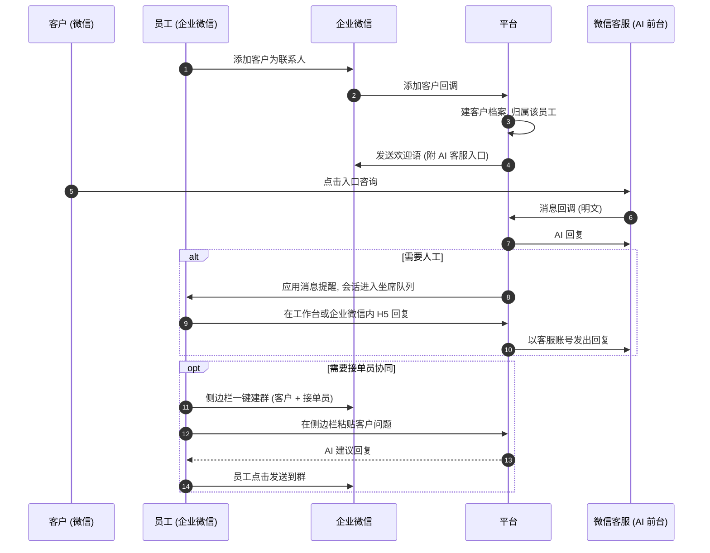
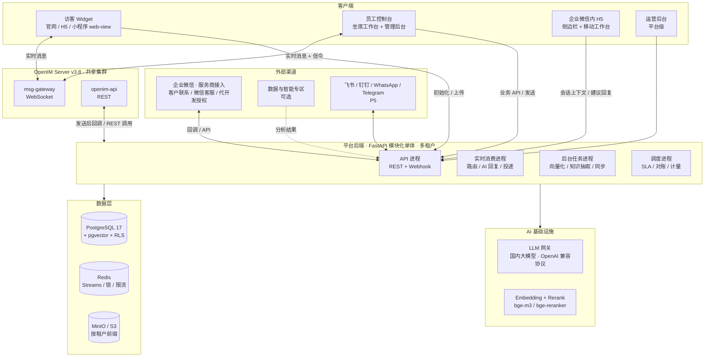
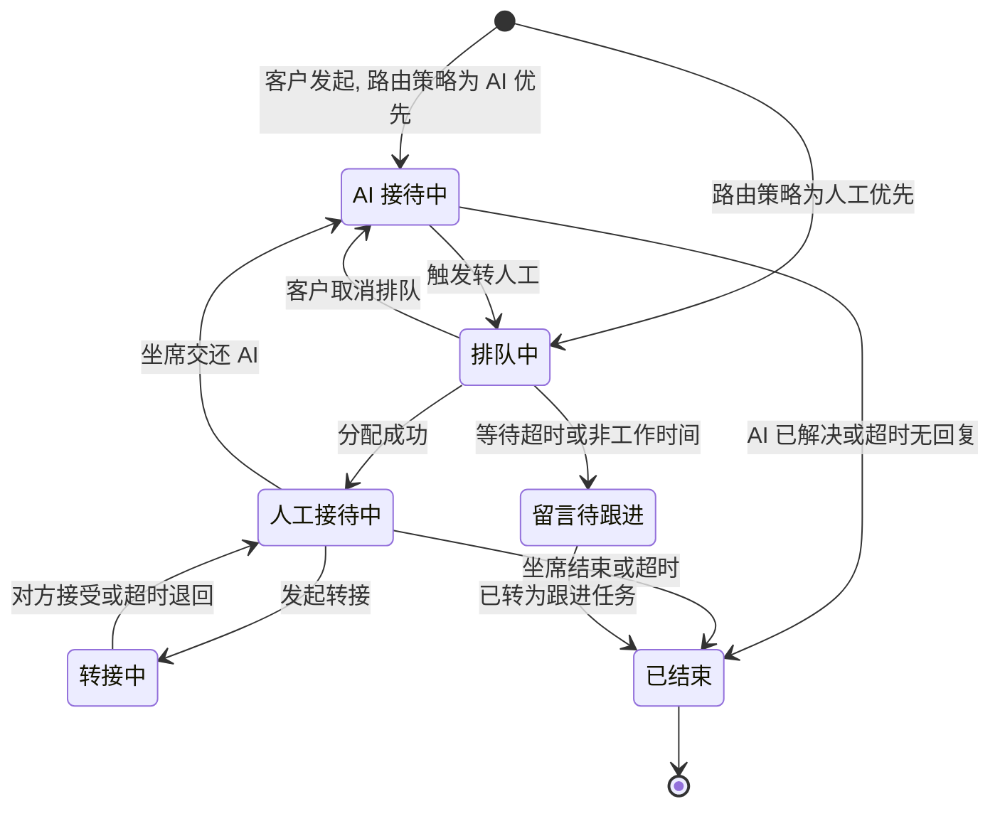
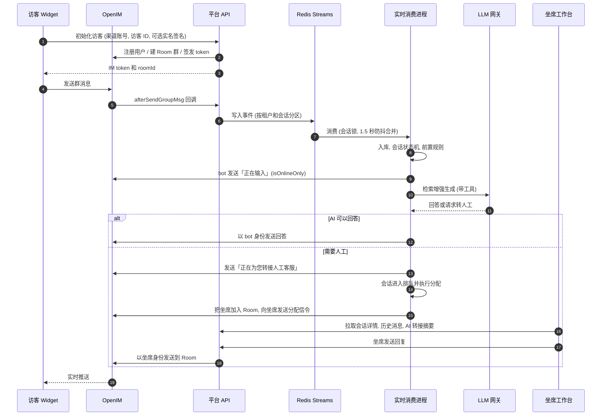
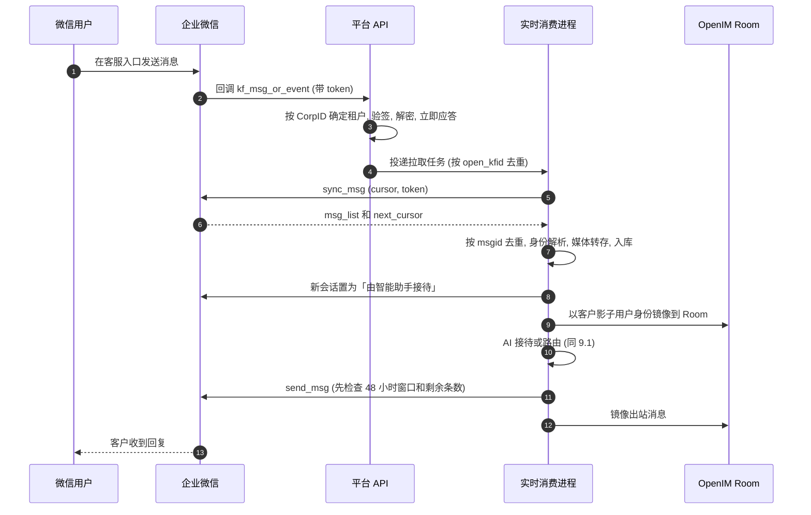
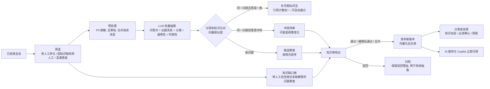
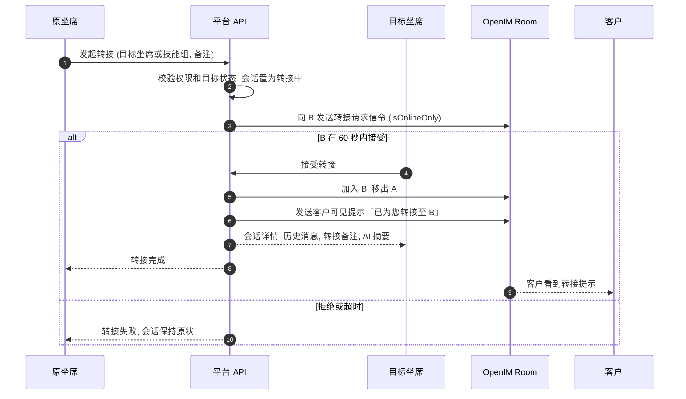

# 企业数字化转型平台 · 全渠道智能客服 设计文档

> 状态：草案 v0.2（已纳入 2026-09-28 第一轮决策反馈，待评审）
> 日期：2026-09-28
> 范围：需求 R1–R8 的整体架构、关键决策与分期方案。本文确认后，再按阶段拆解实施计划。
> 修订记录见附录 B。

---

## 0. 摘要

平台是一个**多租户 SaaS**，以「客户对话」为核心数据资产，分三步：

1. 把企业（租户）所有触点的客户对话汇聚到一个坐席工作台。触点先是企业微信和官网/H5，后续加入飞书、钉钉、WhatsApp、Telegram。
2. 由 AI 做第一道接待，在必要时自主转人工。
3. 把沉淀下来的对话持续提炼成企业知识库，再反哺 AI 和坐席。

**第一轮反馈带来的最大变化：企业微信「一客一群」场景**

你们的主流程是：员工用企业微信添加客户，再拉「客户 + 接单员 + AI 客服账号」建群，由 AI 在群里接待并实时记录。核对官方接口后发现：

- 企业微信**没有**官方方式让 AI 在客户群里自动发言。智能机器人只能用于企业内部；客户群的「小助理」只支持管理员预设的关键词回复。
- 把一个成员账号拉进群，**不会**让平台通过 API 读到群消息。读取群消息正文的唯一官方途径是会话内容存档；而 SaaS 服务商只能在企业微信的「数据与智能专区」里处理存档数据，拿不到明文。
- 因此，「AI 客服账号在群里实时收发、无需会话存档」只能靠非官方协议托管登录这个账号来实现，存在封号和法律风险。

§4 给出三个方案。**本文默认按方案 A 设计**：AI 自动接待放到「微信客服」1:1 入口（官方接口，平台拿到全量数据）；群内由员工服务，企业微信侧边栏里的 AI 助手给出建议回复，员工一键发送。

**核心设计决策**

1. **多租户 SaaS**：共享集群；所有租户数据带 `tenant_id` 并启用 PostgreSQL RLS；支持租户开通、套餐与计量，并提供平台运营后台。
2. **后端**：FastAPI 模块化单体 + 独立 Worker 进程。客户、会话、权限、知识等业务数据以平台后端和 PostgreSQL 为准。
3. **消息**：
   - OpenIM 作为实时消息总线，一个客户渠道身份对应一个服务群（Room），转接就是 Room 的成员变更。
   - 访客直连 IM；员工与 AI 的发送走平台 API；历史消息从平台 API 读取。
   - 先直接使用 OpenIM，商用前购买授权。
4. **企业微信**：以服务商身份，通过「代开发应用」接入。
   - 「客户联系」同步客户和客户群。
   - 「微信客服」承担 AI 前台。
   - 聊天工具栏侧边栏承担群内的 AI 辅助。
   - 不使用非官方协议。
5. **AI**：RAG + 受限工具调用 + 确定性的转人工决策引擎。只接国内大模型（OpenAI 兼容协议），按租户计量和限额。
6. **知识沉淀**：
   - LLM 批量抽取问答候选，去重聚类后人工审核。
   - 发布后推送给坐席，同时产出知识缺口榜。
7. **权限**：租户隔离（RLS）+ 应用层数据范围 + IM 群成员隔离。坐席只看得到自己的客户和当前会话，租户管理员看得到本租户的全部数据。

> ⚠️ **需要你拍板的问题**见 §23。最关键的一条：企业微信群场景选方案 A、B 还是 C。

---

## 1. 已确认的决策（2026-09-28）

| # | 问题 | 决定 | 对设计的影响 |
|---|---|---|---|
| 1 | 交付形态 | 多租户 SaaS | 新增 §7 多租户设计；企业微信必须以服务商身份接入（代开发应用），并受数据与智能专区的规则约束（§3.1、§7.4） |
| 2 | 大模型 | 以国内大模型为主 | LLM 网关只接国内模型（OpenAI 兼容协议），按租户计量与限额；平台需评估生成式 AI 的登记/备案义务（§3.3、§11.5） |
| 3 | OpenIM 许可 | 先直接使用，后续购买授权 | 直接用官方 Web SDK；把购买授权列为商用上线闸门（§21） |
| 4 | 企业微信场景 | 员工加客户为好友 → 拉「客户 + 接单员 + AI 客服账号」建群；希望 AI 在群里实时记录，不买会话存档 | 官方接口不支持这种做法，需要在 §4 的方案中选择；本文默认按方案 A 设计 |
| 5–8 | 规模、客户归属、知识审核、业务系统对接 | 未回复，按上一版默认执行 | 规模见假设 A3；首次人工接待即归属该坐席；知识必须人工审核；P3 预留只读的业务系统接口 |

---

## 2. 背景与目标

### 2.1 需求映射

| # | 需求 | 设计章节 | 分期 |
|---|---|---|---|
| R1 | 基于 Web 的全渠道客服（OpenIM + FastAPI + Vue3），触达企业全部客户并收集聊天数据 | §6 §9 §10.1 §10.2 §17 | P1 |
| R2 | 对接企业微信（后续飞书/钉钉/WhatsApp/Telegram）：聊天、群组、读取客户数据 | §4 §7.4 §10.3–§10.7 | P2（其余渠道 P5） |
| R3 | 企业知识库，能从聊天内容整理沉淀 | §12 | P3 手工知识 / P4 自动沉淀 |
| R4 | 接入大模型的 AI 聊天，承担前期客户接待 | §11.1 §11.5 | P3 |
| R5 | 自主判断是否需要人工介入，AI 处理不了时呼叫客服 | §11.2 §11.3 | P3 |
| R6 | 管理员/坐席角色；每个客户有独立档案；坐席只看自己的客户，管理员看全部 | §13 §15 | P1 |
| R7 | 把客户转移给其他坐席接待 | §14 | P1 |
| R8 | 持续收集聊天内容，更新知识库并分发给其他客服 | §12.3–§12.7 | P4 |

### 2.2 非目标（一期不做）

- 电话呼叫中心（IVR、语音坐席）。
- 营销自动化（SOP、群发编排）和订单、会员等业务系统本身。
- 原生移动端 App。坐席在手机上使用企业微信内打开的 H5 工作台和侧边栏。
- 通过非官方协议（iPad 协议、PC Hook、RPA 等）接入个人微信或企业微信。
- 在线支付。一期只做套餐、计量和账单展示。

### 2.3 关键假设（可推翻）

| # | 假设 | 不成立时的影响 |
|---|---|---|
| A1 | 首批租户是中国大陆企业，主要触点是企业微信，其次是官网 | 若以海外为主，P2 改做 WhatsApp/Telegram，并引入海外模型 |
| A2 | 采用共享集群的多租户 SaaS；个别大客户可以单独部署 | 如果大量客户要求私有化，需要提前做私有化交付包（见方案 B） |
| A3 | 首年规模：≤50 个租户，单租户 ≤50 坐席；全平台 ≤1 万同时在线访客、≤300 万条消息/天 | 超出时需要提前做消息表冷热分离、按租户分片和 OpenIM 集群扩容 |
| A4 | "为每个客户建立单独的客户数据库"理解为：每个客户在所属租户的客户库中有一份独立档案，通过归属关系做行级隔离。不是物理上每人一个库 | 如果要求物理隔离，转接和管理员全局视图的实现代价会很高，不建议 |
| A5 | 知识入库需要人工审核（至少前 6 个月） | 如果要求全自动，需要更强的评测和回滚机制 |
| A6 | "员工通过微信添加客户"指员工用企业微信添加客户的个人微信（企业微信「客户联系」） | 如果员工用的是个人微信，官方没有任何接口，只能改为引导客户进入企业微信或微信客服 |

---

## 3. 调研结论：必须遵守的外部约束

以下结论主要依据官方文档（2026-09 查阅），它们直接决定了架构。标注「需要 POC 验证」或「以官方为准」的条目，请在实施前复核。

### 3.1 企业微信（按 SaaS 服务商视角）

**接入身份**

- 企业微信有三种应用形态：
  - 企业自建应用：由企业自己开发和部署。
  - 第三方应用：服务商开发和部署，面向所有企业，权限由企业按白名单授予。
  - 代开发应用：服务商代企业开发，权限接近自建应用，企业用黑名单排除敏感权限。
- **多租户 SaaS 需要以服务商身份接入**，流程是：
  1. 注册企业微信服务商。
  2. 创建代开发应用模板，通过审核后上线。
  3. 租户管理员扫码授权。
  4. 服务商为每个授权企业完成配置和上线。
- 服务商拿到的成员 ID 和外部联系人 ID 是服务商维度的 ID，需要做映射（以官方 ID 转换规则为准）。

**微信客服（kf）**

- **能做什么**：
  - 微信用户可以从公众号、小程序、视频号、网页、APP、聊天中的客服链接等入口进入客服账号，企业通过 API 收发消息。
  - 代开发应用和第三方应用获得「微信客服」权限后即可调用（以官方权限说明为准）。
- **关键限制**：
  1. 只有会话处于"新接入待处理（0）"或"由智能助手接待（1）"时，API 才能发消息。
  2. 客户最后一次发消息后的 48 小时内，企业最多发 5 条；客户再发消息后，额度重置。
  3. `sync_msg` 只能拉取最近 3 天的消息，回调里的 token 10 分钟内有效。
- **对设计的影响**：
  - 平台整体扮演"智能助手"。人工坐席也在平台内通过 API 回复，**不把会话转到"由人工接待（3）"**。
  - 工作台展示回复窗口和剩余条数。
  - AI 的回答合并成一条发送，节省额度。
- **这是官方唯一允许 AI 全自动接待微信用户、并且平台能拿到消息明文的通道。**

**客户联系与客户群**

- **能做什么**：
  - 同步员工的外部联系人、标签、客户群和群成员，并接收变更回调。
  - 新客户欢迎语。
  - 「联系我」和「加入群聊」。
  - 在职继承、离职继承。
- **关键限制**：
  1. **不能通过 API 直接给外部联系人或客户群发消息。** 只有两种方式：创建群发任务，由员工或群主在客户端确认；或者在聊天工具栏侧边栏里，由员工点击后通过 JS-SDK 发送。
  2. **服务端不能直接创建客户群。** 可以在侧边栏用 JS-SDK `openEnterpriseChat` 一键发起建群（由员工确认；含外部联系人时最多 40 人），或者配置"加入群聊"二维码（群满后自动建新群）。
  3. 在职继承：90 天内每位客户最多被转接 2 次，24 小时后自动接替，每次最多 100 个客户。

**客户群里的机器人和自动回复**

- **智能机器人**：只支持企业内部的单聊和内部群聊，在群里需要被 @ 才会响应。外部微信用户无法与它交互，它也不能加入客户群。
- **客户群「小助理」自动回复**：
  - 管理员在后台预设关键词（包含匹配或完全匹配）和回复内容（文本、图文、网页、小程序），群主需要逐个群开启。
  - 客户 @小助理 或 @员工，且命中关键词时，小助理自动回复。
  - **它不是 AI，也不能接入平台的大模型。**
- **结论：官方没有让 AI 在客户群里自动发言的方式。**

**会话内容存档（读取聊天正文的唯一官方途径）**

- **费用**：付费功能，按存档员工数计费。2026-01-22 起价格上调：办公版 400、服务版 900、企业版 1800 元/人/年（以官方为准）。
- **客户同意**：需要客户同意。群主是存档员工时，该群为"存档群"，新进群的客户默认同意（以官方规则为准）。
- **服务商（SaaS）的限制**：
  - 服务商原有的经典存档接口授权到期后不能再用，必须改用「数据与智能专区」。
  - 在专区里，消息明文只对部署在专区内的程序可见：只有把消息传入专区内的自有模型时，才会替换成原文。**专区外拿不到明文，只能取回分析结果。**
  - 文档只提到两类模型：企业微信提供的模型，以及上传到专区的自有模型；没有提供调用外部大模型 API 的途径（需要 POC 确认）。
  - 会话记录只能获取最近 5 天的数据，需要及时拉取。
- **企业自建应用**：仍然可以用经典 C SDK 拉取并解密明文（5 天内的数据，每次最多 1000 条）。

**通用前置条件**

- 服务商资质（企业认证）、代开发模板审核、回调域名备案、可信 IP 等都需要提前准备，审核有周期。
- **P0 阶段就要启动。**

### 3.2 OpenIM

- **版本**：服务端最新稳定线是 v3.8.3 及其后续 patch，Web SDK 同属 3.8.3 线。
- **许可**：

  | 组件 | 许可 | 结论 |
  |---|---|---|
  | open-im-server | Apache-2.0 | 可以放心自托管 |
  | openim-sdk-core（Go 核心） | Apache-2.0 | — |
  | openimsdk/chat（官方业务层：注册登录、管理后台） | GPL-3.0 | **不使用**，业务层由 FastAPI 承担 |
  | `@openim/client-sdk`（纯 JS Web SDK，不在浏览器存数据，可以跑在小程序里） | GPL-3.0-only | 打包进前端并分发到浏览器，可能触发 copyleft 义务 |
  | `@openim/wasm-client-sdk`（WASM + IndexedDB 本地库） | AGPL-3.0-only | 同上，而且更严格 |

  - **决定**：现在直接使用 `@openim/client-sdk`，商用上线前购买 OpenIM 商业授权（见 §21 上线闸门）。
  - SDK 调用仍然收敛在 `packages/im-client` 这一个适配层。
- **多租户**：
  - OpenIM 开源版没有内置的租户隔离，平台用一个共享集群，用户和群的 ID 统一加租户前缀。
  - 只有平台后端能签发 token。不同租户之间没有好友关系，也没有共同的群，所以天然隔离。
  - OpenIM 里只存展示名和头像，不存敏感信息。
  - 大租户可以分配独立的 OpenIM 集群。
- **Webhook**：
  - 在 `config/webhooks.yml` 中配置。支持单聊和群聊的发送前、发送后回调，以及建群前后、用户上下线等事件。
  - "发送前"回调可以拒绝或修改消息，但会把业务后端放进 IM 的关键路径。
  - 已知问题：`failedContinue` 从 v3.7.0 起配置不生效（open-im-server issue #3808）。
  - **我们的用法**：只用"发送后"回调做入库，再用定时对账兜底；用"建群前"回调禁止访客自行建群。
- **REST 发消息**：
  - 用 `imAdmin` 管理员令牌调用 `/msg/send_msg`，可以指定任意 `sendID`，支持单聊和群聊。
  - `isOnlineOnly`：只投递给在线用户、不存储，适合"正在输入""新会话分配提醒"这类信令。
  - `ex` 扩展字段：携带平台消息 ID，便于去重和关联。
- **流式消息**：开源主线曾经加入这个功能，后来又移除了，目前正在重新引入（issue #3770 / PR #3771），**不能依赖**。AI 回复采用"正在输入提示 + 整段或分段发送"。

### 3.3 合规（SaaS 运营方视角）

- **生成式 AI**：
  - 面向公众提供 AI 对话，需要使用已完成生成式人工智能服务备案的国内模型。
  - 平台作为调用已备案模型的应用运营方，通常还要在属地网信部门办理登记。上线前请法务确认。
- **AI 生成内容标识**：《人工智能生成合成内容标识办法》自 2025-09-01 起施行，AI 回复需要显式标识。例如在访客端的消息气泡上标注"AI 助手"；纯文本渠道加前缀。
- **个人信息保护（PIPL）**：
  - 平台是租户的受托处理者，需要与租户签订数据处理协议（DPA），约定处理目的、范围、保存期限和删除规则。
  - 敏感个人信息需要脱敏。
  - 支持删除和导出请求。
- **运营资质**：
  - 面向企业收费的在线 SaaS，通常需要增值电信业务经营许可（ICP、EDI 等，具体类型按业务形态由法务确认）。
  - 企业客户常会要求等保测评（二级或三级）。
- **非官方协议的法律风险**：
  - 国内已有微信外挂、群控软件的开发者被以「提供侵入、非法控制计算机信息系统程序、工具罪」判刑。
  - 也有群控软件开发商因不正当竞争被判赔偿腾讯。
  - 详见 §4.5。

---

## 4. 企业微信「一客一群」场景：能力边界与方案选择

### 4.1 你们设想的流程

1. 员工用企业微信添加客户。
2. 员工建群，成员包括客户、企业接单员和「AI 客服账号」。
3. AI 客服在群里接待客户、实时记录全部对话；需要时由接单员或客服接手。
4. 不购买会话存档。

### 4.2 官方能力核对

| 需要的能力 | 官方支持 | 说明 |
|---|---|---|
| 同步客户、客户群、群成员及其变更 | ✅ | 客户联系接口 + 变更回调（代开发应用） |
| 新客户自动欢迎语 | ✅ | 由添加客户事件触发，可以附带链接或小程序（有时间窗口，以官方为准） |
| 建群 | ⚠️ 需员工确认 | 在侧边栏用 JS-SDK 一键发起，员工在客户端确认；或使用"加入群聊"二维码 |
| AI 在客户群里自动回复 | ❌ | 智能机器人不能进客户群；「小助理」只有关键词回复 |
| "AI 客服账号"（普通成员）通过 API 在群里发言 | ❌ | 没有自动发送接口；群发任务需要群主在客户端确认 |
| 成员在群里，平台就能读到群消息 | ❌ | 成员身份不等于接口权限；读取正文只能用会话存档 |
| SaaS 平台拿到群消息明文 | ❌ | 服务商只能在专区内处理存档数据，明文不出专区 |
| 员工在群里用 AI 辅助回复 | ✅ | 员工把客户问题粘贴到聊天工具栏侧边栏，AI 生成建议回复，员工点击后由 JS-SDK 发送到当前群（侧边栏读不到群消息） |
| AI 全自动接待微信用户（1:1） | ✅ | 微信客服，消息明文回调给平台 |

**结论**：只把「AI 客服账号」拉进群，官方接口既读不到群消息，也不能替它发言。要做到"AI 在群里实时收发、无需存档"，只能用非官方协议托管登录这个账号（即方案 C）。

### 4.3 三个方案

**方案 A：官方合规（推荐，SaaS 默认）**

- **做法**：微信客服做 AI 前台；群内由员工服务，侧边栏的 AI 助手辅助回复。
- **AI 自动接待**：✅ 通过微信客服 1:1 接待。
- **AI 在群里自动发言**：❌ 由员工一键发送 AI 建议。
- **群聊原文进入平台**：❌ 可选在专区内做分析，只取回摘要、标签等结果（需要 POC）。
- **会话存档费用**：不启用专区分析时为零。
- **封号与法律风险**：无。
- **适用**：多租户 SaaS 主线。

**方案 B：私有化部署 + 会话存档**

- **做法**：平台部署在客户自己的环境里，使用企业自建应用和经典存档 SDK。
- **AI 自动接待**：✅ 同方案 A。
- **AI 在群里自动发言**：❌ 同方案 A。
- **群聊原文进入平台**：✅ 延迟需要实测。
- **会话存档费用**：可以只给担任群主的「存档账号」开通。覆盖范围和同意规则以官方为准。
- **封号与法律风险**：无。
- **适用**：愿意私有化部署、且必须留存群聊原文的大客户。

**方案 C：用非官方协议托管账号**

- **做法**：由第三方网关以 iPad 协议、PC Hook 或 RPA 方式登录「AI 客服账号」。
- **AI 自动接待**：✅ 在群内。
- **AI 在群里自动发言**：✅
- **群聊原文进入平台**：✅
- **会话存档费用**：无。
- **封号与法律风险**：高。
- **适用**：不建议。

方案 B 里，你们设想的「在每个群里放一个专用账号」仍然有用。它的角色从"发言的 AI"变成了"存档锚点"：只需为这一个账号购买存档席位，就能官方地采集它担任群主的服务群。

### 4.4 推荐方案 A 的业务流程



**要点**

- **客户看到的「AI 客服」**：是租户的微信客服账号（可以设置品牌名和头像），不是群成员。
  - 入口可以放在欢迎语、员工对外资料、群公告、公众号菜单、小程序和官网里。
- **群内服务**：
  - 由员工和接单员服务。
  - 侧边栏展示客户档案、历史会话摘要（来自微信客服和 Web）和知识检索；员工把客户的问题粘贴到侧边栏后，AI 给出推荐回复，员工一键发送。
  - 通过侧边栏发出的消息会记录到平台。
- **兜底**：由租户管理员在企业微信后台配置「小助理」关键词回复，例如在非工作时间把客户引导到 AI 客服入口。
- **数据**：
  - 微信客服、Web 以及侧边栏发出的消息全量进入平台，支撑客户档案和知识沉淀。
  - 客户在群里直接发的消息，默认不进入平台。
  - 如果需要分析群聊，走专区 POC（§10.6）或方案 B。
- **对业务流程的改变**：AI 自动接待从"群内"移到了"微信客服入口"。需要确认这一点在业务上能否接受（§23）。

### 4.5 关于方案 C

方案 C 是市面上一些 SCRM 产品的做法，能实现你们设想的效果。本设计不采用它，也不包含协议层的实现，原因如下：

1. **违反平台规则**：企业微信的服务协议不允许未经授权的第三方客户端和自动化操作。账号可能被限制或封禁，受影响的可能不只是 AI 账号，还会波及企业主体。
2. **SaaS 的系统性风险**：所有租户依赖同一套协议通道。一次风控升级或客户端更新，就可能让全部租户同时中断。
3. **法律风险**：
   - 国内已有微信外挂、群控软件的开发者被以「提供侵入、非法控制计算机信息系统程序、工具罪」判处有期徒刑。
   - 也有群控软件开发商因不正当竞争被判赔偿腾讯 260 万元。
   - 作为平台运营方，这些风险由你们公司承担。
4. **安全风险**：账号的登录凭证和全部客户聊天数据都要经过第三方网关。

如果公司经法务评估后仍希望走方案 C，需要单独决策。平台的渠道适配层不依赖任何一种接入方式，按方案 A 建设主链路不受影响。

---

## 5. 关键架构决策（含备选方案）

### D1 后端形态：模块化单体（选定）

- **做法**：
  - 一个 FastAPI 代码库，按领域划分模块：tenancy / iam / customer / conversation / routing / channels / ai / knowledge / billing / analytics / audit。
  - 部署成四类进程：API 进程、实时消费进程、后台任务进程、调度进程。
- **备选方案：微服务。** 否决理由：团队初期规模小，领域边界还在变化，分布式事务和运维的成本都很高。
- **保留的演进空间**：模块之间只通过服务接口和领域事件交互，日后可以把"渠道适配器""AI 推理"拆成独立服务。

### D2 OpenIM 使用模型：一个客户渠道身份对应一个服务群 Room（选定）

| 方案 | 做法 | 优点 | 缺点 |
|---|---|---|---|
| **A. 服务群 Room（选定）** | 每个客户渠道身份对应一个 OpenIM 群。成员是：客户身份、AI 机器人、当前坐席，以及可选的旁听主管 | 转接就是换成员，历史连续；天然支持主管旁听和协助；外部渠道的桥接方式统一；坐席只收到自己 Room 的消息 | 群数量约等于客户数（OpenIM 可以承载）；需要屏蔽成员变更通知；需要禁止访客自行建群 |
| B. 服务号单聊 | 客户与一个虚拟"客服号"单聊，平台在后台把消息路由给坐席 | 客户看到的身份始终一致 | 坐席端几乎用不上 IM 能力，要另建一套实时推送；转接和旁听都要自研 |
| C. 坐席直连单聊 | 客户直接与坐席单聊 | 最简单 | 转接会产生新会话，历史割裂；无法旁听。不推荐 |

### D3 读写路径：访客直连 IM；员工与 AI 走 API 写入；历史走 API 读取（选定）

- **访客消息**：
  - 链路：Widget → OpenIM → `afterSendGroupMsg` 回调 → 平台入库，并触发 AI 或路由。
  - 低延迟、断线重连、离线消息都由 IM 负责。
  - 调度进程定时对账补漏。
- **坐席、AI、系统消息**：
  - 先发到平台 API。平台校验权限、回复窗口和敏感词，写审计日志，先落库。
  - 再按渠道投递：Web 渠道由 OpenIM REST 以坐席身份发到 Room；微信客服先通过渠道 API 发出，成功后再镜像到 Room。
- **历史消息**：工作台一律从平台 API（PostgreSQL）读取，由平台统一控制数据范围。OpenIM 只负责实时增量。
- **理由**：
  - 业务校验必须同步生效，同时又不能把后端放进 IM 的关键路径。
  - 转接后，新坐席需要看到自己加入之前的完整历史，而 IM 群对新成员的历史可见性不适合作为权限依据。

### D4 企业微信接入：服务商 + 代开发应用，只用官方 API（选定）

- **分工**：
  - 客户联系：客户和客户群数据、欢迎语、归属关系。
  - 微信客服：AI 前台，双向收发。
  - 聊天工具栏侧边栏：单聊和群聊中的 AI 助手。
  - 数据与智能专区：可选的群聊分析。
- **应用形态**：
  - 选代开发应用，因为它的权限接近自建应用；第三方应用的权限白名单较窄。
  - 以后如果要上架应用市场，再补一个第三方应用。
- **否决**：非官方协议（见 §4.5）。

### D5 AI 编排：RAG + 受限工具 + 确定性决策引擎（选定）

- **做法**：
  - 模型只拿到只读或低风险的工具：检索知识、请求转人工、留言建单、读取客户资料、登记当前客户的线索字段。
  - 任何越权动作都不提供对应工具。
  - 是否转人工，由规则引擎综合多个信号来裁决。
- **备选方案：完全由模型自主决策（Agent）。** 否决理由：客服场景对可控性和可解释性要求高，需要能调阈值，也需要能回溯每一次判定。

### D6 知识沉淀：LLM 批量抽取 + 人工审核后发布（选定）

- **备选方案：自动入库。** 否决理由：一条错误知识会被 AI 反复输出给客户，代价远大于审核成本。
- **例外**：低风险变更（比如给已有问题补充相似问法）可以开放自动通过。

### D7 数据存储：PostgreSQL + pgvector 一库多用（选定）

- **做法**：业务数据、消息归档、向量检索（稠密向量 + 稀疏向量）都放在 PostgreSQL 17 + pgvector ≥0.8 中。
- **理由**：减少早期要运维的组件。OpenIM 本身已经依赖 MongoDB、Redis、Kafka、MinIO、etcd。
- **演进**：
  - 大表按月分区、按租户分区；租户规模增长后，按租户分片。
  - 知识切片达到千万级，或检索 QPS 很高时，迁移到 Milvus 或 Elasticsearch。
  - 报表数据量大时，引入 ClickHouse。
  - 检索层做接口隔离，方便替换。

### D8 LLM 供应商：国内大模型 + 网关按场景路由（选定）

- **接入方式**：统一通过 OpenAI 兼容协议接入国内模型，例如 DeepSeek、通义千问、智谱、豆包、Kimi。需要私有化时，用 vLLM 部署开源模型。
- **按场景配置**：接待回答、意图/情绪分类、转人工摘要、坐席建议、知识抽取这几个场景，分别配置模型、超时和降级策略。
- **扩展性**：海外模型不在当前范围，适配器接口保留扩展能力。

### D9 多租户：共享集群 + 逻辑隔离（选定）

- **做法**：
  - 所有租户共享一套集群。
  - 所有租户数据表都带 `tenant_id`，并启用 RLS。
  - OpenIM、Redis、对象存储和向量检索都按租户命名空间隔离。
- **备选方案：每个租户独立数据库或独立部署。** 否决理由：早期租户数量多、规模小，独立部署的运维成本不可接受。
- **保留**：为大客户提供"专属部署"，作为高配套餐。

---

## 6. 总体架构

### 6.1 架构图



### 6.2 组件职责

| 组件 | 职责 |
|---|---|
| 访客 Widget | 嵌入式聊天窗口（用 iframe 隔离）；支持匿名和实名访客；收发文字、文件、表情；提供"转人工"按钮、排队提示、满意度评价、离线留言；展示 AI 标识和隐私告知 |
| 员工控制台 | 一个 Vue3 SPA，按角色展示"坐席工作台"和"管理后台"两套布局 |
| 企业微信内 H5 | 聊天工具栏侧边栏（客户档案、AI 建议回复、一键建群、发送），以及手机上的精简版坐席工作台（企业微信内免登） |
| 运营后台 | 平台级：租户、套餐、用量、渠道授权状态、模型供应商配置、系统健康 |
| OpenIM | 实时投递、离线消息、在线状态、"正在输入"、文件上传（对象存储）、多端同步 |
| API 进程 | 业务 REST API；接入 OpenIM 和企业微信的 Webhook（验签后写入 Redis Streams，立即返回） |
| 实时消费进程 | 按（租户，会话）有序消费消息事件：入库、身份解析、会话状态机、路由分配、AI 回复、渠道投递 |
| 后台任务进程 | 文档解析与向量化、知识抽取与聚类、企业微信全量和增量同步、报表 |
| 调度进程 | 排队 SLA 计时、会话超时关闭、消息对账、用量汇总 |
| PostgreSQL | 业务数据的权威来源：租户、员工、客户、会话、消息归档、知识库（含向量）、计量、审计 |
| Redis | 与 OpenIM 使用不同的实例或 DB。承担事件流（Streams）、会话锁与防抖、坐席负载、回复窗口计数、按租户限流、缓存 |
| MinIO | 存放渠道媒体的转存文件和知识文档原件，按租户前缀隔离。可以与 OpenIM 共用集群，但使用不同的 bucket |

### 6.3 技术选型

| 层 | 选型 | 说明 |
|---|---|---|
| 后端 | Python 3.12、FastAPI、Pydantic v2、SQLAlchemy 2.0（async）、Alembic、httpx | 全异步 |
| 任务 | Redis Streams（实时事件）+ Taskiq（后台任务，asyncio 原生） | 如果团队更熟悉 Celery 也可以替换，任务接口已做隔离 |
| 数据库 | PostgreSQL 17 + pgvector ≥0.8 | 稠密向量用 HNSW 索引，稀疏向量用 `sparsevec`；0.8 的迭代索引扫描改善带过滤条件的检索 |
| IM | OpenIM Server v3.8.x（Docker Compose / K8s），共享集群 | 依赖 MongoDB、Redis、Kafka、MinIO、etcd；商用前购买授权 |
| 前端 | Vue 3 + TypeScript + Vite + Pinia + Vue Router + Element Plus（企业微信 H5 用移动端组件库，如 Vant） | pnpm workspace；API 客户端由 OpenAPI 生成 |
| IM 客户端 | `@openim/client-sdk`，封装在 `packages/im-client` 中 | 纯 JS，不在浏览器落盘，转接后旧坐席的电脑上不会残留聊天记录 |
| Embedding/Rerank | bge-m3（稠密 + 稀疏）、bge-reranker-v2-m3，自托管 | 中文效果好，数据不出平台；也可以换成模型供应商的向量接口 |
| LLM | 国内大模型（DeepSeek、通义千问、智谱、豆包等），OpenAI 兼容协议；需要时用 vLLM 私有化部署 | 见 §11.5 |
| 可观测性 | OpenTelemetry、Prometheus + Grafana、Loki | OpenIM 自带 Prometheus 指标；所有指标带租户维度 |
| 工程 | uv、ruff、mypy、pytest + testcontainers；eslint、vitest、Playwright | CI 跑 lint、单测和关键 E2E |

---

## 7. 多租户 SaaS 设计

### 7.1 隔离方案

| 层 | 隔离方式 |
|---|---|
| PostgreSQL | 所有租户表带 `tenant_id` 并启用 RLS；每个请求在事务内执行 `SET LOCAL app.tenant_id`；平台运营的跨租户查询使用单独的数据库角色，并全程审计 |
| 大表 | `messages` 按月分区；`kb_chunks` 按租户哈希分区；租户规模增长后可以按租户分片 |
| Redis | key 前缀 `t:{tenantId}:`；按租户限流 |
| 对象存储 | 路径前缀 `t/{tenantId}/`；只通过签名 URL 访问 |
| OpenIM | 共享集群，用户和群 ID 带租户前缀；不跨租户建立好友或群 |
| 向量检索 | 在 SQL 层强制按 `tenant_id` 过滤 |
| LLM | 每次调用带租户标识；按租户记账，设置配额和并发上限；可选由租户自带 API Key |
| 密钥 | 租户级数据密钥（信封加密），用于加密渠道凭证和敏感字段 |
| 实时消费 | 按（租户，会话）分区；设置单租户并发上限，防止某个租户挤占资源 |

### 7.2 租户开通与生命周期

1. **开通**：自助注册或由运营开通 → 创建租户（分配短码）→ 初始化默认角色、技能组、路由策略 → 邀请租户管理员。
2. **渠道接入向导**：
   - 生成 Web Widget 嵌入代码。
   - 企业微信扫码授权代开发应用。
   - 在企业微信里把微信客服账号交给该应用管理。
3. **生命周期**：试用 → 正式套餐 → 续费或升级 → 停用 → 注销。注销时先提供数据导出，再按保留期删除。

### 7.3 套餐与计量

- **计量维度**：坐席数、AI 接待会话数与 Token、知识库条目与存储、渠道数量、专区分析（如启用）。
- **汇总**：每日汇总到 `usage_records`，租户管理员可以在后台查看。
- **额度控制**：用量接近或超过额度时提醒；超额时按套餐策略处理（提醒、限流，或把 AI 降级为人工接待）。
- **计费**：一期只做套餐、计量和账单展示，在线支付后续再接入。

### 7.4 企业微信服务商接入

1. **注册服务商**：平台注册为企业微信服务商（需要企业认证）。
2. **创建代开发应用模板**：
   - 申请通讯录（成员）、客户联系、客户群、应用消息、JS-SDK（聊天工具栏）、微信客服等权限。
   - 配置指令回调和数据回调 URL。
   - 提交审核，审核通过后上线模板。
3. **租户授权**：
   - 租户管理员扫码授权。
   - 平台收到授权通知，换取永久授权码。
   - 服务商在后台为该企业配置并提交上线。
   - 平台加密保存企业凭证，开始全量同步。
4. **回调路由**：数据回调走统一入口，按 CorpID 路由到对应租户。
5. **需要租户配合的操作**：
   - 在企业微信后台把微信客服账号交给该应用管理。
   - 把侧边栏页面配置到聊天工具栏（由租户管理员或服务商按官方流程完成）。
   - （可选）购买会话存档并授权专区。

### 7.5 运营后台（平台级）

- **功能**：
  - 租户管理：开通、停用、套餐、功能开关。
  - 用量与账单。
  - 渠道授权状态。
  - 模型供应商与路由配置。
  - 全局敏感词与内容安全策略。
  - 系统健康与平台审计。
- **访问控制**：
  - 运营人员账号与租户员工账号完全分开，登录和权限都独立。
  - 运营人员访问租户业务数据，需要租户授权或工单审批，并全程审计。

---

## 8. 核心领域模型

### 8.1 概念

- **租户 Tenant**：一个企业客户。所有业务数据都带 `tenant_id`。
- **套餐 Plan / 订阅 Subscription**：租户的功能与额度。
- **员工 Staff**：租户内的平台用户。
  - 角色有租户管理员、主管、坐席、知识管理员。
  - 坐席有技能组、最大并发数和在线状态。
  - 可以绑定企业微信成员 ID。接单员如果需要接待客户，也开坐席账号。
- **客户 Customer**：客户档案的主记录，也就是 R6 里的"独立档案"。
  - 有归属坐席（`owner_id`），以及标签、备注和自定义字段。
  - 提供客户 360 视图：基本信息、各渠道身份、历史会话、所在企业微信群、线索字段。
- **渠道身份 Identity**：客户在某个渠道上的身份，例如访客 ID、微信客服 external_userid、客户联系 external_userid。
  - 一个客户可以有多个身份。
  - 支持合并：按实名签名、unionid 自动识别；疑似同一客户时，由管理员确认后合并。
- **渠道账号 ChannelAccount**：一个接入点，例如某个官网 Widget 或某个微信客服账号。每个渠道账号挂一套路由策略。
- **服务室 Room**：`客户身份 × 渠道账号` 的长期对话容器，对应一个 OpenIM 群。
- **会话 Session**：Room 中的一次服务过程，从客户发起到结束。
  - 记录 AI/排队/人工状态、分配的坐席、转接记录、摘要和满意度。
  - 知识沉淀以 Session 为单位。
- **消息 Message**：所有渠道消息的统一归档。平台库是消息的业务权威来源。
- **企业微信客户群 WecomGroupChat**：从企业微信同步的客户群，关联客户档案和群成员。在方案 A 下，只有元数据和通过侧边栏发出的消息。
- **知识 KnowledgeItem**：包括 FAQ（标准问 + 相似问 + 答案）、文档和话术。每条知识都有状态、版本、可见范围和有效期。

### 8.2 会话状态机



- 会话结束后，客户再发消息时，会在同一个 Room 中新建 Session。
- 如果在结束后 N 分钟内（可配置）再发消息，可以"续接"原会话。

### 8.3 OpenIM 映射约定

| 平台对象 | OpenIM 对象 | ID 约定（示例，`{t}` 为租户短码） |
|---|---|---|
| 访客或外部客户的身份（外部渠道客户是不登录的"影子用户"，只用于在 Room 中代表客户发言） | 用户 | `{t}_c_{identityId}` |
| 员工 | 用户 | `{t}_s_{staffId}` |
| AI 机器人 | 用户（每个租户一个） | `{t}_bot` |
| 系统用户（群主、系统提示、信令） | 用户 | `{t}_sys` |
| Room | 群，群主为 `{t}_sys` | `{t}_r_{roomId}` |

- **REST 调用**：平台后端使用 `imAdmin` 令牌调用 REST 接口，负责注册用户、签发短时有效的用户 token、建群和换成员、发消息。
- **Room 成员**：
  - 固定成员是客户身份和 AI 机器人，再加上当前被分配的坐席。
  - 可选"归属坐席常驻"。
  - 主管旁听时，以观察者身份加入，访客端不展示观察者。
- **通知屏蔽**：
  - 关闭"成员进群/退群"等群通知在访客端的展示（通过 OpenIM 通知配置和 Widget 过滤）。
  - 转接时，由平台发一条面向客户的系统提示，例如「已为您转接至 XX」。
- **防滥用**：
  - 开启 `beforeCreateGroup` 回调，只允许平台用管理员令牌建群。
  - 单聊开启好友校验，访客之间、访客与员工之间都不能私聊。
  - 系统用户与员工预先建立好友关系，保证单聊信令可达。
- **信令**：业务事件（新分配、转接请求、AI 建议就绪、SLA 告警）由 `{t}_sys` 以 `isOnlineOnly` 自定义消息发给坐席。坐席上线或重连时，从平台 API 拉取最新状态作为兜底。
- **消息关联**：消息的 `ex` 字段携带平台消息 ID（`pmid`），用于前端去重和关联。

---

## 9. 消息链路

### 9.1 Web 访客：AI 接待 → 转人工



### 9.2 坐席发送（统一走 API 写入）

1. 工作台生成 `clientMsgId` 作为幂等键，调用 `POST /api/v1/sessions/{id}/messages`。
2. 平台依次校验：
   - 数据范围：这个会话是否分配给了我。
   - 会话状态。
   - 渠道回复窗口，例如微信客服的 48 小时 / 5 条。
   - 敏感词、附件类型和大小。
3. 写入 `messages` 表，状态为 `pending`。
4. 按渠道投递：
   - Web 渠道：通过 OpenIM REST 以坐席身份发到 Room。
   - 微信客服：通过渠道 API 发送，成功后再镜像到 Room，用 `ex.pmid` 关联。
5. 把状态更新为 `sent` 或 `failed`，失败原因实时回显到工作台，例如"已超过 48 小时回复窗口"。

### 9.3 可靠性

- **幂等**：
  - 入站消息用 `(channel_account_id, channel_msg_id)` 唯一约束去重。OpenIM 消息取 `serverMsgID`，企业微信消息取 `msgid`。
  - 出站消息用 `clientMsgId` 去重。
- **对账补漏**：
  - OpenIM 的发送后回调是异步通知，失败时不保证重投。调度进程每分钟对活跃 Room 按 seq 拉取增量，与平台库比对后补录。
  - 企业微信 `sync_msg` 的游标持久化保存。回调丢失时，由定时任务兜底拉取。由于消息只保留 3 天，拉取频率必须有保障。
- **有序与防抖**：
  - 同一会话的事件串行处理：按（租户，会话）哈希到 N 个分区流，每个分区同一时刻只由一个消费者处理。
  - 客户连续发多条短消息时，等待 1.5–3 秒，合并成一轮再交给 AI。这样可以避免答非所问，也不浪费微信客服的 5 条额度。
- **租户公平**：Webhook 入口和 AI 调用都按租户限流，单个租户的突发流量不影响其他租户。
- **降级**：
  - LLM 超时或故障时，发送兜底话术，并直接转人工。
  - OpenIM 不可用时，坐席发送会返回错误并提示；微信客服等渠道的入站消息照常入库，OpenIM 恢复后再镜像补发。
- **媒体转存**：
  - 企业微信的临时素材只有 3 天有效期，收到后立即下载，转存到 MinIO。
  - 语音从 amr/silk 转码为 mp3，供 Web 端播放；可选语音转文字，供 AI 理解。

---

## 10. 渠道接入层

### 10.1 统一抽象

```python
class ChannelCapabilities(BaseModel):
    reply_window: timedelta | None       # 微信客服 48h；WhatsApp 24h；Web 无限制
    max_msgs_in_window: int | None       # 微信客服 5 条
    supports_media: set[MediaType]
    supports_groups: bool
    supports_recall: bool
    text_limit: int | None
    agent_can_send_via_api: bool         # 客户联系/客户群为 False（只能群发任务 / 侧边栏）
    proactive_outreach: OutreachMode     # 主动触达方式：none / template / broadcast_task


class ChannelAdapter(Protocol):
    type: ChannelType
    capabilities: ChannelCapabilities

    async def verify_and_parse(self, request: Request) -> list[InboundEvent]: ...     # 回调验签/解密/解析
    async def pull(self, account: ChannelAccount, cursor: str | None) -> PullResult: ...  # 拉取型渠道
    async def send(self, room: Room, msg: OutboundMessage) -> SendResult: ...
    async def fetch_profile(self, identity: Identity) -> ProfilePatch: ...
```

**入站的统一流程**

`InboundEvent` → 确定租户 → 身份解析（查找或新建 Identity 和 Customer）→ 查找或新建 Room → 查找或新建 Session → 归档 → 镜像到 OpenIM Room → 触发路由或 AI

**关于"触达全部客户"（R1）**

平台可以汇聚所有渠道的客户，但每个渠道能否"主动"联系客户，受渠道规则限制：

| 渠道 | 主动触达规则 |
|---|---|
| Web 访客 | 只能在访客在线时联系 |
| 微信客服 | 只能在客户最后一次发消息后的 48 小时内联系 |
| 企业微信客户联系、客户群 | 需要员工确认群发任务，或由员工在侧边栏发送 |
| WhatsApp | 需要使用已审核的模板消息 |

这些差异由 `capabilities` 描述。后续的营销触达（P5）统一建立在这层抽象上。

### 10.2 Web 访客渠道

- **嵌入方式**：
  - 企业在网页中插入 `<script src="https://cs.example.com/widget.js" data-channel="ch_xxx" async></script>`，页面上会出现悬浮按钮，点开后加载 iframe（独立源，CSS 和令牌都与宿主页面隔离）。
  - `data-channel` 对应某个租户的渠道账号，平台据此确定租户。
  - 同时提供移动端 H5 全屏链接。小程序通过 web-view 打开。
- **访客身份**：
  - **匿名访客**：Widget 生成访客 ID，平台签发短时有效的 IM token。
  - **实名访客（推荐）**：适用于企业官网的已登录用户。企业服务端用共享密钥对 `{userId, name, phone, ts}` 签名（HMAC 或 JWT）后传给 Widget。平台验签通过后，把访客绑定到同一份客户档案，防止冒充。
- **功能**：文字、表情、图片、文件；AI 标识；"转人工"按钮；排队位置；满意度评价；离线留言；隐私告知与同意。
- **防刷**：按访客、IP 和租户限流，限制图片和文件的类型与大小，可选人机验证。

### 10.3 微信客服（AI 前台，P2 核心）



**接入方式（SaaS）**

- 通过代开发应用的「微信客服」权限接入。
- 租户需要在企业微信里把客服账号交给该应用管理（以官方流程为准）。

**入口投放**

欢迎语、员工对外资料、群公告、公众号菜单、小程序、官网等处都可以放客服入口（参见 §4.4）。

**接管模式（推荐）**

- 收到新会话时，平台把它置为"由智能助手接待（1）"。
- 之后 AI 接待和人工接待都在平台内完成，**不把会话转到"由人工接待（3）"**。否则平台就无法再通过 API 发消息。

**混合模式（可选）**

- 部分坐席继续用企业微信客户端接待（状态 3）。
- 这类会话在平台上只读：通过 `sync_msg` 中 origin=5 的消息同步归档，不在平台内回复。

**回复窗口**

- Redis 按 `(open_kfid, external_userid)` 记录客户最后一次发消息的时间，以及之后已发送的条数。
- 工作台的输入框显示「剩余 N 条 / 截止 hh:mm」。额度用完后，输入框禁用并给出提示。
- AI 的回答合并成一条发送；转人工的过渡话术尽量与最后一条回答合并。
- 可以用菜单消息引导客户点选。客户点选会产生一条客户消息，从而重置回复额度。这一点需要 POC 验证。

**欢迎语**

收到 `enter_session` 事件后，用事件响应接口发送欢迎语。`welcome_code` 只在短时间内有效，而且只能使用一次。

**客户资料**

- 通过 `kf/customer/batchget` 获取客户的昵称、头像，以及 unionid（如果已绑定）。
- unionid 可以用来和客户联系、公众号、小程序体系打通客户身份。

**消息类型**

文本、图片、语音、视频、文件、图文、小程序、菜单消息（可以做成"转人工""满意度"按钮）、位置。

### 10.4 企业微信 · 客户联系与客户群（P2）

| 功能 | 方案 |
|---|---|
| 客户同步 | 授权后按员工全量拉取外部联系人，再批量获取详情；之后通过 `change_external_contact` 回调（添加、编辑、删除）增量同步。写入客户档案和 Identity。如果添加人是平台坐席，就作为客户的默认归属坐席 |
| 新客户欢迎语 | 收到添加客户事件后，发送欢迎语，附带「AI 客服」入口（微信客服链接）。有时间窗口，并且与后台已配置的欢迎语互斥，以官方为准 |
| 标签 | 企业标签双向同步：平台上打的标签会写回企业微信 |
| 客户群 | 同步群列表和成员，通过 `change_external_chat` 回调增量更新；把群和客户档案关联起来，在客户 360 视图中展示 |
| 建群 | 服务端不能直接建客户群，有两种方式：① 在侧边栏用 JS-SDK `openEnterpriseChat` 一键发起建群（客户 + 接单员），由员工确认；② 平台配置"加入群聊"二维码（可以满员后自动建新群），用于活动入群 |
| 给客户发消息 | 不能通过 API 直发，有两种方式：① 平台创建群发任务，员工或群主在企业微信确认后发出，平台回收发送结果；② 在侧边栏由员工点击后通过 JS-SDK 发送 |
| 员工登录 | 员工在企业微信内打开 H5 时免登；在电脑上可以用企业微信扫码登录控制台。同时完成"平台员工 ↔ 企业微信成员"的绑定 |
| 内部通知 | 通过应用消息推送给员工，例如新排队、转人工请求、转接请求、知识更新摘要 |
| 归属转移 | 平台上的客户转移可以联动在职继承和离职继承（见 §14.3） |

### 10.5 聊天工具栏侧边栏（P2 基础 / P3 接入 AI）

- **运行位置**：员工企业微信客户端的单聊和客户群聊天窗口右侧（H5 页面，使用 JS-SDK，需要先调用 `agentConfig`）。
- **获取上下文**：单聊用 `getCurExternalContact` 取当前客户；客户群用 `getCurExternalChat` 取当前群。平台据此加载客户档案，并校验当前员工的数据范围。
- **功能**：
  - 客户档案与标签（可以编辑）。
  - 该客户在微信客服和 Web 的历史会话摘要。
  - AI 推荐回复（P3）、知识检索、快捷话术。
  - 一键建群（`openEnterpriseChat`）。
  - 一键发送到当前聊天（`sendChatMessage`）。
- **记录**：通过侧边栏发出的内容写入平台（渠道记为 `wecom_sidebar`），同时作为坐席采纳 AI 建议的反馈数据。
- **限制**：JS-SDK 读不到聊天内容，侧边栏不知道客户在群里说了什么。生成建议回复时，需要员工把客户的问题粘贴或输入到侧边栏；AI 再结合客户档案，以及该客户在微信客服和 Web 的历史，给出建议。

### 10.6 会话存档与数据与智能专区（可选）

- **SaaS（方案 A 的可选增强）**：
  - 租户购买会话存档，为「存档账号」开通。
  - 平台在专区内部署分析程序，做群聊摘要、情绪、质检和知识候选抽取，只取回结果。
  - 需要 POC 验证：
    - 专区可用的模型和资源。
    - 能否输出"泛化后的问答候选"。
    - 延迟和费用。
- **私有化（方案 B）**：
  - 使用企业自建应用 + 经典 C SDK，每 1–5 分钟按 seq 增量拉取。
  - 用 RSA 私钥解密后入库，私钥放在 KMS 或密钥管理系统中。
  - 可以只给担任群主的存档账号开通。

### 10.7 后续渠道（P5）

| 渠道 | 官方方式 | 需要关注的约束 |
|---|---|---|
| WhatsApp | WhatsApp Business Platform（Cloud API） | 24 小时客服窗口；窗口外只能发已审核的模板消息；按消息计费 |
| Telegram | Bot API（Webhook） | 用户需要先主动与机器人对话；在群里使用需要先把机器人拉进群 |
| 飞书 | 开放平台的机器人 / 服务台 | 主要面向飞书用户（含外部联系人），和面向 C 端的微信场景不同 |
| 钉钉 | 开放平台的机器人 / 服务群 | 同上 |

新增一个渠道，只需要实现一个 `ChannelAdapter` 并补充配置页面，不需要改动会话、AI 和知识模块。

---

## 11. AI 接待与人工介入

### 11.1 AI 回复流水线


**模型可以使用的工具**（只读或低风险）：

| 工具 | 作用 |
|---|---|
| `search_knowledge(query, filters)` | 当模型认为首轮检索的资料不足时，进行二次检索 |
| `get_customer_profile()` | 读取当前客户的档案摘要，不含敏感字段 |
| `save_lead_info(fields)` | 前期接待时登记线索。只能写当前客户的白名单字段，标记来源为 AI，由坐席确认 |
| `request_human_handoff(reason, category, urgency, summary)` | 请求转人工，交给决策引擎裁决 |
| `create_ticket(subject, detail)` | 非工作时间留言建单 |
| `lookup_order(order_no)` 等 | 后续对接业务系统，只读 |

**系统提示词要点**

- 设定身份和语气（每个租户可以配置自己的 AI 客服名称和话术风格）。
- 只依据提供的资料作答。资料里没有时，明确说不知道，并调用转人工。
- 不承诺价格、赔付或法律结论。
- 不透露内部信息。
- 遵守渠道格式约束，例如纯文本渠道不使用 Markdown。

### 11.2 转人工决策引擎

| 类型 | 信号 | 默认处理 |
|---|---|---|
| 硬触发 | 客户明确要求人工（关键词 + 意图识别，如"转人工""找客服"） | 立即转 |
| 硬触发 | 模型调用了 `request_human_handoff` | 立即转 |
| 硬触发 | 敏感类别：投诉、退款/赔偿、法律、安全、隐私删除请求 | 立即转 |
| 硬触发 | 客户是 VIP，或有专属坐席且策略要求人工接待 | 立即转 |
| 硬触发 | 后置护栏连续两次不通过 | 立即转 |
| 软信号 | 检索的最高相关度低于阈值（知识缺失） | +0.4 |
| 软信号 | 模型自评置信度低 | +0.3 |
| 软信号 | 负面情绪或情绪升级（情绪分类） | +0.3 |
| 软信号 | 重复提问：与上一轮问题的语义相似度高于阈值，达到 2 次 | +0.3 |
| 软信号 | 客户否定了回答（"没用""不是这个意思"） | +0.2 |
| 软信号 | AI 接待超过 N 轮仍未解决 | +0.2 |

- **判定规则**：
  - 软信号加权得分 ≥ 阈值（默认 0.6）时转人工。
  - 初始权重是经验值，上线后根据标注数据调整；可以按租户和渠道分别配置。
- **判定留痕**：
  - 每次判定都写入 `ai_decisions`，包括各信号、得分和结果。
  - 管理后台可以查看"误转"和"漏转"的样本，用来调参。
  - 这也是知识缺口的主要来源（见 §12.4）。
- **转接时对客户**：发送过渡话术，例如「这个问题我帮您转给人工客服，请稍候」，并告知排队位置和预计等待时间。

### 11.3 排队与分配策略

分配按以下顺序进行（可配置）：

1. **专属坐席优先**：客户有归属坐席，且该坐席在线、并发未满时，直接分配给该坐席。企业微信场景里，归属坐席通常就是添加该客户的员工。
2. **技能组匹配**：按渠道账号的默认技能组分配；或者按 AI 识别出的意图（售前、售后、技术、投诉）映射到技能组。
3. **组内负载均衡**：优先分配给"当前会话数 / 最大并发数"最低的坐席；相同时，选空闲最久的坐席。
4. **排队**：没有坐席可接时，进入技能组队列。
   - 优先级：VIP > 情绪激动或投诉 > 普通。同一优先级按等待时间排序。
   - 向客户推送排队位置。
5. **溢出与兜底**：
   - 等待超过 X 分钟，溢出到备用技能组。
   - 非工作时间或等待超时，转为留言建单，指派给归属坐席或技能组次日跟进。
   - 等待期间，AI 可以继续回答客户的其他问题（可配置）。

**坐席提醒**

- 分配或转人工时，除了工作台信令，还通过企业微信应用消息提醒坐席。
- 坐席点击提醒，在企业微信内打开 H5 工作台直接回复。

**坐席状态**

- 状态分为在线、忙碌（不接新会话）、小休、离线。
- 登录工作台后自动上线。
- 断线超过 N 分钟后自动离线，已分配但尚未接起的会话退回队列。

### 11.4 坐席 AI 助手（Copilot）

人工接待期间，AI 只对坐席可见。它同时出现在坐席工作台和企业微信侧边栏里，提供以下能力：

- **转接摘要**：客户的诉求、已经提供的信息、AI 已回答的内容、客户情绪。
- **推荐回复**：基于知识库和上下文，生成 1–3 条候选。坐席一键插入后可以编辑，不会自动发给客户。
- **知识检索**：在侧边栏搜索知识库，结果可以一键插入。
- **实时提醒**：情绪升级、出现敏感信息、坐席使用了承诺类话术时给出提示。
- **会话小结**：会话结束时自动生成小结和标签，坐席确认后写入客户档案。
- **采纳反馈**：记录每条建议是"采纳""修改后采纳"还是"忽略"，用于优化知识和提示词。

### 11.5 LLM 网关与模型选择（国内大模型）

**统一接口**：`chat()`（支持工具调用、结构化输出、流式）、`embed()`、`rerank()`。

**横切能力**：

- 超时重试与供应商降级（主力供应商故障时切到备用供应商）。
- 按租户记账、配额和并发上限；可选由租户自带 API Key。
- Token 和成本记账（写入 `llm_calls`，汇总进用量计量）。
- 提示词版本管理。
- 调用前 PII 脱敏，日志脱敏。
- 内容安全：输入和输出都要经过内容安全检查（供应商内容安全接口 + 平台敏感词库）。

**供应商**

- DeepSeek、通义千问（阿里云百炼）、智谱 GLM、豆包（火山方舟）、Kimi 等，都通过 OpenAI 兼容协议接入，用同一个适配器。
- 需要私有化时，用 vLLM 部署开源模型（如 Qwen、DeepSeek）。
- 只使用已完成生成式人工智能服务备案的模型（见 §3.3）。

**各场景的模型建议**

| 场景 | 要求 | 建议 |
|---|---|---|
| 接待回答 | 低延迟、支持工具调用、中文质量好 | 评测后选定的主力模型 |
| 分类、情绪、改写 | 高并发、低成本 | 同一供应商的轻量模型 |
| 转接摘要、会话小结 | 质量稳定 | 主力模型 |
| 知识抽取（离线批量） | 长上下文、结构化输出、低成本 | 主力模型，走供应商的批量接口（如有）或在夜间限速运行 |

**其他**

- **能力标签**：每个模型都登记能力标签（工具调用、JSON Schema、上下文长度、批量接口），网关按场景需求选择可用的模型。
- **模型选型用评测说话**：
  - P3 开始前，用种子租户真实的 200–500 条历史问答建立评测集。
  - 评测指标包括：准确率、拒答正确率、转人工正确率、延迟、成本。
  - 候选模型跑同一套评测后再做决定。

### 11.6 AI 安全与护栏

- **输入不可信**：客户输入一律视为不可信数据，需要防范提示词注入。
  - 手段：系统提示隔离、工具权限最小化、输出过滤。
  - AI 除了登记当前客户的线索字段，没有其他写权限。
- **内部资料在检索层过滤**：`visibility=internal` 的知识永远不进入对客 AI 的上下文，而不是靠提示词让模型"不要说"。
- **租户隔离**：检索、客户资料、上下文组装全部按租户过滤，AI 永远拿不到其他租户的数据。
- **内容过滤**：输入和输出都做敏感词过滤；检测价格、赔付、时效等承诺类话术。
- **AI 标识**：AI 回复要显式标识。Widget 气泡上标注"AI 助手"，纯文本渠道加可配置的前缀。
- **脱敏**：调用模型前，把手机号、身份证、银行卡、地址等替换为占位符；必要时在回复中还原。

---

## 12. 企业知识库与知识沉淀闭环

### 12.1 知识模型

- **知识空间**：按产品线或部门划分。空间内有分类树和标签。每个租户的知识库完全独立。
- **知识类型**：
  - **FAQ**：标准问题 + 多个相似问法 + 答案（可以包含图片、链接、小程序卡片）。这是客服场景的主力。
  - **文档**：产品手册、政策制度等（PDF、Word、Markdown、网页），解析后切片。
  - **话术**：坐席的快捷回复模板，可以带变量。
- **属性**：
  - 状态：草稿 → 待审核 → 已发布 → 已归档。
  - 版本。
  - 可见范围：对客 AI 可用 / 仅坐席可见 / 仅管理员可见。
  - 生效和失效时间，用于活动、价格类知识。
  - 来源：手工录入 / 导入 / 对话沉淀。
  - 负责人和引用证据。
- **冷启动**：支持从 Excel 批量导入 FAQ、上传文档，以及抓取官网帮助中心。

### 12.2 检索设计

- **切片**：
  - 文档按标题层级加语义切分，每片 300–800 字，重叠 10–15%。每个切片保留标题路径作为上下文前缀。
  - FAQ 把标准问和每个相似问分别向量化，因为"问题对问题"的匹配最准。答案单独存储。
- **向量**：
  - bge-m3 同时产出稠密向量（1024 维，使用 pgvector HNSW 索引）和稀疏词权重（`sparsevec`），不需要额外的中文分词插件就能做混合检索。
  - 注意：HNSW 索引对稀疏向量的非零元素数有上限（1000），所以切片长度需要控制。
- **查询流程**：
  1. 问题改写。
  2. 稠密检索和稀疏检索各取 Top-50。
  3. 用 RRF 融合结果。
  4. 用 bge-reranker 重排，取 Top-5。
  5. 用相关度阈值判断"有没有相关知识"。
- **过滤**：租户、空间、可见范围、有效期、渠道，全部在 SQL 层过滤。pgvector 0.8 的迭代索引扫描能保证过滤之后仍有足够的召回数量。

### 12.3 数据来源（按方案 A）

| 来源 | 能否进入沉淀流水线 |
|---|---|
| Web 访客会话 | ✅ 全量 |
| 微信客服会话 | ✅ 全量 |
| 企业微信侧边栏发出的消息 | ✅ 员工回复，以及被采纳的 AI 建议 |
| 客户群里客户直接发的消息 | ❌ 默认不采集；启用专区后，只有专区内抽取出的结果（需 POC）；方案 B 可以全量采集 |
| 手工录入、文档导入 | ✅ |

### 12.4 沉淀流水线（R3 / R8 的核心）



**抽取输出示例（结构化）**

```json
{
  "qa_pairs": [
    {
      "question": "订单发货后多久能到？",
      "answer": "一般 2–3 天送达，偏远地区 5–7 天，可在「我的订单」查看物流。",
      "evidence_message_ids": ["m_01J8...", "m_01J8..."],
      "category": "物流",
      "generalizable": true,
      "time_sensitive": false,
      "confidence": 0.86
    }
  ],
  "unresolved_questions": ["能否开具电子专票？"]
}
```

**要点**

- **只抽取可泛化的知识**：客户个人信息和个案细节必须剔除。有三道关口：先脱敏再抽取；提示词约束；审核时二次检查。
- **不跨租户**：抽取、比对、聚类都只在同一个租户内进行，任何知识都不会流入其他租户。
- **运行方式**：抽取按天批量运行，成本低，也便于安排审核。每条候选都记录抽取时使用的提示词和模型版本，方便追溯。
- **优秀话术挖掘**：从高满意度的会话中，提取坐席的高质量回复，作为话术候选。

### 12.5 审核与发布

- **审核台**：
  - 候选按"影响度 = 出现频次 × 近期趋势"排序。
  - 展示内容：候选本身、相似的现有知识、差异高亮、证据对话（已脱敏）。
- **审核操作**：通过 / 编辑后通过 / 合并到已有知识 / 标记为仅坐席可见 / 驳回（需填写理由）。
- **版本管理**：
  - 每次发布都产生新版本，可以回滚到任意历史版本。
  - 有效期到期后自动下线，并提醒负责人。
- **自动通过规则**（可选，默认关闭）：只适用于"给已有 FAQ 增加相似问法"，且要求证据 ≥3 条、相似度 ≥ 阈值。

### 12.6 分发给坐席（R8）

- **知识动态**：工作台的"知识动态"流按技能组推送新增和变更的知识。
- **必读确认**：政策、价格等重要变更可以设为"必读"，坐席需要确认已读，管理员可以查看确认率。
- **始终最新**：推荐回复和知识检索（工作台和侧边栏）始终基于最新发布的版本。
- **知识周报**：每周通过站内信和企业微信应用消息发送，内容包括新增知识、热门问题、知识缺口 Top 10。
- **快捷话术**：快捷话术库随知识更新同步。

### 12.7 知识运营指标

- **AI 效果**：AI 独立解决率、知识命中率、转人工原因分布。
- **知识缺口**：缺口数量、缺口关闭时长。
- **沉淀质量**：候选通过率、坐席对 AI 建议的采纳率。
- **单条知识**：点赞/点踩、关联的满意度、长期未被命中的"僵尸"知识。

---

## 13. 权限与客户数据隔离（R6）

### 13.1 角色与数据范围

| 层级 | 角色 | 功能权限 | 数据范围 |
|---|---|---|---|
| 平台 | 平台运营 | 租户、套餐、用量、供应商配置 | 不直接访问租户业务数据（需要授权并审计） |
| 租户 | 租户管理员 | 员工、技能组、渠道、路由、知识库、报表、客户分配 | 本租户全部客户和会话 |
| 租户 | 主管（可选，P1 预留） | 所辖团队的监控、转接和质检 | 本团队坐席的客户和会话 |
| 租户 | 坐席 | 接待客户、查看和编辑自己的客户档案、发起转接、搜索知识 | 自己的客户 + 当前分配给自己的会话 |
| 租户 | 知识管理员（作为权限点授予） | 知识审核、发布 | 知识库 + 证据对话（已脱敏） |

权限用"权限点"组合成角色，例如 `customer:read`、`customer:export`、`kb:publish`、`session:transfer:any`，便于日后自定义角色。

### 13.2 坐席的可见性规则

- **能看到哪些客户**：`owner_id = 我` 的客户，加上当前有会话分配给我的客户。后者只在服务期间临时可见，但能看到完整历史。
- **会话结束后**：如果客户不归属于我，就不再可见。可以配置保留 N 小时，方便补写小结。
- **敏感字段**：手机号等字段默认掩码展示（如 `138****1234`），拥有 `customer:view_sensitive` 权限才能看到完整内容。
- **导出**：坐席不能导出客户。租户管理员导出需要二次确认，并记录审计日志。

### 13.3 实现：四层防护

1. **租户层**：
   - 所有租户表都启用 PostgreSQL RLS：每个请求在事务内执行 `SET LOCAL app.tenant_id`。
   - 从根本上防止跨租户泄露。
2. **应用层**：
   - 所有客户、会话、消息的查询，都必须经过统一的 `DataScope` 依赖注入过滤条件。这一点在仓储层强制执行，禁止裸查询。
   - 配套"越权"自动化测试，覆盖列表、详情、消息、搜索、附件下载、导出。测试两件事：坐席 A 通过任何 API 都拿不到坐席 B 的客户；租户甲通过任何 API 都拿不到租户乙的数据。
3. **IM 层**：
   - 坐席只是自己负责的 Room 的群成员，实时消息天然隔离。
   - 转接后，旧坐席被移出 Room。前端使用不落盘的 SDK，旧坐席的电脑上不会残留聊天记录。
4. **企业微信侧边栏**：用企业微信返回的当前员工身份和当前会话，再叠加平台的数据范围做双重校验，只返回该员工有权看到的客户数据。

**附件下载**：先校验数据范围，再签发短时有效的签名 URL，不直接暴露对象存储地址。

---

## 14. 转接与客户归属（R7）

### 14.1 三种操作

| 操作 | 含义 | 发起人 | 效果 |
|---|---|---|---|
| 会话转接 | 把"当前这次对话"交给另一位坐席或技能组 | 坐席、主管、管理员 | 新坐席接手本次会话；客户归属不变（可以勾选"同时转移归属"） |
| 客户转移 | 永久变更客户的归属坐席 | 管理员（坐席可以申请，由管理员审批） | 原坐席失去该客户的可见性；支持批量操作；记录归属历史 |
| 邀请协助（P3） | 邀请其他坐席或主管进入会话协助，不转移会话 | 坐席 | 形成三方会话，协助者可以只读，也可以发言 |

**离职交接**就是批量客户转移：按规则分配给指定坐席，或平均分配给技能组。

### 14.2 会话转接流程



- **转给技能组**：走 §11.3 的分配逻辑，不需要对方接受确认。
- **强制转接**：管理员可以强制转接，不需要对方接受。
- **记录与统计**：所有转接都写入 `session_events`，报表可以统计转接率和转接原因。

### 14.3 与企业微信联动

- **微信客服会话**：转接只在平台内部发生，企业微信侧无感知。
- **客户联系的外部联系人**：
  - 如果客户转移需要同步变更企业微信里的"添加人"，调用在职继承或离职继承接口。
  - 平台需要向操作人提示限制：90 天内每位客户最多被转接 2 次；24 小时后自动接替。
  - 转接结果异步回收。失败时，保留平台内的转移，并标记"企业微信未同步"。
- **客户群**：如果员工离职或调岗，可以把其作为群主的客户群一并转给接替的员工（以官方接口为准）。

---

## 15. 数据模型（PostgreSQL 关键表）

**通用约定**

- 除平台级表外，所有表都含 `id`（UUIDv7）、`tenant_id`、`created_at`、`updated_at`，并启用 RLS。
- 手机号、密钥等敏感字段用租户级数据密钥加密。
- `messages` 表按月分区；`kb_chunks` 按租户哈希分区。

| 模块 | 表 | 关键字段 |
|---|---|---|
| 平台与租户 | `tenants`（平台级） | code, name, status, plan_id, settings, created_by |
| | `plans`（平台级） | name, limits(jsonb), price |
| | `subscriptions` | plan_id, period_start, period_end, status |
| | `usage_records` | metric(seats/ai_sessions/tokens/storage/...), date, quantity |
| | `tenant_keys` | key_ref, wrapped_key（信封加密） |
| | `platform_users`（平台级） | 运营人员账号，与租户员工分开 |
| 组织与权限 | `staff` | name, email, phone_enc, password_hash, wecom_userid, im_user_id, status |
| | `roles` / `role_permissions` / `staff_roles` | 用权限点组合出角色 |
| | `teams` / `skill_groups` / `skill_group_members` | 主管团队、技能组 |
| | `agent_settings` | staff_id, max_concurrency, status(online/busy/away/offline), status_changed_at |
| 客户 | `customers` | display_name, avatar, phone_enc, email, company, level, owner_id, owner_since, custom_fields(jsonb), lead_fields(jsonb), first_contact_at, last_contact_at |
| | `customer_identities` | customer_id, channel, channel_account_id, external_id, unionid, im_user_id, profile(jsonb), verified；唯一键 (tenant_id, channel_account_id, external_id) |
| | `customer_owner_history` | customer_id, from_owner, to_owner, reason, operator_id, wecom_sync_status |
| | `tags` / `customer_tags` / `customer_notes` | 标签字典（与企业微信企业标签同步）、客户标签、备注 |
| 渠道 | `channel_accounts` | type(web/wecom_kf/wecom_contact/...), name, config_enc(jsonb), routing_policy_id, status |
| | `channel_cursors` | channel_account_id, cursor, updated_at（sync_msg 游标等） |
| 会话 | `rooms` | customer_id, identity_id, channel_account_id, im_group_id, last_message_at |
| | `sessions` | room_id, customer_id, status, assignee_id, skill_group_id, started_at, first_response_at, handoff_at, human_joined_at, closed_at, close_reason, handoff_reason, ai_summary, csat, resolved |
| | `session_events` | session_id, type(created/ai_reply/handoff/queued/assigned/transfer_*/closed…), actor_id, payload(jsonb) |
| | `messages`（按月分区） | room_id, session_id, direction, sender_type(customer/agent/bot/system), sender_id, content_type, content(jsonb), text_plain, channel_msg_id, im_msg_id, client_msg_id, delivery_status；唯一键 (channel_account_id, channel_msg_id) |
| | `routing_policies` | mode(ai_first/human_first), business_hours, default_skill_group_id, overflow_rules, max_wait_seconds |
| | `tickets` | 留言和跟进任务 |
| AI | `ai_decisions` | session_id, message_id, signals(jsonb), score, decision |
| | `llm_calls` | scene, provider, model, input_tokens, output_tokens, latency_ms, cost, status, session_id |
| | `prompt_templates` | scene, version, content, is_active（平台默认 + 租户覆盖） |
| | `ai_suggestions` | session_id, source(workbench/sidebar), content, sources, adoption(adopted/edited/ignored) |
| 知识 | `kb_spaces` / `kb_categories` | 知识空间、分类树 |
| | `kb_items` | space_id, type(faq/doc/snippet), title, answer/content, visibility, status, version, valid_from, valid_to, source, owner_id, stats(jsonb) |
| | `kb_item_versions` | 历史版本快照 |
| | `kb_questions` | item_id, question, is_primary（标准问与相似问） |
| | `kb_documents` | 原始文件、解析状态 |
| | `kb_chunks`（按租户哈希分区） | item_id 或 document_id, content, embedding vector(1024), sparse sparsevec, metadata(jsonb) |
| | `kb_candidates` | cluster_id, question, answer, evidence_message_ids, frequency, matched_item_id, suggestion(new/merge/conflict), status, reviewer_id, review_note, extractor_version |
| | `kb_gaps` | 问题聚类、频次、状态 |
| | `kb_feedback` / `kb_acks` | 点赞点踩、必读确认 |
| 企业微信 | `wecom_authorizations` | corp_id, auth_type(代开发/第三方), permanent_code_enc, agent_id, scopes, status, authorized_at |
| | `wecom_kf_accounts` | open_kfid, name, channel_account_id |
| | `wecom_contacts` / `wecom_follow_users` | 外部联系人及其添加人（客户联系同步） |
| | `wecom_group_chats` / `wecom_group_members` | 客户群及成员，关联客户档案 |
| | `wecom_zone_results`（可选） | chat_id, type(summary/sentiment/qa_candidates), payload(jsonb) |
| 审计 | `audit_logs` | actor_type(platform/staff), actor_id, action, resource_type, resource_id, detail(jsonb), ip |

---

## 16. 接口概览

```text
# 员工端（JWT，令牌内含 tenant_id）
POST   /api/v1/auth/login  |  /auth/refresh  |  /auth/wecom/oauth
GET    /api/v1/me
PUT    /api/v1/agent/status
GET    /api/v1/sessions?status=&scope=mine|team|all
GET    /api/v1/sessions/{id}  |  /sessions/{id}/messages?before=
POST   /api/v1/sessions/{id}/messages                # 坐席发送（clientMsgId 幂等）
POST   /api/v1/sessions/{id}/accept | close | transfer | return-to-ai
GET    /api/v1/sessions/{id}/copilot/suggestions
GET    /api/v1/customers  |  /customers/{id}      PATCH /customers/{id}
POST   /api/v1/customers/transfer                   # 批量客户转移（管理员）
GET    /api/v1/kb/search?q=
CRUD   /api/v1/kb/items  |  /kb/documents  |  /kb/candidates/{id}/review
CRUD   /api/v1/admin/staff  |  /admin/skill-groups  |  /admin/channels  |  /admin/routing-policies
GET    /api/v1/admin/usage                          # 本租户用量与额度
GET    /api/v1/admin/integrations/wecom             # 企业微信授权状态与向导
GET    /api/v1/reports/*

# 企业微信侧边栏（企业微信免登 → 平台会话）
GET    /api/v1/sidebar/context?externalUserId=|chatId=   # 当前客户或群的档案
POST   /api/v1/sidebar/suggestions                  # AI 建议回复
POST   /api/v1/sidebar/sent                         # 记录员工通过侧边栏发出的内容
GET    /api/v1/sidebar/jssdk-config                 # JS-SDK 签名

# 访客端（渠道 key + 访客签名）
POST   /api/v1/visitor/init                         # 返回 IM token、roomId、Widget 配置
POST   /api/v1/visitor/handoff                      # 点击「转人工」
POST   /api/v1/visitor/rating  |  /visitor/leave-message
POST   /api/v1/visitor/uploads                      # 预签名上传

# 运营后台（平台账号，独立鉴权）
CRUD   /platform/v1/tenants  |  /platform/v1/plans
GET    /platform/v1/usage  |  /platform/v1/health

# Webhook（仅内网可达或验签）
POST   /hooks/openim/{command}                      # afterSendGroupMsg、beforeCreateGroup、用户上下线
GET    /hooks/wecom/{callbackType}                  # 回调 URL 验证（cmd 为指令回调，data 为数据回调）
POST   /hooks/wecom/{callbackType}                  # 指令回调：授权变更；数据回调：客户联系、客户群、微信客服事件（按 CorpID 路由租户）
```

---

## 17. 前端设计

### 17.1 应用划分

- `apps/console`：员工控制台，包含坐席工作台和租户管理后台，按角色路由。
- `apps/widget`：访客端。以体积为先，独立构建，通过 iframe 嵌入。
- `apps/wecom-h5`：企业微信内的 H5，包含聊天工具栏侧边栏和手机端精简工作台，移动端优先。
- `apps/platform-admin`：平台运营后台，独立域名和登录。
- `packages/im-client`：OpenIM SDK 的封装，负责连接、重连、消息标准化、去重。**这是唯一允许直接引用 OpenIM SDK 的包。**
- `packages/api-client`：由 FastAPI 的 OpenAPI 描述自动生成的类型和请求函数。
- `packages/ui`：共享组件，如消息气泡、富文本、文件预览。

### 17.2 坐席工作台（三栏布局）

| 区域 | 内容 |
|---|---|
| 左栏：会话列表 | 分为"进行中""排队""AI 接待中"（主管可见）"已结束"四个标签；顶部是坐席状态切换（在线/忙碌/小休） |
| 中栏：聊天区 | 顶部显示客户名、渠道、回复窗口（如「剩余 4 条 / 截止 18:30」）；消息流的历史部分走 API，增量部分走 IM；底部是输入框，以及快捷话术、转接、结束按钮 |
| 右栏：辅助面板 | 客户档案与历史会话（含所在企业微信群）、AI 助手（摘要、推荐回复）、知识检索、会话信息（标签、小结） |

### 17.3 租户管理后台

| 模块 | 内容 |
|---|---|
| 数据看板 | 实时排队、在线坐席、AI 解决率、满意度 |
| 员工与角色 | 员工、角色、权限点 |
| 技能组与路由策略 | 技能组、分配规则、工作时间、溢出策略 |
| 渠道接入 | 生成 Widget 嵌入代码、企业微信授权向导、微信客服账号绑定 |
| 客户管理 | 全部客户、批量转移、合并客户、企业微信客户群 |
| 会话监控 | 实时旁听、强制转接 |
| 知识库 | 知识空间、知识条目、文档、审核台、缺口榜 |
| AI 配置 | AI 客服名称与话术风格、提示词、转人工阈值、评测 |
| 用量与套餐 | 用量、额度、账单 |
| 报表与审计 | 运营报表、审计日志 |

### 17.4 企业微信侧边栏

- **单聊客户**：客户档案、标签、历史会话摘要、AI 建议回复、快捷话术、一键建群。
- **客户群**：群成员与关联客户、群内客户的档案、AI 建议回复、快捷话术。
- **交互原则**：所有发送都由员工点击触发，平台不在后台替员工发消息。

---

## 18. 安全、合规与审计

- **认证**：
  - 员工使用账号密码登录，或者用企业微信扫码登录、企业微信内免登。
  - Access Token 有效期 15 分钟；Refresh Token 有效期 7 天、轮换使用，存放在 httpOnly Cookie 中。
  - 登录失败达到次数后锁定。
  - 平台运营账号使用独立的登录入口，并强制二次验证。
  - 后续支持 OIDC 和 LDAP。
- **密钥**：
  - 包括 OpenIM 管理员密钥、企业微信服务商凭证与各企业的永久授权码、模型 API Key。
  - 统一放在密钥管理系统中（K8s Secret + 外部 KMS/Vault）。数据库里只存引用或加密值，租户凭证用租户级密钥加密。
- **网络**：
  - OpenIM 的 Webhook 只在内网可达，并附带共享密钥。
  - 企业微信回调需要验签和解密。
  - 对外只暴露网关。
  - OpenIM API 在网关层做路径白名单和限流，管理员接口只允许内网访问。
- **审计**：记录登录、权限变更、客户转移、会话转接、数据导出、知识发布、查看敏感字段，以及平台运营人员对租户数据的任何访问。
- **数据生命周期**：
  - 消息保留期可以按租户配置（如 3 年），到期后删除或匿名化。
  - 知识库只保存脱敏后的内容。
  - 支持客户提出的数据查询和删除请求。
  - 租户注销时先导出、再删除，并出具删除记录。
- **隐私告知**：访客首次打开 Widget 时展示隐私提示；与租户签订数据处理协议。
- **合规**：见 §3.2 与 §3.3（开源许可、模型备案与登记、AI 生成内容标识、PIPL、运营资质）。

---

## 19. 非功能需求与部署

### 19.1 目标

| 指标 | 首年目标 |
|---|---|
| 消息端到端投递 | P95 < 500 ms（Web 渠道） |
| AI 首次回复 | P95 < 8 s（含防抖时间，期间显示"正在输入"） |
| 可用性 | 消息链路 99.9%；AI 故障时自动降级为人工接待 |
| 规模 | ≤50 个租户、全平台 ≤1 万同时在线访客、≤300 万条消息/天 |
| 数据可靠性 | PostgreSQL PITR（RPO ≤ 5 分钟）；MongoDB 和 MinIO 定期备份 |

### 19.2 部署

- **开发 / POC**：用 Docker Compose 一键拉起全部组件：OpenIM 官方 compose、PostgreSQL/pgvector、Redis、MinIO，以及平台的各个进程。
- **生产**：
  - 使用国内云上的 Kubernetes。OpenIM 官方提供 K8s 部署方案。
  - 平台 API 和实时消费进程可以水平扩展。
  - PostgreSQL 使用云数据库（主从 + PITR）。
  - 如有需要，Embedding/Rerank 服务部署在 GPU 节点上。
- **域名与网络**：
  - 使用已备案域名的公网 HTTPS，承载 Widget、控制台、企业微信 H5、OpenIM 的 wss 网关和企业微信回调。
  - 把平台的出口 IP 配置为企业微信可信 IP。
- **专属部署**：大客户可以使用独立的命名空间或独立集群，代码与 SaaS 版一致。

### 19.3 可观测性

- **链路追踪**：贯穿"渠道回调 → Redis Streams → 实时消费 → LLM → 投递"全程，所有追踪和指标都带租户维度。
- **核心指标看板**：
  - 排队：排队长度、等待时长。
  - 坐席：在线人数、负载。
  - AI：解决率、转人工率。
  - LLM：延迟、错误率、成本（按租户）。
  - 消息链路：Webhook 延迟、对账补录数。
  - 企业微信：API 错误码分布、授权失效数。
- **告警**：排队超时、LLM 错误率升高、回调积压、对账差异过大、企业微信凭证失效、租户用量异常。

---

## 20. 代码仓库结构（建议）

```text
EnterpriseDigitalPlatform/
├── backend/
│   ├── pyproject.toml
│   ├── alembic/
│   ├── app/
│   │   ├── main.py
│   │   ├── core/              # 配置、数据库、鉴权、租户上下文、RLS、DataScope、事件总线、日志
│   │   ├── modules/
│   │   │   ├── tenancy/ billing/ iam/ org/ customer/ conversation/ routing/
│   │   │   ├── channels/      # base, web, wecom_kf, wecom_contact, wecom_sidebar, wecom_zone
│   │   │   ├── ai/            # gateway, rag, handoff, copilot, prompts, safety
│   │   │   ├── knowledge/     # ingest, search, extract, review
│   │   │   └── analytics/ audit/
│   │   ├── integrations/      # openim_client, wecom_client (服务商/代开发), storage, kms
│   │   ├── platform_api/      # 运营后台接口
│   │   └── workers/           # 实时消费、Taskiq 任务、调度
│   └── tests/
├── frontend/
│   ├── apps/console/
│   ├── apps/widget/
│   ├── apps/wecom-h5/
│   ├── apps/platform-admin/
│   └── packages/im-client/ api-client/ ui/
├── deploy/
│   ├── compose/               # 开发环境
│   └── k8s/                   # 生产环境
└── docs/
    └── plans/
```

---

## 21. 分期路线图

参考团队配置：后端 3 人、前端 2 人、测试 1 人；AI 方向可以由后端兼任，或增加 1 人。

**P0 基础（3 周）**

- **交付内容**：
  - 代码仓库与 CI；Compose 开发环境（OpenIM + PostgreSQL + Redis + MinIO）。
  - FastAPI 骨架：配置、数据库、JWT、RBAC、租户上下文与 RLS、DataScope。
  - 租户开通流程与运营后台雏形。
  - 控制台骨架：登录、布局、按角色显示菜单。
  - 技术验证（见下方清单）。
  - **并行启动**：企业微信服务商注册与代开发模板审核；大模型登记/备案评估；OpenIM 商业授权询价。
- **验收标准**：
  - 可以一键启动。
  - 可以开通两个租户，且互相看不到对方的数据。
  - 不同角色登录后看到不同的菜单。
  - 技术验证有结论。

**P1 Web 客服核心（5–6 周，覆盖 R1、R6、R7）**

- **交付内容**：
  - 访客 Widget。
  - Room、Session、消息归档与对账。
  - 路由与排队。
  - 坐席工作台。
  - 客户档案与归属、数据范围权限。
  - 会话转接和客户转移。
  - 租户管理后台：员工、技能组、渠道、客户、会话。
  - 基础报表与用量计量。
- **验收标准**：
  - 访客与坐席可以实时对话。
  - 转接后，新坐席能看到完整历史，旧坐席看不到。
  - 越权测试全部通过（跨坐席、跨租户）。
  - 租户管理员可以看到本租户的全部客户和会话。

**P2 企业微信接入（服务商模式，5–6 周，覆盖 R2）**

- **交付内容**：
  - 代开发授权接入与多企业凭证管理。
  - 客户联系同步：客户、标签、客户群、归属映射。
  - 新客户欢迎语（附 AI 客服入口）。
  - 微信客服接入：收发、回复窗口、媒体。
  - 企业微信免登与 H5 工作台、应用消息提醒。
  - 侧边栏 v1：客户档案、一键建群、快捷话术、发送记录。
  - 在职继承与离职继承联动。
- **验收标准**：
  - 新租户扫码授权后，客户和客户群自动出现在平台。
  - 微信用户通过客服入口咨询，在平台内完成接待。
  - 员工在企业微信里用侧边栏查看客户档案并一键建群。

**P3 AI 接待（5–6 周，覆盖 R3、R4、R5）**

- **交付内容**：
  - LLM 网关（国内模型，按租户计量）。
  - 知识库：FAQ、文档导入、切片、向量化、混合检索。
  - AI 接待，覆盖 Web 和微信客服。
  - 转人工决策引擎和转接摘要。
  - 坐席 Copilot（工作台 + 侧边栏建议回复）。
  - 评测集和 AI 配置后台。
- **验收标准**：
  - 在评测集上，准确率和转人工正确率达到约定阈值。
  - AI 故障时自动降级为人工接待。
  - 超出额度时，按套餐策略处理。

**P4 知识沉淀闭环（4 周，覆盖 R3、R8）**

- **交付内容**：
  - 抽取流水线、去重聚类、审核台、版本管理与发布。
  - 知识缺口榜。
  - 知识动态、必读确认、周报。
  - 反馈指标。
  - 专区 POC（如租户有需求）。
- **验收标准**：
  - 每天自动产出知识候选。
  - 审核发布后，AI 和坐席立即可以使用新知识。
  - 缺口榜可以形成闭环。

**P5 扩展（持续）**

飞书、钉钉、WhatsApp、Telegram 渠道；在线支付；质检；ClickHouse 报表；私有化交付包（方案 B）。

**商用上线闸门**（全部满足后才能对外收费）

1. 已购买 OpenIM 商业授权。
2. 企业微信服务商资质与代开发模板上线。
3. 大模型相关的登记/备案手续与 AI 生成内容标识到位。
4. 增值电信业务经营许可、等保测评（按法务和客户要求）。
5. 数据处理协议（DPA）与隐私政策模板。

**P0 技术验证清单**（先做小规模 POC，再定细节）

1. **OpenIM 多租户下的 Room 模型**：在目标规模（10 万个群、频繁的成员变更）下的表现；bot 和系统用户的发送路径（作为群成员发送，还是配置为管理员身份免校验发送）。
2. **OpenIM 回调**：吞吐量、延迟，以及按 seq 对账的可行性。
3. **Widget 集成**：`@openim/client-sdk` 在 iframe Widget 中的体积、断线重连、多标签页行为。
4. **企业微信测试企业**（需要服务商资质）：
   - 代开发授权全流程。
   - 微信客服的接管模式、48 小时 / 5 条额度、菜单消息能否重置额度。
   - 欢迎语里附带客服链接。
   - 侧边栏 JS-SDK（`openEnterpriseChat`、`sendChatMessage`）在客户群中的表现。
5. **中文 RAG 基线**：用种子租户的真实数据，测试 bge-m3 + 候选国内模型的效果。

**排期说明**

- P1 用 Web 渠道打通核心链路，不依赖服务商审核；审核期间并行开发 P2。
- P2 和 P3 相互独立，两个小组可以并行。

---

## 22. 风险与应对

| 风险 | 影响 | 应对 |
|---|---|---|
| 企业微信群内无官方 AI 发言能力 | 与设想的业务流程不一致 | 采用方案 A（微信客服 AI 前台 + 侧边栏辅助）；先与 2–3 个种子租户验证流程是否可接受 |
| 服务商资质与代开发模板审核周期 | P2 延期 | P0 启动申请；P1 先做 Web 渠道 |
| 专区能力不确定 | 群聊分析无法实现或成本过高 | 只作为可选增强，先 POC，不作为主链路依赖；强需求客户走方案 B |
| 选择方案 C 的风险 | 封号、全部租户同时中断、法律责任 | 本设计不采用；如需评估，由公司法务单独决策 |
| OpenIM Web SDK 是 GPL/AGPL | 未授权即商用有合规风险 | 已决定商用前购买授权（上线闸门）；IM 调用收敛到 `packages/im-client` |
| 多租户"吵闹邻居" | 单个租户拖慢全平台 | 按租户限流、配额、分区消费；大租户可专属部署 |
| 跨租户数据泄露 | 严重安全事故 | RLS + 应用层 DataScope + 跨租户越权自动化测试 + 审计 |
| AI 幻觉或错误承诺 | 客诉和合规风险 | 只依据知识作答 + 检索阈值 + 护栏 + 决策引擎 + 人工审核知识库 + 评测回归 |
| 合规（备案/登记、AI 标识、PIPL、运营资质） | 无法上线或受到处罚 | P0 启动法务评估；只用已备案的国内模型；全链路脱敏与审计 |
| 知识被污染或过期 | AI 持续输出错误信息 | 审核后发布、版本回滚、有效期、冲突检测、清理僵尸知识 |
| OpenIM 运维复杂（MongoDB、Kafka、etcd 等） | 故障排查困难 | 使用官方部署方案，配置监控告警；团队需要有人熟悉 Go 和这些组件；关键路径有对账兜底 |
| OpenIM 发送后回调是异步通知，不保证送达 | 消息漏入库 | 幂等入库 + 按 seq 定时对账 |
| OpenIM 开源版暂无稳定的流式消息 | 影响 AI 回复的体验 | 用"正在输入"提示 + 分段发送；Web Widget 可选用 SSE 流式展示 |
| 单库压力随消息量增长 | 查询变慢 | 按月分区、按租户分区、冷数据归档、报表迁移到 ClickHouse |

---

## 23. 待确认问题（第二轮）

请逐条回复。括号内是默认方案，如果不回复就按默认执行。

1. **企业微信群场景**：选方案 A（推荐）、B 还是 C？（默认：A）
2. **如果选方案 A**：把 AI 自动接待放到「微信客服」入口，群内由员工一键发送 AI 建议回复，业务上能否接受？（默认：可以接受）
3. **群聊原文**：是否必须进入平台（例如用于知识沉淀或质检）？
   - 如果必须：是接受在专区内分析（只取回结果），还是对这类客户采用私有化部署（方案 B）？
   - （默认：不必须，知识沉淀以微信客服和 Web 会话为主）
4. **接单员**：是否需要登录平台作为坐席，还是只在企业微信里协作？（默认：需要接待客户的员工都开坐席账号，在企业微信内通过 H5 和侧边栏使用）
5. **计费模式**：按坐席、按 AI 用量，还是按套餐？（默认：套餐 = 坐席数 + AI 用量额度；一期只做计量和账单展示）
6. **首批租户**：预计多少家？每家多少坐席？（默认：见假设 A3）

---

## 附录 A：参考资料（2026-09 查阅）

- 企业微信 · 微信客服
  - 发送消息：<https://developer.work.weixin.qq.com/document/path/94677>
  - 分配客服会话：<https://developer.work.weixin.qq.com/document/path/94669>
  - 读取消息：<https://developer.work.weixin.qq.com/document/path/94670>
- 企业微信 · 智能机器人
  - 概述：<https://developer.work.weixin.qq.com/document/path/101039>
  - 接收消息：<https://developer.work.weixin.qq.com/document/path/100719>
  - 主动回复消息：<https://developer.work.weixin.qq.com/document/path/101138>
- 企业微信 · 客户群自动回复（官方介绍）：<https://work.weixin.qq.com/nl/act/p/bfbc0708645f4551>
- 企业微信 · 会话内容存档与数据与智能专区
  - 会话内容存档概述：<https://developer.work.weixin.qq.com/document/path/91360>
  - 获取会话内容（经典 SDK）：<https://developer.work.weixin.qq.com/document/path/91774>
  - 专区接入指引：<https://developer.work.weixin.qq.com/document/path/99871>
  - 专区常见问题：<https://developer.work.weixin.qq.com/document/path/100142>
  - 专区获取会话记录：<https://developer.work.weixin.qq.com/document/path/99824>
  - 专区会话内容导出：<https://developer.work.weixin.qq.com/document/path/99987>
  - 专区管理企业知识集：<https://developer.work.weixin.qq.com/document/path/99836>
  - 2026 年价格调整（第三方整理，以官方公告为准）：<https://www.wescrm.com/siyuzhishiku/qiweiyunying/7912.html>
- 企业微信 · 客户联系与代开发
  - 分配在职成员的客户：<https://developer.work.weixin.qq.com/document/path/92125>
  - 客户群「加入群聊」管理：<https://developer.work.weixin.qq.com/document/path/92229>
  - JS-SDK `wx.qy.openEnterpriseChat`：<https://developer.work.weixin.qq.com/document/path/96967>
  - 代开发流程：<https://developer.work.weixin.qq.com/document/path/97112>
- 外部群机器人限制与非官方方案（第三方分析）：<https://cloud.tencent.com/developer/article/2684021>
- 法律案例
  - 张尧等提供侵入、非法控制计算机信息系统程序、工具案（广州法院）：<https://www.gzcourt.gov.cn/ck487/ck335/ck490/2019/04/7502881915201189.html>
  - 微信"群控"软件开发商不正当竞争判赔腾讯 260 万：<https://m.thepaper.cn/newsDetail_forward_8382763>
- OpenIM
  - 文档：<https://docs.openim.io/>
  - REST 发送消息：<https://doc.rentsoft.cn/restapi/apis/messagemanagement/sendmessage>
  - 流式消息 issue：<https://github.com/openimsdk/open-im-server/issues/3770>
  - `failedContinue` issue：<https://github.com/openimsdk/open-im-server/issues/3808>
- 许可信息来源
  - npm registry：`@openim/client-sdk`（GPL-3.0-only）、`@openim/wasm-client-sdk`（AGPL-3.0-only）
  - Go 模块代理：open-im-server v3.8.3、openim-sdk-core v3.8.3（Apache-2.0）；openimsdk/chat v1.8.4（GPL-3.0）
- pgvector：<https://github.com/pgvector/pgvector>

## 附录 B：修订记录

| 版本 | 日期 | 变更 |
|---|---|---|
| v0.1 | 2026-09-28 | 初稿：架构、关键决策、分期路线图、待确认问题 |
| v0.2 | 2026-09-28 | 纳入第一轮决策（多租户 SaaS、国内大模型、OpenIM 先用后购、企业微信一客一群场景）。新增 §1 已确认决策、§4 群场景方案对比、§7 多租户设计、§10.5 侧边栏；企业微信改为服务商（代开发）接入；LLM 只接国内模型；更新数据模型、接口、前端、路线图（含上线闸门）、风险和待确认问题 |
