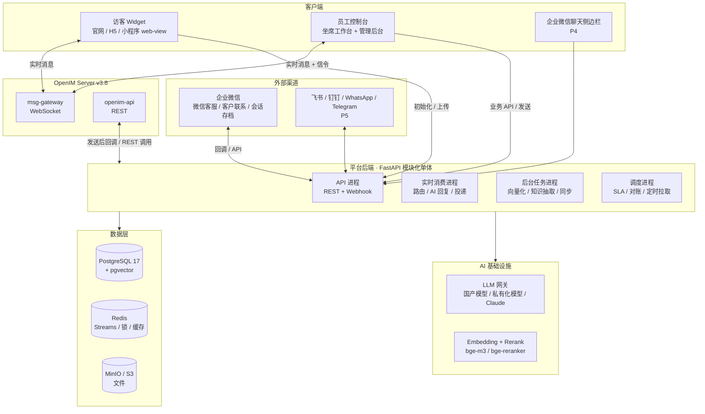
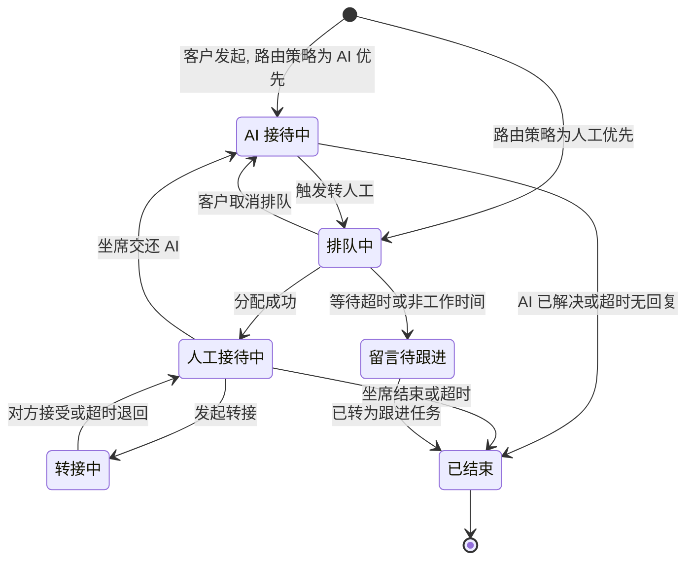
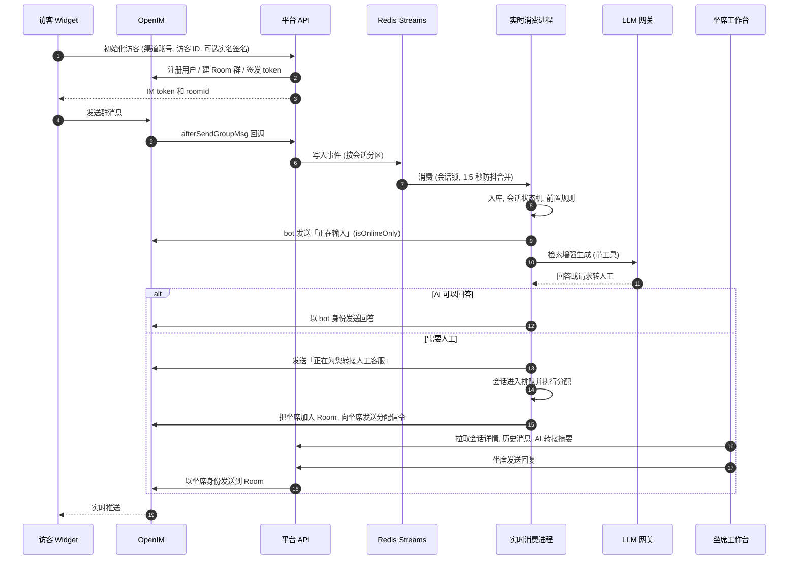
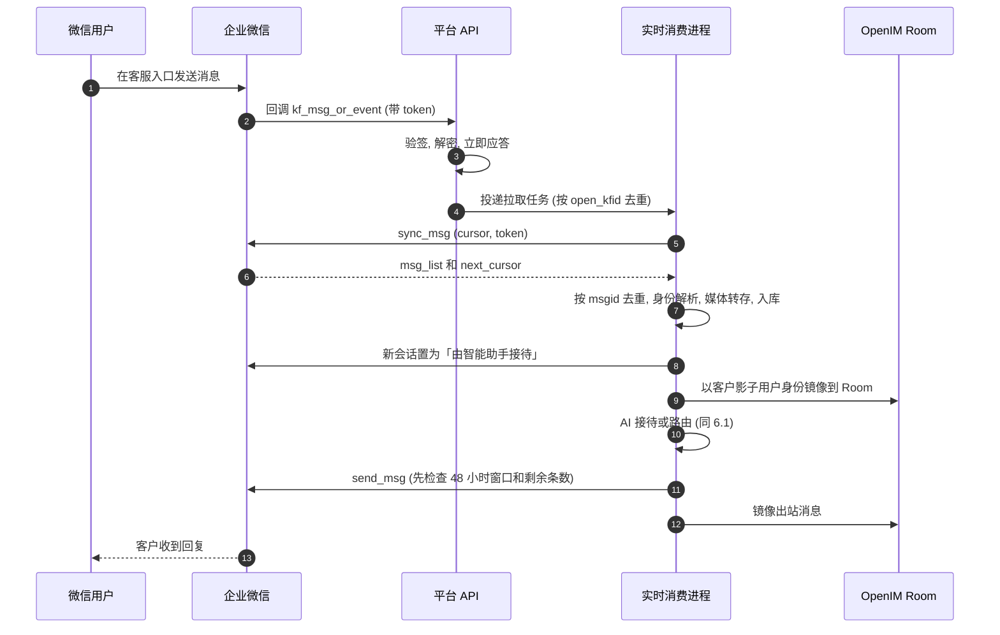
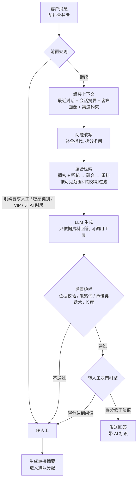
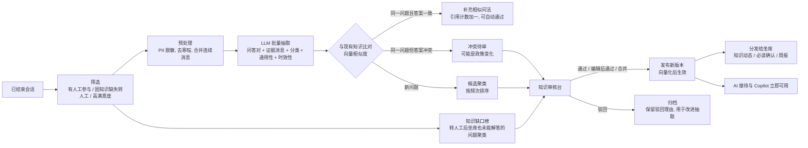
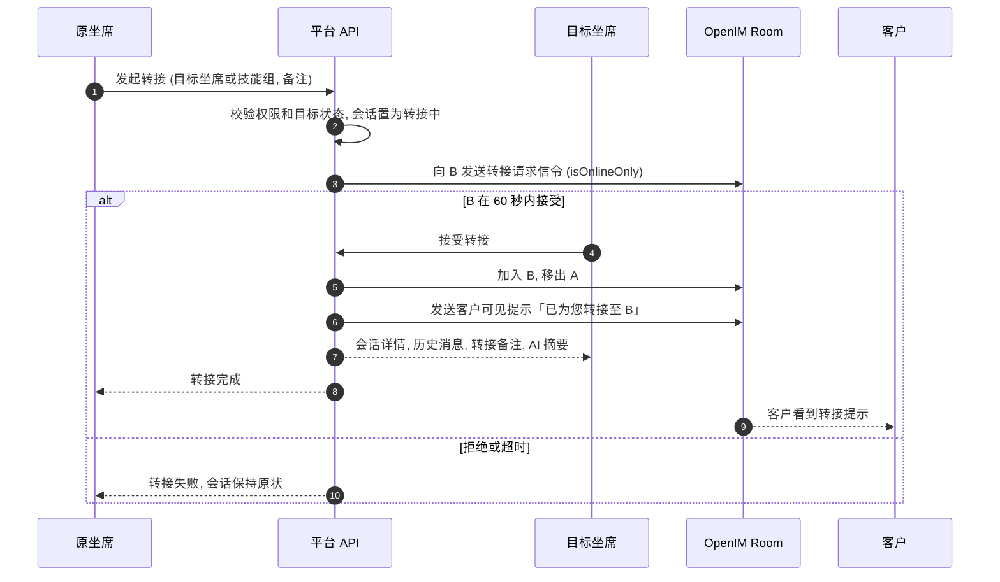

# 企业数字化转型平台 · 全渠道智能客服 设计文档

> 状态：草案 v0.1（头脑风暴产出，待评审）
> 日期：2026-09-28
> 范围：需求 R1–R8 的整体架构、关键决策与分期方案。本文确认后，再按阶段拆解实施计划。

---

## 0. 摘要

平台以「客户对话」为核心数据资产，分三步：

1. 把企业所有触点的客户对话汇聚到一个坐席工作台。触点先是官网/H5 和企业微信，后续加入飞书、钉钉、WhatsApp、Telegram。
2. 由 AI 做第一道接待，在必要时自主转人工。
3. 把沉淀下来的对话持续提炼成企业知识库，再反哺 AI 和坐席。

**核心设计决策**

1. **后端采用 FastAPI 模块化单体 + 独立 Worker 进程。** 客户、会话、权限、知识等业务数据以平台后端和 PostgreSQL 为准，不拆微服务。
2. **OpenIM 作为实时消息总线，一个客户（渠道身份）对应一个服务群（Room）。**
   - 访客、坐席、AI 机器人都是 OpenIM 用户，转接就是 Room 的成员变更。
   - 企业微信等外部渠道的消息，由渠道适配器桥接进 Room。坐席在一个工作台里处理所有渠道。
3. **读写路径：访客直连 IM，员工与 AI 的发送走平台 API，历史消息从平台 API 读取。**
   - 平台只把 IM 当作实时通道。
   - 发送前的校验（权限、回复窗口、敏感词）都在平台同步完成。
   - 权限统一由平台控制，转接后新坐席也能看到完整历史。
4. **企业微信只使用官方接口。**
   - 「微信客服」API 负责双向收发。AI 和人工都在平台内接待，企业微信侧的会话一直保持在"智能助手接待"状态。
   - 「客户联系」和「会话内容存档」负责同步客户和群数据，并只读采集聊天记录。
   - 不使用任何非官方协议。
5. **AI 采用"RAG + 受限工具调用 + 确定性的转人工决策引擎"。** 模型负责回答和自评；是否转人工，由多信号规则引擎最终裁决。每次判定都有记录，阈值可调。
6. **知识沉淀闭环，发布前必须人工审核。**
   - LLM 从已结束的会话中批量抽取问答候选。
   - 候选经过去重和聚类后交给知识管理员审核，发布后推送给坐席。
   - 同时产出"知识缺口"榜单。
7. **数据权限做三层防护：租户级 PostgreSQL RLS、应用层统一的数据范围过滤、IM 层群成员隔离。** 坐席只能看到"归属自己的客户 + 当前分配给自己的会话"，管理员能看到全部。
8. **LLM 通过网关与供应商解耦，按"场景"配置模型。** 国内部署默认使用已备案的国产模型（按 OpenAI 兼容协议接入）或私有化模型；海外部署可以接入 Claude。

> ⚠️ **动手前必须拍板的三件事**（详见 §20）：
> 1. OpenIM Web SDK 是 GPL/AGPL 许可，要确定如何处理。
> 2. 大模型的选型与合规路径。
> 3. 企业微信的接入范围，包括是否购买会话内容存档。

---

## 1. 背景与目标

### 1.1 需求映射

| # | 需求 | 设计章节 | 分期 |
|---|---|---|---|
| R1 | 基于 Web 的全渠道客服（OpenIM + FastAPI + Vue3），触达企业全部客户并收集聊天数据 | §4 §6 §7.1 §7.2 §14 | P1 |
| R2 | 对接企业微信（后续飞书/钉钉/WhatsApp/Telegram）：聊天、群组、读取客户数据 | §7.3–§7.6 | P2（其余渠道 P5） |
| R3 | 企业知识库，能从聊天内容整理沉淀 | §9 | P3 手工知识 / P4 自动沉淀 |
| R4 | 接入大模型的 AI 聊天，承担前期客户接待 | §8.1 §8.5 | P3 |
| R5 | 自主判断是否需要人工介入，AI 处理不了时呼叫客服 | §8.2 §8.3 | P3 |
| R6 | 管理员/坐席角色；每个客户有独立档案；坐席只看自己的客户，管理员看全部 | §10 §12 | P1 |
| R7 | 把客户转移给其他坐席接待 | §11 | P1 |
| R8 | 持续收集聊天内容，更新知识库并分发给其他客服 | §9.3–§9.6 | P4 |

### 1.2 非目标（一期不做）

- 电话呼叫中心（IVR、语音坐席）。
- 营销自动化（SOP、群发编排）和订单/会员等业务系统本身。
- 移动端坐席 App。一期先做响应式 Web。
- 通过非官方协议（iPad 协议、Hook 等）接入个人微信或企业微信。

### 1.3 关键假设（可推翻）

| # | 假设 | 不成立时的影响 |
|---|---|---|
| A1 | 首批客户是中国大陆企业，主要触点是企业微信和官网 | 若以海外为主，P2 改做 WhatsApp/Telegram，LLM 可以优先选 Claude |
| A2 | 先按"单企业私有化部署"交付，但数据模型从第一天起带 `tenant_id`（多租户就绪） | 若直接做 SaaS，需要提前设计租户开通、计费和资源隔离 |
| A3 | 一期规模：≤200 坐席，≤5,000 同时在线访客，≤100 万条消息/天 | 超出这个规模，需要提前规划消息表冷热分离和 OpenIM 集群化 |
| A4 | "为每个客户建立单独的客户数据库"理解为：每个客户在统一客户库中有一份独立档案（主记录、渠道身份、标签、备注、历史），通过归属关系做行级隔离。不是物理上每人一个库 | 如果要求物理隔离，转接和管理员全局视图的实现代价会很高，不建议 |
| A5 | 知识入库需要人工审核（至少前 6 个月） | 如果要求全自动，需要更强的评测和回滚机制 |

---

## 2. 调研结论：必须遵守的外部约束

以下结论主要依据官方文档（2026-09 查阅），它们直接决定了架构。标注「需要 POC 验证」或「以官方为准」的条目，请在实施前复核。

### 2.1 企业微信

**微信客服（kf）**

- **能做什么**：微信用户从公众号、小程序、视频号、网页、APP 等入口进入客服账号，企业通过 API 收发消息。
- **关键限制**：
  1. 只有会话处于"新接入待处理（0）"或"由智能助手接待（1）"状态时，API 才能发消息。
  2. 客户最后一次发消息后的 48 小时内，企业最多发 5 条。客户再发消息后，额度重置。
  3. `sync_msg` 只能拉取最近 3 天的消息，回调里的 token 10 分钟内有效。
- **对设计的影响**：
  - 在企业微信看来，平台整体扮演"智能助手"。**人工坐席也在平台内通过 API 回复，不把会话转到"由人工接待（3）"。**
  - 工作台必须展示回复窗口和剩余条数。
  - AI 的回复要合并成一条发送，节省额度。

**客户联系**

- **能做什么**：同步员工的外部联系人、标签和客户群；配置"联系我"和"加入群聊"；办理在职继承和离职继承。
- **关键限制**：
  1. **不能通过 API 直接给外部联系人发单聊消息。** 只能创建群发任务，由员工在客户端确认后发出；或者在聊天侧边栏里，由员工点击后通过 JS-SDK 发送。
  2. **服务端不能直接创建客户群。** 可以配置"加入群聊"，群满后自动建新群；也可以由员工在客户端建群后，在平台登记。
  3. 在职继承：90 天内每位客户最多被转接 2 次，24 小时后自动接替，每次最多 100 个客户。
- **对设计的影响**：
  - 客户联系的定位是"数据同步 + 运营辅助"，不是实时双向通道。
  - 平台提供企业微信聊天侧边栏应用，把 AI 助手和知识库带进员工的企业微信客户端。

**会话内容存档**

- **能做什么**：拉取已开启存档的员工与客户、客户群之间的聊天记录，包括图片和文件。
- **关键限制**：
  1. 这是付费功能，按存档员工数计费。2026-01-22 起价格上调：办公版 400、服务版 900、企业版 1800 元/人/年（以官方为准）。
  2. 需要客户同意存档。
  3. 必须使用官方 C SDK（Linux/Windows，x86/ARM）拉取，再用 RSA 私钥解密。单次最多 1000 条。
  4. 只能获取 5 天内的数据，所以必须定时拉取。
- **对设计的影响**：
  - 作为可选模块（P2b/P4），只读入库，用于客户画像和知识沉淀。
  - 用一个独立的小服务封装 C SDK。

**智能机器人**

- **能做什么**：企业内可以创建的 AI 机器人，支持回调和长连接两种接入方式，支持流式回复。
- **待验证**：能否用于外部群或与微信用户对话，需要做 POC。
- **对设计的影响**：列为后续探索项，比如让员工在企业微信里直接查询知识库。

**通用前置条件**

- 回调 URL 必须是公网 HTTPS，域名需要备案且与企业主体相关。
- 自建应用需要配置可信 IP。
- 回调需要验签和 AES 解密，并尽快应答。
- 具体要求以官方最新文档为准。**P0 阶段就要开始准备域名、备案、可信 IP 等条件。**

### 2.2 OpenIM

- **版本**：服务端最新稳定线是 v3.8.3 及其后续 patch，Web SDK 同属 3.8.3 线。
- **许可（重要）**：

  | 组件 | 许可 | 结论 |
  |---|---|---|
  | open-im-server | Apache-2.0 | 可以放心自托管 |
  | openim-sdk-core（Go 核心） | Apache-2.0 | — |
  | openimsdk/chat（官方业务层：注册登录、管理后台） | GPL-3.0 | **不使用**，业务层由 FastAPI 承担 |
  | `@openim/client-sdk`（纯 JS Web SDK，不在浏览器存数据，可以跑在小程序里） | GPL-3.0-only | 打包进前端并分发到浏览器，可能触发 copyleft 义务 |
  | `@openim/wasm-client-sdk`（WASM + IndexedDB 本地库） | AGPL-3.0-only | 同上，而且更严格 |

  - 对外商用之前，必须在三条路径中选一条：购买 OpenIM 商业授权；接受前端代码按兼容协议开源；自研 Web 端网关客户端。
  - 设计上，所有 IM SDK 调用都收敛到 `packages/im-client` 这一个适配层，保证日后可以替换。
  - **此项需要法务确认，本文不构成法律意见。**
- **Webhook**：
  - 在 `config/webhooks.yml` 中配置。支持单聊和群聊的发送前、发送后回调，以及建群前后、用户上下线等事件。
  - "发送前"回调可以拒绝或修改消息，但会把业务后端放进 IM 的关键路径。
  - 已知问题：`failedContinue` 从 v3.7.0 起配置不生效（open-im-server issue #3808）。
  - **我们的用法**：只用"发送后"回调做入库，再用定时对账兜底；用"建群前"回调禁止访客自行建群。
- **REST 发消息**：
  - 使用 `imAdmin` 管理员令牌调用 `/msg/send_msg`，可以指定任意 `sendID`，支持单聊和群聊。
  - `isOnlineOnly` 表示只投递给在线用户、不存储，适合"正在输入""新会话分配提醒"这类信令。
  - `ex` 扩展字段用来携带平台消息 ID，便于去重和关联。
- **流式消息**：开源主线曾经加入这个功能，后来又移除了，目前正在重新引入（issue #3770 / PR #3771），**不能依赖**。AI 回复采用"正在输入提示 + 整段或分段发送"。

### 2.3 合规

- **生成式 AI**：面向中国大陆公众提供 AI 对话服务，需要使用已完成生成式人工智能服务备案的模型。调用已备案模型的应用，通常还要在属地网信部门办理登记。上线前请法务确认具体义务。
- **AI 生成内容标识**：《人工智能生成合成内容标识办法》自 2025-09-01 起施行，AI 回复需要显式标识。例如在访客端的消息气泡上标注"AI 助手"，纯文本渠道则加前缀。
- **个人信息保护法（PIPL）**：
  - 采集聊天数据需要告知并取得同意，包括访客端的隐私提示和会话存档的客户同意。
  - 遵循最小必要原则，设定保存期限，支持删除和导出请求。
  - 身份证、银行卡等敏感个人信息需要脱敏。
  - 如果调用境外模型处理境内个人信息，还涉及数据出境合规。这也是国内部署默认使用国产模型的原因之一。

---

## 3. 关键架构决策（含备选方案）

### D1 后端形态：模块化单体（选定）

- **做法**：
  - 一个 FastAPI 代码库，按领域划分模块：iam / customer / conversation / routing / channels / ai / knowledge / analytics / audit。
  - 部署成四类进程：API 进程、实时消费进程、后台任务进程、调度进程。
- **备选方案：微服务。** 否决理由：团队初期规模小，领域边界还在变化，而分布式事务和运维的成本都很高。
- **保留的演进空间**：模块之间只通过服务接口和领域事件交互，日后可以把"渠道适配器""AI 推理"拆成独立服务。

### D2 OpenIM 使用模型：一个客户渠道身份对应一个服务群 Room（选定）

| 方案 | 做法 | 优点 | 缺点 |
|---|---|---|---|
| **A. 服务群 Room（选定）** | 每个客户渠道身份对应一个 OpenIM 群。成员是：客户身份、AI 机器人、当前坐席，以及可选的旁听主管 | 转接就是换成员，历史连续；天然支持主管旁听和协助；外部渠道的桥接方式统一；坐席只收到自己 Room 的消息 | 群数量约等于客户数（OpenIM 可以承载）；需要屏蔽成员变更通知；需要禁止访客自行建群 |
| B. 服务号单聊 | 客户与一个虚拟"客服号"单聊，平台在后台把消息路由给坐席 | 客户看到的身份始终一致 | 坐席端几乎用不上 IM 能力，要另建一套实时推送；转接和旁听都要自研 |
| C. 坐席直连单聊 | 客户直接与坐席单聊 | 最简单 | 转接会产生新会话，历史割裂；无法旁听。不推荐 |

### D3 读写路径：访客直连 IM；员工与 AI 走 API 写入；历史走 API 读取（选定）

- **访客消息**：
  - 链路：Widget → OpenIM → `afterSendGroupMsg` 回调 → 平台入库，并触发 AI 或路由。
  - 低延迟、断线重连、离线消息都由 IM 负责。
  - 调度进程定时对账补漏。
- **坐席、AI、系统消息**：
  - 先发到平台 API。平台校验权限、回复窗口、敏感词，写审计日志，先落库。
  - 再按渠道投递：Web 渠道由 OpenIM REST 以坐席身份发到 Room；企业微信渠道先通过渠道 API 发出，成功后再镜像到 Room。
- **历史消息**：工作台一律从平台 API（PostgreSQL）读取，由平台统一控制数据范围。OpenIM 只负责实时增量。
- **理由**：
  - 业务校验必须同步生效，同时又不能把后端放进 IM 的关键路径。
  - 转接后，新坐席需要看到自己加入之前的完整历史，而 IM 群对新成员的历史可见性不适合作为权限依据。

### D4 企业微信接入路线：只用官方 API（选定）

- **分工**：
  - 微信客服：双向实时通道（P2 核心）。
  - 客户联系：客户和群数据，以及运营辅助。
  - 会话存档：可选的只读采集。
- **否决**：iPad 协议、Hook 等非官方方式。它们违反平台规则，有封号和数据安全风险。

### D5 AI 编排：RAG + 受限工具 + 确定性决策引擎（选定）

- **做法**：
  - 模型只拿到只读或低风险的工具：检索知识、请求转人工、留言建单、读取客户资料、登记当前客户的线索字段。
  - 任何越权动作都不提供对应工具。
  - 是否转人工，由规则引擎综合多个信号来裁决。
- **备选方案：完全由模型自主决策（Agent）。** 否决理由：客服场景对可控性和可解释性要求高，需要能调阈值，也需要能回溯每一次判定。

### D6 知识沉淀：LLM 批量抽取 + 人工审核后发布（选定）

- **备选方案：自动入库。** 否决理由：一条错误知识会被 AI 反复输出给客户，代价远大于审核成本。
- **例外**：低风险变更（比如给已有问题补充相似问法）可以开放自动通过。

### D7 数据存储：PostgreSQL + pgvector 一库多用（选定）

- **做法**：业务数据、消息归档、向量检索（稠密向量 + 稀疏向量）都放在 PostgreSQL 17 + pgvector ≥0.8 中。
- **理由**：减少一期要运维的组件。OpenIM 本身已经依赖 MongoDB、Redis、Kafka、MinIO、etcd。
- **演进**：
  - 知识切片达到千万级，或检索 QPS 很高时，迁移到 Milvus 或 Elasticsearch。
  - 报表数据量大时，引入 ClickHouse。
  - 检索层做接口隔离，方便替换。

### D8 LLM 供应商：网关抽象 + 按场景路由（选定）

- **统一接口，两类适配器**：
  - OpenAI 兼容协议：覆盖 DeepSeek、通义千问、智谱、豆包、Kimi，以及用 vLLM/Xinference 私有化部署的模型。
  - Anthropic 官方 SDK：接入 Claude，面向海外部署。
- **按场景配置**：接待回答、意图/情绪分类、转人工摘要、坐席建议、知识抽取这几个场景，分别配置模型、超时和降级策略。

---

## 4. 总体架构

### 4.1 架构图



### 4.2 组件职责

| 组件 | 职责 |
|---|---|
| 访客 Widget | 嵌入式聊天窗口（用 iframe 隔离）；支持匿名和实名访客；收发文字、文件、表情；提供"转人工"按钮、排队提示、满意度评价、离线留言；展示 AI 标识和隐私告知 |
| 员工控制台 | 一个 Vue3 SPA，按角色展示"坐席工作台"和"管理后台"两套布局 |
| OpenIM | 实时投递、离线消息、在线状态、"正在输入"、文件上传（对象存储）、多端同步 |
| API 进程 | 业务 REST API；接入 OpenIM 和企业微信的 Webhook（验签后写入 Redis Streams，立即返回） |
| 实时消费进程 | 按会话有序消费消息事件：入库、身份解析、会话状态机、路由分配、AI 回复、渠道投递 |
| 后台任务进程 | 文档解析与向量化、知识抽取与聚类、企业微信全量和增量同步、会话存档拉取、报表 |
| 调度进程 | 排队 SLA 计时、会话超时关闭、消息对账、定时拉取（存档、同步） |
| PostgreSQL | 业务数据的权威来源：租户、员工、客户、会话、消息归档、知识库（含向量）、审计 |
| Redis | 与 OpenIM 使用不同的实例或 DB。承担事件流（Streams）、会话锁与防抖、坐席负载、回复窗口计数、缓存 |
| MinIO | 存放渠道媒体的转存文件和知识文档原件。可以与 OpenIM 共用集群，但使用不同的 bucket |

### 4.3 技术选型

| 层 | 选型 | 说明 |
|---|---|---|
| 后端 | Python 3.12、FastAPI、Pydantic v2、SQLAlchemy 2.0（async）、Alembic、httpx | 全异步 |
| 任务 | Redis Streams（实时事件）+ Taskiq（后台任务，asyncio 原生） | 如果团队更熟悉 Celery 也可以替换，任务接口已做隔离 |
| 数据库 | PostgreSQL 17 + pgvector ≥0.8 | 稠密向量用 HNSW 索引，稀疏向量用 `sparsevec`；0.8 的迭代索引扫描改善带过滤条件的检索 |
| IM | OpenIM Server v3.8.x（Docker Compose / K8s） | 依赖 MongoDB、Redis、Kafka、MinIO、etcd |
| 前端 | Vue 3 + TypeScript + Vite + Pinia + Vue Router + Element Plus | pnpm workspace；API 客户端由 OpenAPI 生成 |
| IM 客户端 | `@openim/client-sdk`，封装在 `packages/im-client` 中 | 纯 JS，不在浏览器落盘，转接后旧坐席的电脑上不会残留聊天记录；许可问题见 §2.2 |
| Embedding/Rerank | bge-m3（稠密 + 稀疏）、bge-reranker-v2-m3，自托管 | 中文效果好，数据不出域 |
| LLM | 已备案的国产模型 / vLLM 私有化部署 / Claude（海外） | 见 §8.5 |
| 可观测性 | OpenTelemetry、Prometheus + Grafana、Loki | OpenIM 自带 Prometheus 指标 |
| 工程 | uv、ruff、mypy、pytest + testcontainers；eslint、vitest、Playwright | CI 跑 lint、单测和关键 E2E |

---

## 5. 核心领域模型

### 5.1 概念

- **租户 Tenant**：一个企业。所有数据都带 `tenant_id`。
- **员工 Staff**：平台用户。
  - 角色有管理员、主管、坐席、知识管理员。
  - 坐席有技能组、最大并发数和在线状态。
  - 可以绑定企业微信 userid。
- **客户 Customer**：客户档案的主记录，也就是 R6 里的"独立档案"。
  - 有归属坐席（`owner_id`），以及标签、备注和自定义字段。
  - 提供客户 360 视图：基本信息、各渠道身份、历史会话、所在企业微信群、线索字段。
- **渠道身份 Identity**：客户在某个渠道上的身份，例如访客 ID、微信客服 external_userid、客户联系 external_userid、WhatsApp 号码。
  - 一个客户可以有多个身份。
  - 支持合并：按实名签名、unionid 自动识别；疑似同一客户时，由管理员确认后合并。
- **渠道账号 ChannelAccount**：一个接入点，例如某个官网 Widget 或某个微信客服账号。每个渠道账号挂一套路由策略。
- **服务室 Room**：`客户身份 × 渠道账号` 的长期对话容器，对应一个 OpenIM 群。
- **会话 Session**：Room 中的一次服务过程，从客户发起到结束。
  - 记录 AI/排队/人工状态、分配的坐席、转接记录、摘要和满意度。
  - 知识沉淀以 Session 为单位。
- **消息 Message**：所有渠道消息的统一归档。平台库是消息的业务权威来源。
- **知识 KnowledgeItem**：包括 FAQ（标准问 + 相似问 + 答案）、文档和话术。每条知识都有状态、版本、可见范围和有效期。

### 5.2 会话状态机



- 会话结束后，客户再发消息时，会在同一个 Room 中新建 Session。
- 如果在结束后 N 分钟内（可配置）再发消息，可以"续接"原会话。

### 5.3 OpenIM 映射约定

| 平台对象 | OpenIM 对象 | ID 约定（示例，`{t}` 为租户短码） |
|---|---|---|
| 访客或外部客户的身份（外部渠道客户是不登录的"影子用户"，只用于在 Room 中代表客户发言） | 用户 | `{t}_c_{identityId}` |
| 员工 | 用户 | `{t}_s_{staffId}` |
| AI 机器人 | 用户（每个租户一个） | `{t}_bot` |
| 系统用户（群主、系统提示、信令） | 用户 | `{t}_sys` |
| Room | 群，群主为 `{t}_sys` | `{t}_r_{roomId}` |

- **REST 调用**：平台后端使用 `imAdmin` 令牌调用 REST 接口，负责注册用户、签发短时有效的用户 token、建群和换成员、发消息。
- **Room 成员**：
  - 固定成员是客户身份和 AI 机器人，再加上当前被分配的坐席。
  - 可选"归属坐席常驻"。
  - 主管旁听时，以观察者身份加入，访客端不展示观察者。
- **通知屏蔽**：
  - 关闭"成员进群/退群"等群通知在访客端的展示（通过 OpenIM 通知配置和 Widget 过滤）。
  - 转接时，由平台发一条面向客户的系统提示，例如「已为您转接至 XX」。
- **防滥用**：
  - 开启 `beforeCreateGroup` 回调，只允许平台用管理员令牌建群。
  - 单聊开启好友校验，访客之间、访客与员工之间都不能私聊。
  - 系统用户与员工预先建立好友关系，保证单聊信令可达。
- **信令**：业务事件（新分配、转接请求、AI 建议就绪、SLA 告警）由 `{t}_sys` 以 `isOnlineOnly` 自定义消息发给坐席。坐席上线或重连时，从平台 API 拉取最新状态作为兜底。
- **消息关联**：消息的 `ex` 字段携带平台消息 ID（`pmid`），用于前端去重和关联。

---

## 6. 消息链路

### 6.1 Web 访客：AI 接待 → 转人工



### 6.2 坐席发送（统一走 API 写入）

1. 工作台生成 `clientMsgId` 作为幂等键，调用 `POST /api/v1/sessions/{id}/messages`。
2. 平台依次校验：
   - 数据范围：这个会话是否分配给了我。
   - 会话状态。
   - 渠道回复窗口，例如微信客服的 48 小时 / 5 条。
   - 敏感词、附件类型和大小。
3. 写入 `messages` 表，状态为 `pending`。
4. 按渠道投递：
   - Web 渠道：通过 OpenIM REST 以坐席身份发到 Room。
   - 企业微信：通过渠道 API 发送，成功后再镜像到 Room，用 `ex.pmid` 关联。
5. 把状态更新为 `sent` 或 `failed`，失败原因实时回显到工作台，例如"已超过 48 小时回复窗口"。

### 6.3 可靠性

- **幂等**：
  - 入站消息用 `(channel_account_id, channel_msg_id)` 唯一约束去重。OpenIM 消息取 `serverMsgID`，企业微信消息取 `msgid`。
  - 出站消息用 `clientMsgId` 去重。
- **对账补漏**：
  - OpenIM 的发送后回调是异步通知，失败时不保证重投。调度进程每分钟对活跃 Room 按 seq 拉取增量，与平台库比对后补录。
  - 企业微信 `sync_msg` 的游标持久化保存。回调丢失时，由定时任务兜底拉取。由于消息只保留 3 天，拉取频率必须有保障。
- **有序与防抖**：
  - 同一会话的事件串行处理：按会话哈希到 N 个分区流，每个分区同一时刻只由一个消费者处理。
  - 客户连续发多条短消息时，等待 1.5–3 秒，合并成一轮再交给 AI。这样可以避免答非所问，也不浪费微信客服的 5 条额度。
- **降级**：
  - LLM 超时或故障时，发送兜底话术，并直接转人工。
  - OpenIM 不可用时，坐席发送会返回错误并提示；企业微信等渠道的入站消息照常入库，OpenIM 恢复后再镜像补发。
- **媒体转存**：
  - 企业微信的临时素材只有 3 天有效期，收到后立即下载，转存到 MinIO。
  - 语音从 amr/silk 转码为 mp3，供 Web 端播放；可选语音转文字，供 AI 理解。

---

## 7. 渠道接入层

### 7.1 统一抽象

```python
class ChannelCapabilities(BaseModel):
    reply_window: timedelta | None       # 微信客服 48h；WhatsApp 24h；Web 无限制
    max_msgs_in_window: int | None       # 微信客服 5 条
    supports_media: set[MediaType]
    supports_groups: bool
    supports_recall: bool
    text_limit: int | None
    agent_can_send_via_api: bool         # 客户联系为 False（只能群发任务 / 侧边栏）
    proactive_outreach: OutreachMode     # 主动触达方式：none / template / broadcast_task


class ChannelAdapter(Protocol):
    type: ChannelType
    capabilities: ChannelCapabilities

    async def verify_and_parse(self, request: Request) -> list[InboundEvent]: ...     # 回调验签/解密/解析
    async def pull(self, account: ChannelAccount, cursor: str | None) -> PullResult: ...  # 拉取型渠道
    async def send(self, room: Room, msg: OutboundMessage) -> SendResult: ...
    async def fetch_profile(self, identity: Identity) -> ProfilePatch: ...
```

**入站的统一流程**

`InboundEvent` → 身份解析（查找或新建 Identity 和 Customer）→ 查找或新建 Room → 查找或新建 Session → 归档 → 镜像到 OpenIM Room → 触发路由或 AI

**关于"触达全部客户"（R1）**

平台可以汇聚所有渠道的客户，但每个渠道能否"主动"联系客户，受渠道规则限制：

| 渠道 | 主动触达规则 |
|---|---|
| Web 访客 | 只能在访客在线时联系 |
| 微信客服 | 只能在客户最后一次发消息后的 48 小时内联系 |
| 企业微信客户联系 | 需要员工确认群发任务 |
| WhatsApp | 需要使用已审核的模板消息 |

这些差异由 `capabilities` 描述。后续的营销触达（P5）统一建立在这层抽象上。

### 7.2 Web 访客渠道

- **嵌入方式**：
  - 企业在网页中插入 `<script src="https://cs.example.com/widget.js" data-channel="ch_xxx" async></script>`，页面上会出现悬浮按钮，点开后加载 iframe（独立源，CSS 和令牌都与宿主页面隔离）。
  - 同时提供移动端 H5 全屏链接。小程序通过 web-view 打开。
- **访客身份**：
  - **匿名访客**：Widget 生成访客 ID，平台签发短时有效的 IM token。
  - **实名访客（推荐）**：适用于企业官网的已登录用户。企业服务端用共享密钥对 `{userId, name, phone, ts}` 签名（HMAC 或 JWT）后传给 Widget。平台验签通过后，把访客绑定到同一份客户档案，防止冒充。
- **功能**：文字、表情、图片、文件；AI 标识；"转人工"按钮；排队位置；满意度评价；离线留言；隐私告知与同意。
- **防刷**：按访客和 IP 限流，限制图片和文件的类型与大小，可选人机验证。

### 7.3 企业微信 · 微信客服（P2 核心）



**接管模式（推荐）**

- 在企业微信后台，把客服账号授权给平台的自建应用，由 API 接待。
- 收到新会话时，平台把它置为"由智能助手接待（1）"。
- 之后 AI 接待和人工接待都在平台内完成，**不把会话转到"由人工接待（3）"**。否则平台就无法再通过 API 发消息。

**混合模式（可选）**

- 部分坐席继续用企业微信客户端接待（状态 3）。
- 这类会话在平台上只读：通过 `sync_msg` 中 origin=5 的消息同步归档，不在平台内回复。

**回复窗口**

- Redis 按 `(open_kfid, external_userid)` 记录客户最后一次发消息的时间，以及之后已发送的条数。
- 工作台的输入框显示「剩余 N 条 / 截止 hh:mm」。额度用完后，输入框禁用并给出提示。
- AI 的回答合并成一条发送；转人工的过渡话术尽量与最后一条回答合并。
- 可以用菜单消息引导客户点选。客户点选会产生一条客户消息，从而重置回复额度。这一点需要 POC 验证。

**欢迎语**

收到 `enter_session` 事件后，用事件响应接口发送欢迎语。`welcome_code` 只在短时间内有效，而且只能使用一次。

**客户资料**

- 通过 `kf/customer/batchget` 获取客户的昵称、头像，以及 unionid（如果已绑定）。
- unionid 可以用来和公众号、小程序体系打通客户身份。

**消息类型**

文本、图片、语音、视频、文件、图文、小程序、菜单消息（可以做成"转人工""满意度"按钮）、位置。

### 7.4 企业微信 · 客户联系与客户群（P2）

| 功能 | 方案 |
|---|---|
| 客户同步 | 首次按员工全量拉取外部联系人，再批量获取详情；之后通过 `change_external_contact` 回调（添加、编辑、删除）增量同步。写入客户档案和 Identity。如果添加人（follow_user）是平台坐席，就作为客户的默认归属坐席 |
| 标签 | 企业标签双向同步：平台上打的标签会写回企业微信 |
| 客户群 | 同步群列表和成员，通过 `change_external_chat` 回调增量更新；把群和客户档案关联起来 |
| "创建群组" | 服务端不能直接建客户群，有三种替代方式：① 平台配置"加入群聊"二维码（可以满员后自动建新群），用于活动或客户入群；② 员工在客户端建群后，平台自动识别并登记；③ 在聊天侧边栏中，通过 JS-SDK 引导员工一键建群 |
| 给客户发消息 | 不能通过 API 直发，有两种方式：① 平台创建群发任务，员工在企业微信确认后发出，平台回收发送结果；② 在聊天侧边栏（P4）中由 AI 生成回复草稿，员工点击后由 JS-SDK 发送到当前聊天 |
| 员工登录 | 员工可以用企业微信扫码登录平台，同时完成"平台员工 ↔ 企业微信 userid"的绑定 |
| 内部通知 | 通过应用消息推送给员工，例如新排队、转接请求、知识更新摘要 |
| 归属转移 | 平台上的客户转移可以联动在职继承和离职继承（见 §11.3） |

### 7.5 企业微信 · 会话内容存档（可选，P2b/P4）

- **前提条件**：
  - 企业已经购买会话存档，并为相关员工开启存档。
  - 已在管理后台配置 RSA 公钥和可信 IP。
  - 客户已同意存档。
- **实现**：
  - 用一个独立的 `wecom-archive` 小服务（Linux）封装官方 C SDK v3。
  - 每 1–5 分钟按 seq 增量拉取一次，每次最多 1000 条。
  - 用 RSA 私钥解密后，写入平台消息归档，渠道记为 `wecom_contact`。
  - Room 按"员工 × 客户"或"客户群"建立。这类 Room 只读，不镜像到 OpenIM。
  - 媒体文件用 SDK 拉取后，转存到 MinIO。
- **用途**：客户画像、坐席质检、知识沉淀（见 §9）。
- **私钥管理**：私钥放在 KMS 或密钥管理系统中，不存入数据库。
- **成本**：按开启存档的员工人数计费，建议只为一线销售和客服开启。

### 7.6 后续渠道（P5）

| 渠道 | 官方方式 | 需要关注的约束 |
|---|---|---|
| WhatsApp | WhatsApp Business Platform（Cloud API） | 24 小时客服窗口；窗口外只能发已审核的模板消息；按消息计费 |
| Telegram | Bot API（Webhook） | 用户需要先主动与机器人对话；在群里使用需要先把机器人拉进群 |
| 飞书 | 开放平台的机器人 / 服务台 | 主要面向飞书用户（含外部联系人），和面向 C 端的微信场景不同 |
| 钉钉 | 开放平台的机器人 / 服务群 | 同上 |

新增一个渠道，只需要实现一个 `ChannelAdapter` 并补充配置页面，不需要改动会话、AI 和知识模块。

---

## 8. AI 接待与人工介入

### 8.1 AI 回复流水线



**模型可以使用的工具**（只读或低风险）：

| 工具 | 作用 |
|---|---|
| `search_knowledge(query, filters)` | 当模型认为首轮检索的资料不足时，进行二次检索 |
| `get_customer_profile()` | 读取当前客户的档案摘要，不含敏感字段 |
| `save_lead_info(fields)` | 前期接待时登记线索。只能写当前客户的白名单字段，标记来源为 AI，由坐席确认 |
| `request_human_handoff(reason, category, urgency, summary)` | 请求转人工，交给决策引擎裁决 |
| `create_ticket(subject, detail)` | 非工作时间留言建单 |
| `lookup_order(order_no)` 等 | 后续对接业务系统，只读 |

**系统提示词要点**

- 设定身份和语气。
- 只依据提供的资料作答。资料里没有时，明确说不知道，并调用转人工。
- 不承诺价格、赔付或法律结论。
- 不透露内部信息。
- 遵守渠道格式约束，例如纯文本渠道不使用 Markdown。

### 8.2 转人工决策引擎

| 类型 | 信号 | 默认处理 |
|---|---|---|
| 硬触发 | 客户明确要求人工（关键词 + 意图识别，如"转人工""找客服"） | 立即转 |
| 硬触发 | 模型调用了 `request_human_handoff` | 立即转 |
| 硬触发 | 敏感类别：投诉、退款/赔偿、法律、安全、隐私删除请求 | 立即转 |
| 硬触发 | 客户是 VIP，或有专属坐席且策略要求人工接待 | 立即转 |
| 硬触发 | 后置护栏连续两次不通过 | 立即转 |
| 软信号 | 检索的最高相关度低于阈值（知识缺失） | +0.4 |
| 软信号 | 模型自评置信度低 | +0.3 |
| 软信号 | 负面情绪或情绪升级（情绪分类） | +0.3 |
| 软信号 | 重复提问：与上一轮问题的语义相似度高于阈值，达到 2 次 | +0.3 |
| 软信号 | 客户否定了回答（"没用""不是这个意思"） | +0.2 |
| 软信号 | AI 接待超过 N 轮仍未解决 | +0.2 |

- **判定规则**：
  - 软信号加权得分 ≥ 阈值（默认 0.6）时转人工。
  - 初始权重是经验值，上线后根据标注数据调整；可以按租户和渠道分别配置。
- **判定留痕**：
  - 每次判定都写入 `ai_decisions`，包括各信号、得分和结果。
  - 管理后台可以查看"误转"和"漏转"的样本，用来调参。
  - 这也是知识缺口的主要来源（见 §9.3）。
- **转接时对客户**：发送过渡话术，例如「这个问题我帮您转给人工客服，请稍候」，并告知排队位置和预计等待时间。

### 8.3 排队与分配策略

分配按以下顺序进行（可配置）：

1. **专属坐席优先**：客户有归属坐席，且该坐席在线、并发未满时，直接分配给该坐席。
2. **技能组匹配**：按渠道账号的默认技能组分配；或者按 AI 识别出的意图（售前、售后、技术、投诉）映射到技能组。
3. **组内负载均衡**：优先分配给"当前会话数 / 最大并发数"最低的坐席；相同时，选空闲最久的坐席。
4. **排队**：没有坐席可接时，进入技能组队列。
   - 优先级：VIP > 情绪激动或投诉 > 普通。同一优先级按等待时间排序。
   - 向客户推送排队位置。
5. **溢出与兜底**：
   - 等待超过 X 分钟，溢出到备用技能组。
   - 非工作时间或等待超时，转为留言建单，指派给归属坐席或技能组次日跟进。
   - 等待期间，AI 可以继续回答客户的其他问题（可配置）。

**坐席状态**

- 状态分为在线、忙碌（不接新会话）、小休、离线。
- 登录工作台后自动上线。
- 断线超过 N 分钟后自动离线，已分配但尚未接起的会话退回队列。

### 8.4 坐席 AI 助手（Copilot）

人工接待期间，AI 只对坐席可见，提供以下能力：

- **转接摘要**：客户的诉求、已经提供的信息、AI 已回答的内容、客户情绪。
- **推荐回复**：基于知识库和上下文，生成 1–3 条候选。坐席一键插入后可以编辑，不会自动发给客户。
- **知识检索**：在侧边栏搜索知识库，结果可以一键插入。
- **实时提醒**：情绪升级、出现敏感信息、坐席使用了承诺类话术时给出提示。
- **会话小结**：会话结束时自动生成小结和标签，坐席确认后写入客户档案。
- **采纳反馈**：记录每条建议是"采纳""修改后采纳"还是"忽略"，用于优化知识和提示词。

### 8.5 LLM 网关与模型选择

**统一接口**：`chat()`（支持工具调用、结构化输出、流式）、`embed()`、`rerank()`。

**横切能力**：

- 超时重试与供应商降级。
- 租户级限流与配额。
- Token 和成本记账（写入 `llm_calls`）。
- 提示词版本管理。
- 调用前 PII 脱敏，日志脱敏。

**各场景的模型建议**：

| 场景 | 要求 | 国内部署建议 | 海外部署建议 |
|---|---|---|---|
| 接待回答 | 低延迟、支持工具调用、中文质量好 | 已备案的国产模型 API（如 DeepSeek、通义千问、智谱 GLM、豆包，通过评测择优），或用 vLLM 私有化部署开源模型 | Claude（默认 `claude-opus-5`） |
| 分类、情绪、改写 | 高并发、低成本 | 同上，可以选更小的模型 | 同一模型配低 effort；是否换更小的模型，由评测结果决定 |
| 转接摘要、会话小结 | 质量稳定 | 与接待回答相同 | Claude |
| 知识抽取（离线批量） | 长上下文、结构化输出、低成本 | 供应商的批量接口（如果有），或者限速异步调用 | Claude Message Batches（异步批量，价格减半）+ 结构化输出 |

- **适配器**：
  - 国产模型和私有化推理基本都提供 OpenAI 兼容接口，用一个适配器即可覆盖。
  - Claude 通过 Anthropic 官方 Python SDK（`anthropic`）接入，用到以下能力：
    - 工具调用，并用 `strict: true` 保证参数合法。
    - 结构化输出。
    - 提示缓存：固定的系统提示和工具定义可以缓存。
    - Message Batches。
- **能力标签**：每个模型都登记能力标签（工具调用、JSON Schema、上下文长度、批量接口），网关按场景需求选择可用的模型。
- **模型选型用评测说话**：
  - P3 开始前，用企业真实的 200–500 条历史问答建立评测集。
  - 评测指标包括：准确率、拒答正确率、转人工正确率、延迟、成本。
  - 候选模型跑同一套评测后再做决定。

### 8.6 AI 安全与护栏

- **输入不可信**：客户输入一律视为不可信数据，需要防范提示词注入。
  - 手段：系统提示隔离、工具权限最小化、输出过滤。
  - AI 除了登记当前客户的线索字段，没有其他写权限。
- **内部资料在检索层过滤**：`visibility=internal` 的知识永远不进入对客 AI 的上下文，而不是靠提示词让模型"不要说"。
- **内容过滤**：输入和输出都做敏感词过滤；检测价格、赔付、时效等承诺类话术。
- **AI 标识**：AI 回复要显式标识。Widget 气泡上标注"AI 助手"，纯文本渠道加可配置的前缀。
- **脱敏**：调用外部模型前，把手机号、身份证、银行卡、地址等替换为占位符；必要时在回复中还原。

---

## 9. 企业知识库与知识沉淀闭环

### 9.1 知识模型

- **知识空间**：按产品线或部门划分。空间内有分类树和标签。
- **知识类型**：
  - **FAQ**：标准问题 + 多个相似问法 + 答案（可以包含图片、链接、小程序卡片）。这是客服场景的主力。
  - **文档**：产品手册、政策制度等（PDF、Word、Markdown、网页），解析后切片。
  - **话术**：坐席的快捷回复模板，可以带变量。
- **属性**：
  - 状态：草稿 → 待审核 → 已发布 → 已归档。
  - 版本。
  - 可见范围：对客 AI 可用 / 仅坐席可见 / 仅管理员可见。
  - 生效和失效时间，用于活动、价格类知识。
  - 来源：手工录入 / 导入 / 对话沉淀。
  - 负责人和引用证据。
- **冷启动**：支持从 Excel 批量导入 FAQ、上传文档，以及抓取官网帮助中心。

### 9.2 检索设计

- **切片**：
  - 文档按标题层级加语义切分，每片 300–800 字，重叠 10–15%。每个切片保留标题路径作为上下文前缀。
  - FAQ 把标准问和每个相似问分别向量化，因为"问题对问题"的匹配最准。答案单独存储。
- **向量**：
  - bge-m3 同时产出稠密向量（1024 维，使用 pgvector HNSW 索引）和稀疏词权重（`sparsevec`），不需要额外的中文分词插件就能做混合检索。
  - 注意：HNSW 索引对稀疏向量的非零元素数有上限（1000），所以切片长度需要控制。
- **查询流程**：
  1. 问题改写。
  2. 稠密检索和稀疏检索各取 Top-50。
  3. 用 RRF 融合结果。
  4. 用 bge-reranker 重排，取 Top-5。
  5. 用相关度阈值判断"有没有相关知识"。
- **过滤**：租户、空间、可见范围、有效期、渠道，全部在 SQL 层过滤。pgvector 0.8 的迭代索引扫描能保证过滤之后仍有足够的召回数量。

### 9.3 沉淀流水线（R3 / R8 的核心）



**抽取输出示例（结构化）**

```json
{
  "qa_pairs": [
    {
      "question": "订单发货后多久能到？",
      "answer": "一般 2–3 天送达，偏远地区 5–7 天，可在「我的订单」查看物流。",
      "evidence_message_ids": ["m_01J8...", "m_01J8..."],
      "category": "物流",
      "generalizable": true,
      "time_sensitive": false,
      "confidence": 0.86
    }
  ],
  "unresolved_questions": ["能否开具电子专票？"]
}
```

**要点**

- **只抽取可泛化的知识**：客户个人信息和个案细节必须剔除。有三道关口：先脱敏再抽取；提示词约束；审核时二次检查。
- **运行方式**：抽取按天批量运行，成本低，也便于安排审核。每条候选都记录抽取时使用的提示词和模型版本，方便追溯。
- **优秀话术挖掘**：从高满意度的会话中，提取坐席的高质量回复，作为话术候选。

### 9.4 审核与发布

- **审核台**：
  - 候选按"影响度 = 出现频次 × 近期趋势"排序。
  - 展示内容：候选本身、相似的现有知识、差异高亮、证据对话（已脱敏）。
- **审核操作**：通过 / 编辑后通过 / 合并到已有知识 / 标记为仅坐席可见 / 驳回（需填写理由）。
- **版本管理**：
  - 每次发布都产生新版本，可以回滚到任意历史版本。
  - 有效期到期后自动下线，并提醒负责人。
- **自动通过规则**（可选，默认关闭）：只适用于"给已有 FAQ 增加相似问法"，且要求证据 ≥3 条、相似度 ≥ 阈值。

### 9.5 分发给坐席（R8）

- **知识动态**：工作台的"知识动态"流按技能组推送新增和变更的知识。
- **必读确认**：政策、价格等重要变更可以设为"必读"，坐席需要确认已读，管理员可以查看确认率。
- **始终最新**：推荐回复和知识检索始终基于最新发布的版本。
- **知识周报**：每周通过站内信和企业微信应用消息发送，内容包括新增知识、热门问题、知识缺口 Top 10。
- **快捷话术**：快捷话术库随知识更新同步。

### 9.6 知识运营指标

- **AI 效果**：AI 独立解决率、知识命中率、转人工原因分布。
- **知识缺口**：缺口数量、缺口关闭时长。
- **沉淀质量**：候选通过率、坐席对 AI 建议的采纳率。
- **单条知识**：点赞/点踩、关联的满意度、长期未被命中的"僵尸"知识。

---

## 10. 权限与客户数据隔离（R6）

### 10.1 角色与数据范围

| 角色 | 功能权限 | 数据范围 |
|---|---|---|
| 超级管理员 | 全部功能，包括租户配置和渠道密钥 | 全部 |
| 管理员 | 员工、技能组、渠道、路由、知识库、报表、客户分配 | 全部客户和会话 |
| 主管（可选，P1 预留） | 所辖团队的监控、转接和质检 | 本团队坐席的客户和会话 |
| 坐席 | 接待客户、查看和编辑自己的客户档案、发起转接、搜索知识 | 自己的客户 + 当前分配给自己的会话 |
| 知识管理员（作为权限点授予） | 知识审核、发布 | 知识库 + 证据对话（已脱敏） |

权限用"权限点"组合成角色，例如 `customer:read`、`customer:export`、`kb:publish`、`session:transfer:any`，便于日后自定义角色。

### 10.2 坐席的可见性规则

- **能看到哪些客户**：`owner_id = 我` 的客户，加上当前有会话分配给我的客户。后者只在服务期间临时可见，但能看到完整历史。
- **会话结束后**：如果客户不归属于我，就不再可见。可以配置保留 N 小时，方便补写小结。
- **敏感字段**：手机号等字段默认掩码展示（如 `138****1234`），拥有 `customer:view_sensitive` 权限才能看到完整内容。
- **导出**：坐席不能导出客户。管理员导出需要二次确认，并记录审计日志。

### 10.3 实现：三层防护

1. **数据库层**：
   - 所有业务表都启用 PostgreSQL RLS 做租户隔离：每个请求在事务内执行 `SET LOCAL app.tenant_id`。
   - 从根本上防止跨租户泄露。
2. **应用层**：
   - 所有客户、会话、消息的查询，都必须经过统一的 `DataScope` 依赖注入过滤条件。这一点在仓储层强制执行，禁止裸查询。
   - 配套"越权"自动化测试：坐席 A 通过任何 API，都拿不到坐席 B 的客户。覆盖列表、详情、消息、搜索、附件下载、导出。
3. **IM 层**：
   - 坐席只是自己负责的 Room 的群成员，实时消息天然隔离。
   - 转接后，旧坐席被移出 Room。前端使用不落盘的 SDK，旧坐席的电脑上不会残留聊天记录。

**附件下载**：先校验数据范围，再签发短时有效的签名 URL，不直接暴露对象存储地址。

---

## 11. 转接与客户归属（R7）

### 11.1 三种操作

| 操作 | 含义 | 发起人 | 效果 |
|---|---|---|---|
| 会话转接 | 把"当前这次对话"交给另一位坐席或技能组 | 坐席、主管、管理员 | 新坐席接手本次会话；客户归属不变（可以勾选"同时转移归属"） |
| 客户转移 | 永久变更客户的归属坐席 | 管理员（坐席可以申请，由管理员审批） | 原坐席失去该客户的可见性；支持批量操作；记录归属历史 |
| 邀请协助（P3） | 邀请其他坐席或主管进入会话协助，不转移会话 | 坐席 | 形成三方会话，协助者可以只读，也可以发言 |

**离职交接**就是批量客户转移：按规则分配给指定坐席，或平均分配给技能组。

### 11.2 会话转接流程



- **转给技能组**：走 §8.3 的分配逻辑，不需要对方接受确认。
- **强制转接**：管理员可以强制转接，不需要对方接受。
- **记录与统计**：所有转接都写入 `session_events`，报表可以统计转接率和转接原因。

### 11.3 与企业微信联动

- **微信客服会话**：转接只在平台内部发生，企业微信侧无感知。
- **客户联系的外部联系人**：
  - 如果客户转移需要同步变更企业微信里的"添加人"，调用在职继承或离职继承接口。
  - 平台需要向操作人提示限制：90 天内每位客户最多被转接 2 次；24 小时后自动接替。
  - 转接结果异步回收。失败时，保留平台内的转移，并标记"企业微信未同步"。

---

## 12. 数据模型（PostgreSQL 关键表）

**通用约定**

- 所有表都含 `id`（UUIDv7）、`tenant_id`、`created_at`、`updated_at`。
- 手机号、密钥等敏感字段在应用层加密。
- `messages` 表按月分区。

| 模块 | 表 | 关键字段 |
|---|---|---|
| 组织与权限 | `tenants` | code, name, settings |
| | `staff` | name, email, phone_enc, password_hash, wecom_userid, im_user_id, status |
| | `roles` / `role_permissions` / `staff_roles` | 用权限点组合出角色 |
| | `teams` / `skill_groups` / `skill_group_members` | 主管团队、技能组 |
| | `agent_settings` | staff_id, max_concurrency, status(online/busy/away/offline), status_changed_at |
| 客户 | `customers` | display_name, avatar, phone_enc, email, company, level, owner_id, owner_since, custom_fields(jsonb), lead_fields(jsonb), first_contact_at, last_contact_at |
| | `customer_identities` | customer_id, channel, channel_account_id, external_id, unionid, im_user_id, profile(jsonb), verified；唯一键 (tenant_id, channel_account_id, external_id) |
| | `customer_owner_history` | customer_id, from_owner, to_owner, reason, operator_id, wecom_sync_status |
| | `tags` / `customer_tags` / `customer_notes` | 标签字典（与企业微信企业标签同步）、客户标签、备注 |
| 渠道 | `channel_accounts` | type(web/wecom_kf/wecom_contact/...), name, config_enc(jsonb), routing_policy_id, status |
| | `channel_cursors` | channel_account_id, cursor, updated_at（sync_msg 游标、存档 seq） |
| 会话 | `rooms` | customer_id, identity_id, channel_account_id, im_group_id, last_message_at |
| | `sessions` | room_id, customer_id, status, assignee_id, skill_group_id, started_at, first_response_at, handoff_at, human_joined_at, closed_at, close_reason, handoff_reason, ai_summary, csat, resolved |
| | `session_events` | session_id, type(created/ai_reply/handoff/queued/assigned/transfer_*/closed…), actor_id, payload(jsonb) |
| | `messages`（按月分区） | room_id, session_id, direction, sender_type(customer/agent/bot/system), sender_id, content_type, content(jsonb), text_plain, channel_msg_id, im_msg_id, client_msg_id, delivery_status；唯一键 (channel_account_id, channel_msg_id) |
| | `routing_policies` | mode(ai_first/human_first), business_hours, default_skill_group_id, overflow_rules, max_wait_seconds |
| | `tickets` | 留言和跟进任务 |
| AI | `ai_decisions` | session_id, message_id, signals(jsonb), score, decision |
| | `llm_calls` | scene, provider, model, input_tokens, output_tokens, latency_ms, cost, status, session_id |
| | `prompt_templates` | scene, version, content, is_active |
| | `ai_suggestions` | session_id, content, sources, adoption(adopted/edited/ignored) |
| 知识 | `kb_spaces` / `kb_categories` | 知识空间、分类树 |
| | `kb_items` | space_id, type(faq/doc/snippet), title, answer/content, visibility, status, version, valid_from, valid_to, source, owner_id, stats(jsonb) |
| | `kb_item_versions` | 历史版本快照 |
| | `kb_questions` | item_id, question, is_primary（标准问与相似问） |
| | `kb_documents` | 原始文件、解析状态 |
| | `kb_chunks` | item_id 或 document_id, content, embedding vector(1024), sparse sparsevec, metadata(jsonb) |
| | `kb_candidates` | cluster_id, question, answer, evidence_message_ids, frequency, matched_item_id, suggestion(new/merge/conflict), status, reviewer_id, review_note, extractor_version |
| | `kb_gaps` | 问题聚类、频次、状态 |
| | `kb_feedback` / `kb_acks` | 点赞点踩、必读确认 |
| 企业微信 | `wecom_corps` | corp_id, secrets_enc, archive_key_ref |
| | `wecom_contacts` / `wecom_follow_users` / `wecom_group_chats` / `wecom_group_members` | 客户联系的同步数据 |
| 审计 | `audit_logs` | actor_id, action, resource_type, resource_id, detail(jsonb), ip |

---

## 13. 接口概览

```text
# 员工端（JWT）
POST   /api/v1/auth/login  |  /auth/refresh  |  /auth/wecom/callback
GET    /api/v1/me
PUT    /api/v1/agent/status
GET    /api/v1/sessions?status=&scope=mine|team|all
GET    /api/v1/sessions/{id}  |  /sessions/{id}/messages?before=
POST   /api/v1/sessions/{id}/messages                # 坐席发送（clientMsgId 幂等）
POST   /api/v1/sessions/{id}/accept | close | transfer | return-to-ai
GET    /api/v1/sessions/{id}/copilot/suggestions
GET    /api/v1/customers  |  /customers/{id}      PATCH /customers/{id}
POST   /api/v1/customers/transfer                   # 批量客户转移（管理员）
GET    /api/v1/kb/search?q=
CRUD   /api/v1/kb/items  |  /kb/documents  |  /kb/candidates/{id}/review
CRUD   /api/v1/admin/staff  |  /admin/skill-groups  |  /admin/channels  |  /admin/routing-policies
GET    /api/v1/reports/*

# 访客端（渠道 key + 访客签名）
POST   /api/v1/visitor/init                         # 返回 IM token、roomId、Widget 配置
POST   /api/v1/visitor/handoff                      # 点击「转人工」
POST   /api/v1/visitor/rating  |  /visitor/leave-message
POST   /api/v1/visitor/uploads                      # 预签名上传

# Webhook（仅内网可达或验签）
POST   /hooks/openim/{command}                      # afterSendGroupMsg、beforeCreateGroup、用户上下线
GET    /hooks/wecom/{corpId}/{appId}                # 回调 URL 验证
POST   /hooks/wecom/{corpId}/{appId}                # 事件回调
```

---

## 14. 前端设计

### 14.1 应用划分

- `apps/console`：员工控制台，包含坐席工作台和管理后台，按角色路由。
- `apps/widget`：访客端。以体积为先，独立构建，通过 iframe 嵌入。
- `packages/im-client`：OpenIM SDK 的封装，负责连接、重连、消息标准化、去重。**这是唯一允许直接引用 OpenIM SDK 的包。**
- `packages/api-client`：由 FastAPI 的 OpenAPI 描述自动生成的类型和请求函数。
- `packages/ui`：共享组件，如消息气泡、富文本、文件预览。

### 14.2 坐席工作台（三栏布局）

| 区域 | 内容 |
|---|---|
| 左栏：会话列表 | 分为"进行中""排队""AI 接待中"（主管可见）"已结束"四个标签；顶部是坐席状态切换（在线/忙碌/小休） |
| 中栏：聊天区 | 顶部显示客户名、渠道、回复窗口（如「剩余 4 条 / 截止 18:30」）；消息流的历史部分走 API，增量部分走 IM；底部是输入框，以及快捷话术、转接、结束按钮 |
| 右栏：辅助面板 | 客户档案与历史会话、AI 助手（摘要、推荐回复）、知识检索、会话信息（标签、小结） |

### 14.3 管理后台

| 模块 | 内容 |
|---|---|
| 数据看板 | 实时排队、在线坐席、AI 解决率、满意度 |
| 员工与角色 | 员工、角色、权限点 |
| 技能组与路由策略 | 技能组、分配规则、工作时间、溢出策略 |
| 渠道接入 | 生成 Widget 嵌入代码、企业微信配置向导 |
| 客户管理 | 全部客户、批量转移、合并客户 |
| 会话监控 | 实时旁听、强制转接 |
| 知识库 | 知识空间、知识条目、文档、审核台、缺口榜 |
| AI 配置 | 提示词、模型、转人工阈值、评测 |
| 报表与审计 | 运营报表、审计日志 |

---

## 15. 安全、合规与审计

- **认证**：
  - 员工使用账号密码登录，可选企业微信扫码登录。
  - Access Token 有效期 15 分钟；Refresh Token 有效期 7 天、轮换使用，存放在 httpOnly Cookie 中。
  - 登录失败达到次数后锁定。
  - 后续支持 OIDC 和 LDAP。
- **密钥**：
  - 包括 OpenIM 管理员密钥、企业微信 Secret 和 EncodingAESKey、会话存档私钥、模型 API Key。
  - 统一放在密钥管理系统中（K8s Secret + 外部 KMS/Vault）。数据库里只存引用或加密值。
- **网络**：
  - OpenIM 的 Webhook 只在内网可达，并附带共享密钥。
  - 企业微信回调需要验签和解密。
  - 对外只暴露网关。
  - OpenIM API 在网关层做路径白名单和限流，管理员接口只允许内网访问。
- **审计**：记录登录、权限变更、客户转移、会话转接、数据导出、知识发布、查看敏感字段。
- **数据生命周期**：
  - 消息保留期可以配置（如 3 年），到期后删除或匿名化。
  - 知识库只保存脱敏后的内容。
  - 支持客户提出的数据查询和删除请求。
- **隐私告知**：访客首次打开 Widget 时展示隐私提示；会话存档依赖客户同意。
- **合规**：见 §2.2 与 §2.3（开源许可、模型备案与登记、AI 生成内容标识、PIPL、数据出境）。

---

## 16. 非功能需求与部署

### 16.1 目标

| 指标 | 一期目标 |
|---|---|
| 消息端到端投递 | P95 < 500 ms（Web 渠道） |
| AI 首次回复 | P95 < 8 s（含防抖时间，期间显示"正在输入"） |
| 可用性 | 消息链路 99.9%；AI 故障时自动降级为人工接待 |
| 规模 | 200 坐席、5,000 同时在线访客、100 万条消息/天 |
| 数据可靠性 | PostgreSQL PITR（RPO ≤ 5 分钟）；MongoDB 和 MinIO 定期备份 |

### 16.2 部署

- **开发 / POC**：用 Docker Compose 一键拉起全部组件：OpenIM 官方 compose、PostgreSQL/pgvector、Redis、MinIO，以及平台的各个进程。
- **生产**：
  - 使用 Kubernetes。OpenIM 官方提供 K8s 部署方案。
  - 平台 API 和实时消费进程可以水平扩展。
  - PostgreSQL 使用主从架构或云数据库。
  - 如有需要，Embedding/Rerank 服务和私有化 LLM 部署在 GPU 节点上。
- **域名与网络**：
  - 使用已备案域名的公网 HTTPS，承载 Widget、控制台、OpenIM 的 wss 网关和企业微信回调。
  - 把平台的出口 IP 配置为企业微信可信 IP。

### 16.3 可观测性

- **链路追踪**：贯穿"渠道回调 → Redis Streams → 实时消费 → LLM → 投递"全程。
- **核心指标看板**：
  - 排队：排队长度、等待时长。
  - 坐席：在线人数、负载。
  - AI：解决率、转人工率。
  - LLM：延迟、错误率、成本。
  - 消息链路：Webhook 延迟、对账补录数。
  - 企业微信：API 错误码分布。
- **告警**：排队超时、LLM 错误率升高、回调积压、对账差异过大、企业微信 token 失效。

---

## 17. 代码仓库结构（建议）

```text
EnterpriseDigitalPlatform/
├── backend/
│   ├── pyproject.toml
│   ├── alembic/
│   ├── app/
│   │   ├── main.py
│   │   ├── core/              # 配置、数据库、鉴权、租户、DataScope、事件总线、日志
│   │   ├── modules/
│   │   │   ├── iam/ org/ customer/ conversation/ routing/
│   │   │   ├── channels/      # base, web, wecom_kf, wecom_contact, wecom_archive
│   │   │   ├── ai/            # gateway, rag, handoff, copilot, prompts
│   │   │   ├── knowledge/     # ingest, search, extract, review
│   │   │   └── analytics/ audit/
│   │   ├── integrations/      # openim_client, wecom_client, storage
│   │   └── workers/           # 实时消费、Taskiq 任务、调度
│   └── tests/
├── services/
│   └── wecom-archive/         # 会话存档 SDK 封装（可选）
├── frontend/
│   ├── apps/console/
│   ├── apps/widget/
│   └── packages/im-client/ api-client/ ui/
├── deploy/
│   ├── compose/               # 开发环境
│   └── k8s/                   # 生产环境
└── docs/
    └── plans/
```

---

## 18. 分期路线图

参考团队配置：后端 2–3 人、前端 2 人、测试 1 人；AI 方向可以由后端兼任，或增加 1 人。

**P0 基础（2 周）**

- **交付内容**：
  - 代码仓库与 CI。
  - Compose 开发环境：OpenIM + PostgreSQL + Redis + MinIO。
  - FastAPI 骨架：配置、数据库、JWT、RBAC、租户、DataScope。
  - 控制台骨架：登录、布局、按角色显示菜单。
  - 技术验证（见下方清单）。
  - **并行启动**：企业微信认证、域名备案、可信 IP；模型选型与合规确认；OpenIM 许可决策。
- **验收标准**：可以一键启动；不同角色登录后看到不同的菜单；技术验证有结论。

**P1 Web 客服核心（5–6 周，覆盖 R1、R6、R7）**

- **交付内容**：
  - 访客 Widget。
  - Room、Session、消息归档与对账。
  - 路由与排队。
  - 坐席工作台。
  - 客户档案与归属。
  - 数据范围权限。
  - 会话转接和客户转移。
  - 管理后台：员工、技能组、渠道、客户、会话。
  - 基础报表。
- **验收标准**：
  - 访客与坐席可以实时对话。
  - 转接后，新坐席能看到完整历史，旧坐席看不到。
  - 越权测试全部通过。
  - 管理员可以看到全部客户和会话。

**P2 企业微信接入（4–5 周，覆盖 R2）**

- **交付内容**：
  - 微信客服双向收发：回调、拉取、发送、媒体、回复窗口。
  - 客户联系同步：客户、标签、客户群、归属映射。
  - 企业微信扫码登录、应用消息通知。
  - 在职继承与离职继承联动。
  - （可选）会话存档服务。
- **验收标准**：
  - 微信用户通过客服入口咨询，在平台内完成接待。
  - 企业微信的客户和客户群可以在平台中查到。

**P3 AI 接待（5–6 周，覆盖 R3、R4、R5）**

- **交付内容**：
  - LLM 网关。
  - 知识库：FAQ、文档导入、切片、向量化、混合检索。
  - AI 接待，覆盖 Web 和微信客服。
  - 转人工决策引擎和转接摘要。
  - 坐席 Copilot。
  - 评测集和 AI 配置后台。
- **验收标准**：
  - 在评测集上，准确率和转人工正确率达到约定阈值。
  - AI 故障时自动降级为人工接待。

**P4 知识沉淀闭环（4 周，覆盖 R3、R8）**

- **交付内容**：
  - 抽取流水线、去重聚类、审核台、版本管理与发布。
  - 知识缺口榜。
  - 知识动态、必读确认、周报。
  - 反馈指标。
  - 企业微信聊天侧边栏。
- **验收标准**：
  - 每天自动产出知识候选。
  - 审核发布后，AI 和坐席立即可以使用新知识。
  - 缺口榜可以形成闭环。

**P5 扩展（持续）**

飞书、钉钉、WhatsApp、Telegram 渠道；质检；ClickHouse 报表；移动端；营销 SOP。

**P0 技术验证清单**（先做小规模 POC，再定细节）：

1. **OpenIM Room 模型在目标规模下的表现**：10 万个群、频繁的成员变更、bot/系统用户的发送路径（作为群成员发送，还是配置为管理员身份免校验发送）。
2. **OpenIM 回调**：吞吐量、延迟，以及按 seq 对账的可行性。
3. **Widget 集成**：`@openim/client-sdk` 在 iframe Widget 中的体积、断线重连、多标签页行为。
4. **企业微信测试企业**：跑通微信客服的完整链路，包括接管模式、48 小时 / 5 条额度、菜单消息重置额度。
5. **中文 RAG 基线**：用真实数据测试 bge-m3 + 候选 LLM 的效果。

**排期说明**

- P2 和 P3 相互独立，两个小组可以并行。
- 如果客户主要在微信上，建议 AI 先在 Web 渠道灰度；P2 完成后，直接接入微信客服。

---

## 19. 风险与应对

| 风险 | 影响 | 应对 |
|---|---|---|
| OpenIM Web SDK 是 GPL/AGPL | 对外商用或交付时，可能需要开源前端，或者购买授权 | P0 做出决策；IM 调用收敛到 `packages/im-client`，保留自研网关客户端这条退路 |
| 企业微信接口的能力边界 | 客户联系无法通过 API 单聊，也不能直接建群；微信客服有 48 小时 / 5 条的限制 | 按官方能力设计产品：微信客服做双向通道，配合侧边栏辅助和群发任务；在需求评审中提前对齐预期 |
| 会话存档的成本与客户同意率 | 费用高；部分客户不同意存档，导致数据不全 | 作为可选模块；只为关键岗位开启；知识沉淀以平台内的会话为主 |
| AI 幻觉或错误承诺 | 客诉和合规风险 | 只依据知识作答 + 检索阈值 + 护栏 + 决策引擎 + 人工审核知识库 + 评测回归 |
| 合规（备案/登记、AI 标识、PIPL、数据出境） | 无法上线或受到处罚 | P0 启动法务评估；国内默认使用已备案的国产模型；全链路脱敏与审计 |
| 知识被污染或过期 | AI 持续输出错误信息 | 审核后发布、版本回滚、有效期、冲突检测、清理僵尸知识 |
| OpenIM 运维复杂（MongoDB、Kafka、etcd 等） | 故障排查困难 | 使用官方部署方案，配置监控告警；团队需要有人熟悉 Go 和这些组件；关键路径有对账兜底 |
| OpenIM 发送后回调是异步通知，不保证送达 | 消息漏入库 | 幂等入库 + 按 seq 定时对账 |
| OpenIM 开源版暂无稳定的流式消息 | 影响 AI 回复的体验 | 用"正在输入"提示 + 分段发送；Web Widget 可选用 SSE 流式展示 |
| 单库压力随消息量增长 | 查询变慢 | 按月分区、冷数据归档、报表迁移到 ClickHouse |

---

## 20. 待确认问题

请逐条回复。括号内是默认方案，如果不回复就按默认执行。

1. **交付形态**：单企业私有化部署，还是多租户 SaaS？（默认：先私有化部署，数据模型多租户就绪）
2. **大模型**：客户主要在国内还是海外？倾向哪家模型？是否需要私有化部署？（默认：国内用已备案的国产模型 API，网关支持切换）
3. **OpenIM 许可**：能否接受前端代码按 GPL/AGPL 开源？还是准备购买商业授权？（默认：MVP 阶段先用官方 SDK 验证，商用前定案）
4. **企业微信**：
   - 企业是否已认证？
   - 客户主要通过"微信客服"入口咨询，还是加员工的企业微信好友后沟通？
   - 是否计划购买会话存档？
   - （默认：微信客服双向收发 + 客户联系只读同步，会话存档作为可选项）
5. **规模**：坐席数量、日均会话量、峰值并发访客分别是多少？（默认：见假设 A3）
6. **客户归属规则**：首次人工接待后自动归属该坐席，还是由管理员分配？（默认：首次接待即归属，管理员可以调整）
7. **知识入库**：是否同意"人工审核后才发布"？由谁担任知识管理员？（默认：必须审核）
8. **业务系统对接**：AI 是否需要查询订单、物流、会员等业务系统？（默认：P3 预留只读工具接口，P5 再对接）

---

## 附录 A：参考资料（2026-09 查阅）

- 企业微信 · 微信客服
  - 发送消息：<https://developer.work.weixin.qq.com/document/path/94677>
  - 分配客服会话：<https://developer.work.weixin.qq.com/document/path/94669>
  - 读取消息：<https://developer.work.weixin.qq.com/document/path/94670>
- 企业微信 · 会话内容存档
  - 概述：<https://developer.work.weixin.qq.com/document/path/91360>
  - 获取会话内容：<https://developer.work.weixin.qq.com/document/path/91774>
  - 数据与智能专区 · 会话内容导出：<https://developer.work.weixin.qq.com/document/path/99987>
  - 2026 年价格调整（第三方整理，以官方公告为准）：<https://www.wescrm.com/siyuzhishiku/qiweiyunying/7912.html>
- 企业微信 · 客户联系
  - 分配在职成员的客户：<https://developer.work.weixin.qq.com/document/path/92125>
  - 客户群「加入群聊」管理：<https://developer.work.weixin.qq.com/document/path/92229>
- 企业微信 · 智能机器人：<https://developer.work.weixin.qq.com/document/path/101039>
- OpenIM
  - 文档：<https://docs.openim.io/>
  - REST 发送消息：<https://doc.rentsoft.cn/restapi/apis/messagemanagement/sendmessage>
  - 流式消息 issue：<https://github.com/openimsdk/open-im-server/issues/3770>
  - `failedContinue` issue：<https://github.com/openimsdk/open-im-server/issues/3808>
- 许可信息来源
  - npm registry：`@openim/client-sdk`（GPL-3.0-only）、`@openim/wasm-client-sdk`（AGPL-3.0-only）
  - Go 模块代理：open-im-server v3.8.3、openim-sdk-core v3.8.3（Apache-2.0）；openimsdk/chat v1.8.4（GPL-3.0）
- pgvector：<https://github.com/pgvector/pgvector>
